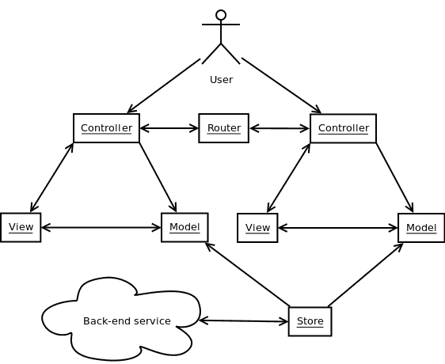
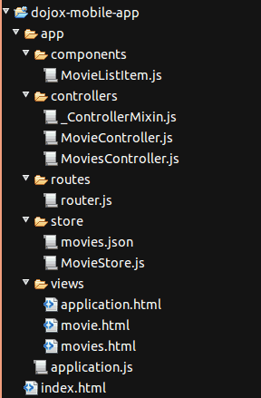

After a lot of tutorials and guides written in Dutch, I thought it was the time to write some English tutorials as well. In this tutorial I'll show you how to create an application using Dojo with [Dojo mobile](http://dojotoolkit.org/documentation/#mobile "Dojo Mobile"). I will not talk about frameworks like [dojox/app](http://dojotoolkit.org/reference-guide/1.9/dojox/app.html)\* or [dojox/mvc](http://dojotoolkit.org/reference-guide/1.9/dojox/mvc.html)\*, but I will tend to create an application with reusable code as much as possible.

> _\* While both frameworks are good and give you the possibility to write beautifully constructed apps, because of the incomplete documentation and the lack of examples, it takes quite some time to understand them and to master them. To reduce the amount of time spent at learning these two frameworks, you can create some interesting apps as well with just the base knowledge of the Dojo toolkit._

### App structure

There are no "rules" when creating folders/files for your application. But in this example I will divide my application in the following parts:

- **Components**: Small UI elements that can be used, can also be seen as widgets.
- **Controllers**: The controllers will contain the code behind a view. These actually have two purposes, the first is to initialize the entire view linked to the controller and the second purpose is to handle the user interaction.
- **Routes**: The code written in the route-package will act as the glue between controllers. Each controller is connected to a single view, so when you need to switch between views (for example, to get a detailed view of some information), this code will be executed to do that switch.
- **Stores**: In Dojo, when providing data, you will use [Dojo stores](http://dojotoolkit.org/reference-guide/1.9/dojo/store.html) in 9 out of 10 cases. This folder will be used to create a store with all model data.
- **Views**: The HTML templates used for each view can be found here. There will be an HTML file for each controller that is created.



It's actually a similar setup to a normal Model-View-Controller application. The user sees the view, but interacts with the controller (one at a time). The controller retrieves the model which is used to render the view (for example, when showing a tasklist, the list of task details is the model, while the user interface is the view). The model data comes from a Dojo store, which can be connected to a back-end service (RESTful webservice).

When another view should be displayed, the controller must call the router, which will then perform the acitons necessary to make the transition. The user will now see the second view and will interact to the second controller. Model data can be connected to the same store, but it can also be connected to another store (or just without a store).

Now, create the same directory structure (and files) as I did in the next screenshot:



As you can see, they follow the structure I described earlier. A more detailed look about the files will follow.

### Storage

In this example I will make a simple application showing a list of movies and by clicking on a title, giving a more detailed view about that movie. The first file we need to change is the `movies.json` in the **app/store** directory. This file will just contain our model data and can be used for mock purposes. In reality you will be using a `JsonRest` store retrieving the data from a RESTful webservice. The file will contain:

```json
[{
    "id": 82992,
    "release_date": "2013-05-24",
    "popularity": 56.5133968700669,
    "title": "Fast & Furious 6",
    "vote_average": 7.3
}, {
    "id": 68721,
    "release_date": "2013-05-03",
    "popularity": 55.118598761825,
    "title": "Iron Man 3",
    "vote_average": 7.3
}, {
    "id": 47964,
    "release_date": "2013-02-14",
    "popularity": 53.9077809585504,
    "title": "A Good Day to Die Hard",
    "vote_average": 6.0
}, {
    "id": 134411,
    "release_date": "2013-02-22",
    "popularity": 48.6472963993062,
    "title": "Snitch",
    "vote_average": 7.7
}, {
    "id": 49051,
    "release_date": "2012-12-12",
    "popularity": 47.5020577063227,
    "title": "The Hobbit: An Unexpected Journey",
    "vote_average": 6.7
}, {
    "id": 68728,
    "release_date": "2013-03-08",
    "popularity": 45.8321401309985,
    "title": "Oz: The Great and Powerful",
    "vote_average": 7.6
}, {
    "id": 60304,
    "release_date": "2013-01-25",
    "popularity": 32.6524484520598,
    "title": "Hansel & Gretel: Witch Hunters",
    "vote_average": 7.5
}, {
    "id": 82654,
    "release_date": "2013-02-01",
    "popularity": 30.5946592068883,
    "title": "Warm Bodies",
    "vote_average": 7.6
}, {
    "id": 68718,
    "release_date": "2012-12-25",
    "popularity": 29.1149763813121,
    "title": "Django Unchained",
    "vote_average": 7.2
}, {
    "id": 54138,
    "release_date": "2013-05-16",
    "popularity": 27.6521203700075,
    "title": "Star Trek Into Darkness",
    "vote_average": 8.5
}, {
    "id": 119283,
    "release_date": "2013-01-25",
    "popularity": 24.2810191038002,
    "title": "Parker",
    "vote_average": 5.9
}, {
    "id": 109431,
    "release_date": "2013-02-07",
    "popularity": 22.3382127204636,
    "title": "Identity Thief",
    "vote_average": 4.9
}, {
    "id": 13804,
    "release_date": "2009-03-11",
    "popularity": 20.1446806145099,
    "title": "Fast And Furious",
    "vote_average": 7.7
}, {
    "id": 75780,
    "release_date": "2012-12-21",
    "popularity": 19.1763149832215,
    "title": "Jack Reacher",
    "vote_average": 7.3
}, {
    "id": 9799,
    "release_date": "2001-06-17",
    "popularity": 18.1965285044048,
    "title": "The Fast and the Furious",
    "vote_average": 7.9
}, {
    "id": 51497,
    "release_date": "2011-04-28",
    "popularity": 17.4500929305629,
    "title": "Fast Five",
    "vote_average": 8.0
}, {
    "id": 24428,
    "release_date": "2012-05-04",
    "popularity": 17.2196799692765,
    "title": "The Avengers",
    "vote_average": 7.4
}, {
    "id": 168259,
    "release_date": "2014-07-11",
    "popularity": 16.8820145528661,
    "title": "Fast & Furious 7",
    "vote_average": 0.0
}, {
    "id": 109421,
    "release_date": "2013-02-08",
    "popularity": 16.6879135174643,
    "title": "Side Effects",
    "vote_average": 5.1
}, {
    "id": 106021,
    "release_date": "2012-09-26",
    "popularity": 16.338470937008,
    "title": "Erased",
    "vote_average": 5.7
}]
```

This data actually comes from a real RESTful webservice, [The Movie Database API](http://docs.themoviedb.apiary.io/), so it should not be too hard to make changes that it will use a real back-end service.

Now, the next file we need to edit is the `MovieStore.js`. What we're going to do here is quite easy. We're going to read the `movies.json` file and insert it into a store (`dojo/store/Memory`). For example:

```javascript
define([ "dojo/store/Memory", "dojo/json", "dojo/text!./movies.json" ], function(Memory, JSON, movieData) {
    return new Memory({
        data: JSON.parse(movieData)
    });
});
```

The `define([])` is used to import other modules, in this module we need a store (`dojo/store/Memory`), the contents of the JSON file (`dojo/text!./movies.json`) and because that module only reads the file as plaintext, we need to convert it to JSON using the `dojo/json` module.

And finally we return the store using:

```javascript
return new Memory({
    data: JSON.parse(movieData);
});
```

We create new instance of `Memory` and provide the data from the JSON file, but as I told you before, we need to parse it first using `JSON.parse(movieData)`.

So now we created the storage/model layer. In the next tutorial I will tell you more about the router, the glue between multiple controllers.

### Building mobile apps with Dojo mobile series

1. [Application structure, stores and model](/dojo-mobile-model/)
2. [Routing between controllers](/dojo-mobile-router/)
3. [Controller mixin](/dojo-mobile-controller-mixin/)
4. [Views, controllers and demo](/dojo-mobile-controllers/)
