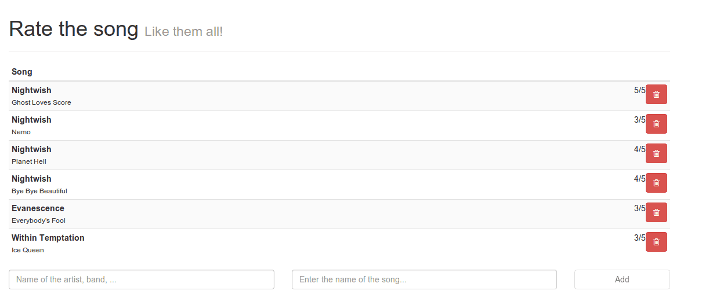
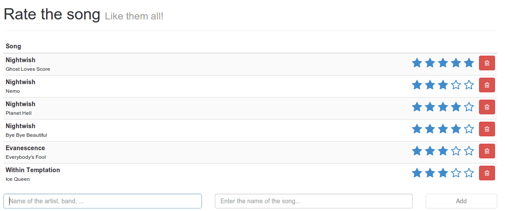
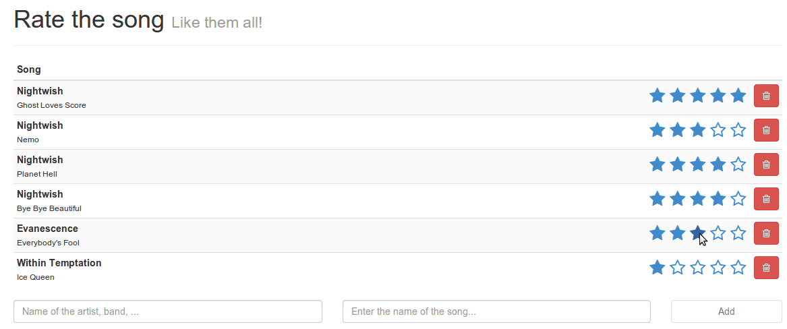
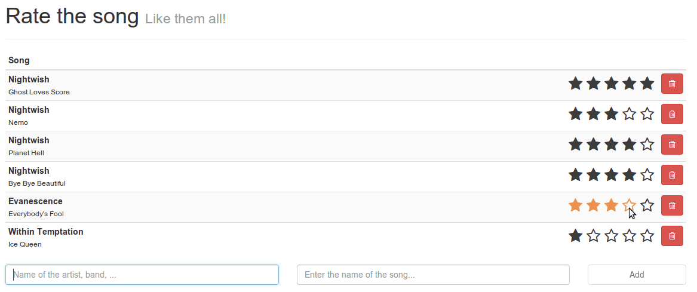
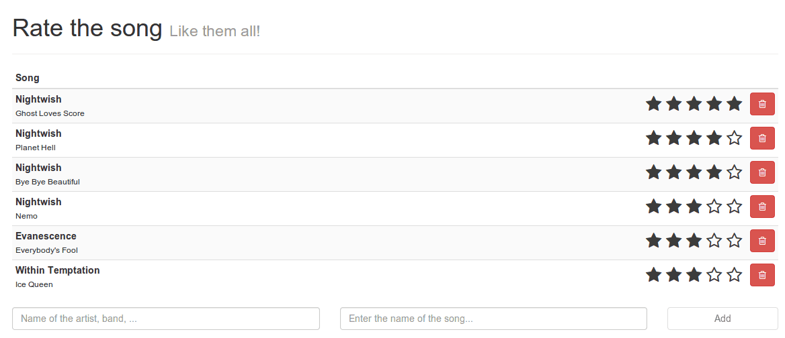
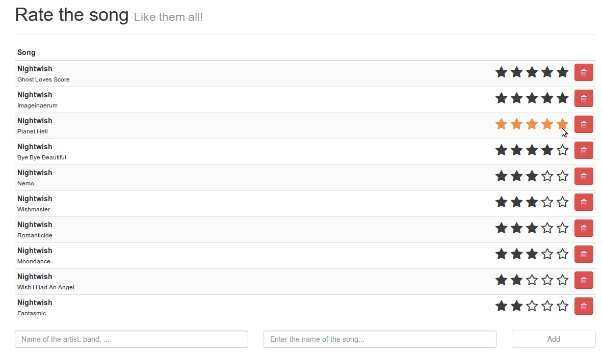

In this final part of the introduction to AngularJS series I'm going to write a directive. When you start writing apps using AngularJS, you will eventually have to re-use certain UI components over and over again. The best way to componentize these small pieces of user interface + behavior, we use directives. Directives are very important in AngularJS, when you want to use the JavaScript components from Twitter Bootstrap, you will have to create your own directives, or use libraries that are already doing this, like for example [Angular UI](http://angular-ui.github.io/).

### Rating the songs

Until now we were only able to list the songs. After this tutorial you will also be able to rate them as well. To start, we will have to change our model a bit. Open **controllers.js** and look at the `addSong()` function. In stead of just pushing the name of the artist and the song, I'm also going to add a field called `score`:

```javascript
$scope.songs.push({
  artist : artist,
  title : title,
  score: 0
});
```

So each time we add a song now, it will also have a score. Of course, we still have to implement the entire rating widget. To do that, let's start by opening **index.html**. Locate the `<div class="pull-right">` inside the `<table>` and put the following contents just before the delete button:

```html
<div rating score="song.score" max="5" class="pull-left"></div>
```

We're going to make a directive called **rating** that accepts two parameters, the score and the maximum score. We just pass `song.score` here and the maximum number is just a static "5". So after doing that, you should open **app.js** (like usual) to add the directives package:

```javascript
angular.module("myApp", [
  'myApp.filters',
  'myApp.services',
  'myApp.directives',
  'myApp.controllers'
]);
```

Now we can finally start writing our directive, open **directives.js** and let's add our directive:

```javascript
angular.module("myApp.directives", []).directive("rating", function() {
  // Write code here
});
```

Nothing new here, this is just similar to how we created a controller, filter and factory before, so let's start by actually implementing the directive.

### Directive setup

The first thing we have to do is "configuring" the directive by saying how the `score` and the `max` field are bound, there are three possibilities:

- **Two-way binding**: If the controller changes the value, the directive is updated AND if the directive changes the value, the controller is updated
- **One-way binding**: If the controller changes the value, the directive is updated but if the directive changes the value, nothing happens
- **No binding**: If the controller or the directive changes the value, nothing happens (they're not bound to each other)

We also have to configure how we can initiate the directive. Here are also three possibilities:

- **Element**: This means we could initiate the directive by using `<rating score="song.score" max="5" />`
- **Attribute**: This means we could initiate the directive by using `<div rating score="song.score" max="5" />` like we just did in our HTML
- **Classname**: This means we could initiate the directive by using `<div class="rating" score="song.score" max="5" />`

You can use any combination of these (so for example both element and attribute). So let's see how we do that in our code:

```javascript
var directive = { };
directive.restrict = 'AE';

directive.scope = {
  score: '=score',
  max: '=max'
};

return directive;
```

So the first part (`directive.restrict`) configures the way we can initiate the directive. In this case we used `'AE'` what stands for **A**ttribute and **E**lement. If we would like to use the classname as well, then we should have used `'AEC'`.

Then in the `directive.scope` we say how our local scope is bound to the directive's attributes. In this case we map `scope.score` to our score attribute and `scope.max` to our max attribute. The equals sign in front of the attribute name (for example in `'=score'`) tells us how it's bound where:

- `=` means two-way binding
- `@` means one-way binding
- `&` is used commonly for functions

### Writing your first directive

Like I said before, a directive is a custom "UI component", so it will probably contain some HTML as well. To add the HTML to our directive we could add it inline, for example by using:

```javascript
directive.template = '<div>My template</div>';
```

But we could also use an external template, which is probably more convenient if your template becomes more complex. The only thing you have to do in your directive is specify where your template is located. So in our directive add the following code:

```javascript
directive.templateUrl = "app/templates/rating.html";
```

The next part is that we're going to actually implement the template, so open **rating.html **and let's start by writing something really simple. For example:

```html
<div class="rating">
  {{score}}/{{max}}
</div>
```

Nothing really new here. If we open our app we can now see that the directive is being loaded for each song. It's still pretty ugly, but hey, we just wrote our first directive!



### First directive, second version

Let's improve our directive a bit and show some stars representing the score in stead of just a few numbers. Before we do that, let's add some CSS to **style.css**. Nothing here is really important, but I just want to make the start have a different color when they're clicked/hovered. The stylesheet I'm going to use is:

```css
.rating {
  font-size: 175%;
  padding: 0 0.5em;
}

.rating > a {
  text-decoration: none;
}

.rating .rating-highlight, .rating.rating-highlight:hover {
  color: #F4914E;
}

.rating .rating-normal, .rating.rating-normal:hover {
  color: #3C3C3C;
}
```

So after doing that, we're going back to **directives.js** to implement our stars! With our current model (the score) it's quite impossible to realize what we want. So we have to create a new model based on the score that has an array of "stars". Each star is just a simple object with a property called `full` that will be `true` when a full star should be displayed or `false` when an empty star have to be displayed. For example, when the score is 3/5 we have to draw 3 full stars followed by 2 empty stars.

So let's add a function called `link()` to our directive:

```javascript
directive.link = function(scope, elements, attr) {
  // Write code here
};
```

The `link()` function is actually the function where everything happens. It is executed when the directive is loaded and all logic should take place here. The first thing I'm going to do is add a function **updateStars** inside of it that will loop until it reaches the max score and will add the star object with the `full` property that I just explained.

```javascript
scope.updateStars = function() {
  var idx = 0;
  scope.stars = [ ];
  for (idx = 0; idx < scope.max; idx += 1) {
    scope.stars.push({
      full: scope.score > idx
    });
  }
};
```

**Be careful!** All these functions must be added inside the `link()` function.

But this is not all we need. We also have to create a function that will show the correct icon based on the `full` property. I will use the [Font Awesome](http://fontawesome.io) iconset to do this. This set is based upon classnames, so the only thing I have to do is provide the `fa-star-o` class if it's an empty star and `fa-star` for a full star.

The function I'm going to use for this is:

```javascript
scope.starClass = function(star, idx) {
  var starClass = 'fa-star-o';
  if (star.full) {
    starClass = 'fa-star';
  }
  return starClass;
};
```

And last but not least we have to make sure that every time the score changes, the star model is also updated. To do that we're going to do something similar like in the second tutorial, by **watching** the score. For example, let's add the following piece of code to the `link()` function as well:

```javascript
scope.$watch('score', function(newValue, oldValue) {
  if (newValue !== null && newValue !== undefined) {
    scope.updateStars();
  }
});
```

We now implemented all logic we need, so let's start by updating the template as well.

```html
<div class="rating">
  <a ng-repeat="star in stars">
    <i class="fa" ng-class="starClass(star, $index)"></i>
  </a>
</div>
```

So, we're going to show a star for each object inside the **stars** array, so we're going to use the `ng-repeat` attribute again. What's new in this example is that I'm using the `ng-class` function to determine the class used to display the correct icon.

That's it for our updated directive, let's test everything out. If we're opening the app, we will see that this is pretty close to our end result, the only thing we want to do now is make it possible to update the score by clicking on a specific icon.



### Interaction

The interaction itself is not hard to implement. We're just going to add an `ng-click` attribute to the star and add `$index` as a parameter. As I already explained before, `$index` contains the index of the current item (star) in the array, starting with zero. The only thing we have to do is add 1 to the `$index` (because it's starting with 0) and we have our new score.

So let's quickly add that feature as well by adding the following function to the `link()` function:

```javascript
scope.setRating = function(idx) {
  scope.score = idx + 1;
};
```

And let's also add the `ng-click="setRating($index)"` attribute to the `<a>` element in the directive. If we now open our app again and click a star, we will see that the rating is updated. Also, when refreshing the page the rating is still updated, so that means that our factory from previous tutorial is still working well.

### Finishing touch

Right now when we hover over a star, the current star gets selected. However, it would be way more interesting if you hover over the third star, that the first three stars get a different color, not only the one you're hovering.



To do that we're going to write two extra functions, one for when the user starts hovering a star and another one for when the user stops hovering. Inside this function we're going to store the current index of the star that is being hovered. For example by writing:

```javascript
scope.hover = function(idx) {
  scope.hoverIdx = idx;
};

scope.stopHover = function() {
  scope.hoverIdx = -1;
};
```

Nothing really special here (just make sure they're added to the `link()` function). We only need to update our template now by adding the attributes `ng-mouseover="hover($index)"` and `ng-mouseleave="stopHover()"` to the `<a>` element.

Now, the second thing we need to do is to make another function that adds the right class to the star. For all stars with a lower or equal index to the currently hovering index, we need to show an orange color and for the other ones we need a black color. The colors are not really important, in fact, by adding the stylesheet I gave you earlier, you already have those colors. We only have to apply the class `rating-highlight` for a yellow star and `rating-normal` for a black star.

If you paid attention before, you know that we can do that by using the `ng-class` attribute, so let's add the `ng-class="starColor($index)"` attribute to the `<a>` element. Now the only thing that rests is implementing the `starColor()` function, luckily that one isn't hard either:

```javascript
scope.starColor = function(idx) {
  var starClass = 'rating-normal';
  if (idx <= scope.hoverIdx) {
   starClass = 'rating-highlight'; 
  }
  return starClass;
};
```

Nothing special here, we're just determining the correct class based on the index of the star that it will applied to (`idx`) and the index of the star that is being hovered (`scope.hoverIdx`). If we test our app now, you will see that we're finished for 99% percent of the time. The only adjustment I want to make is that if we're hovering over an empty star, that star becomes full as well.



To do that, we simply change the `if` statement from the `starClass()` function to:

```javascript
if (star.full || idx <= scope.hoverIdx) {
  // ...
}
```

### Sorting the songs

As a last feature, I want to sort the songs based on their rating. If you remember the second tutorial, I already told you AngularJS has several built in filters, and one of them is called the [orderBy](http://docs.angularjs.org/api/ng/filter/orderBy) filter. Let's open **index.html** and replace the `ng-repeat` attribute by:

```html
ng-repeat="song in songs | orderBy:'-score'"
```

In this example we're sorting the songs based on the score, and the minus sign in front of it means that it's in a **descending **order. If we now run our app again, we will see that they now appear sorted by their rating.



There are only a few small bugs we need to fix before ending it. If we change the rating of a song, we will see that they get sorted immediately. However, because the <codeng-mouseleave event is never triggered, the stars will remain coloured, which we obviously don't want. To fix this kind of issue, we simply call the `scope.stopHover();` function from inside the `setRating()` function in our directive, for example:

```javascript
scope.setRating = function(idx) {
  scope.score = idx + 1;
  scope.stopHover();
};
```

Another thing that has to be changed is deleting the song. The `$index` value will now be based on the sorted songs, so this will not necessarily match with the index of the song in the original songs array. To fix that, we're going to pass the song itself in stead of the index. So, open up **index.html**, locate the delete button and in stead of using `ng-click="deleteSong($index)"`, we're now going to use `ng-click="deleteSong(song)"`.

Now we only have to change the implementation of the `deleteSong()` function a bit, for example by using:

```javascript
$scope.deleteSong = function(/** Song */ song) {
  var idx = $scope.songs.indexOf(song);
  if (idx >= 0) {
    $scope.songs.splice(idx, 1);
  }
};
```

In this case we're going to look for the index in the original array and not the sorted array, which means everything should work fine now.



### Summary

However, with this step we actually finished our app, so this is the end of the introduction series to AngularJS. I hope you learned a lot of new things, but here's a small summary of everything we learned so far:

- Thanks to the **Model**, **View**, **Controller** pattern our HTML is loosely coupled to our UI logic, which makes it way easier to test and improves the design of your application
- **Two way data binding** is the magic that happens when you enter something in a textfield and that value is immediately changed in your model as well and vice versa
- Use **controllers** to "control" your model + view, **filters** to "convert" input, **services** for everything that is not related to the user interface (persisting, calling services, ...) and **directives** for small re-usable chunks of UI behavior, like "widgets"
- AngularJS comes with several handy built in filters (JSON, orderBy, lowercase, uppercase, ...)
- To call services from your controllers, you can just use **dependency** **injection**
- Directives can be initiated by an **attribute**, **classname** or **element name**
- The scope data in your directive can be bound in **two way**s, **one way** or as a **function**

#### Achievement: Introduced to AngularJS

This means it's the end of the introduction tutorial series about AngularJS. If you're interested in the full code example, you can find it on [GitHub](https://github.com/song-rate-mvc/angular-song-rate/tree/0.0.1). If you want to try out the code yourself, you can download an archive from [Github](https://github.com/song-rate-mvc/angular-song-rate/archive/0.0.1.zip).

You can also find the demo on [Github](https://song-rate-mvc.github.io/angular-song-rate).

### Introduction to AngularJS series

1. [Writing your first controller](/introduction-angularjs-controller/ "An introduction to AngularJS: Writing your first controller")
2. [Filters and factories](/introduction-angularjs-filter-factory)
3. [A rating directive](/introduction-angularjs-directives)
