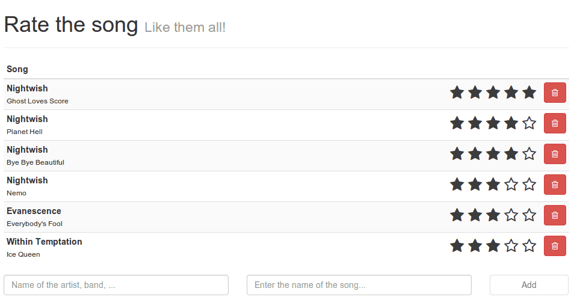

Are you new to AngularJS? Good! Just because you're reading this means you're willing to jump onto the JavaScript train towards the future of web development. Over the past years, HTML5, CSS3 and JavaScript became a valuable alternative to desktop applications. This entire new trend also caused an entire wave of new JavaScript ideas, libraries and frameworks that are making JavaScript what it is today. JavaScript is not only hip and trendy, it's becoming mature as well.

In this small series (just three parts) I'm going to introduce you into the world of AngularJS. AngularJS is a framework by Google that allows you to write your code according to the **Model**, **View**, **Controller** pattern. If you're already familiar with it, then you probably know that it allows you to design your application well and defining a good structure. It also makes it possible to decouple your view (HTML) from your logic (JavaScript) which makes it easy to test.

The application I'm going to build in this tutorial series will contain a controller, a filter, a factory and a directive, which are some of the basic (and even more advanced) features of AngularJS. But don't worry, the complexity will only rise gradually. In the first tutorial we will just try to make a small app without having to worry about filters, factories or directives. The app itself will show you a list of songs and give you the possibility to add new songs, to rate the songs and to delete them. And because we're going to be using HTML5, we will store these inside the HTML5 Local Storage.

The code for the application is also available on [Github](https://github.com/song-rate-mvc/angular-song-rate/tree/0.0.2), together with the [full demo](http://song-rate-mvc.github.io/angular-song-rate).

### Introduction to AngularJS series

1. [Writing your first controller](/introduction-angularjs-controller/ "An introduction to AngularJS: Writing your first controller")
2. [Filters and factories](/introduction-angularjs-filter-factory)
3. [A rating directive](/introduction-angularjs-directives)
