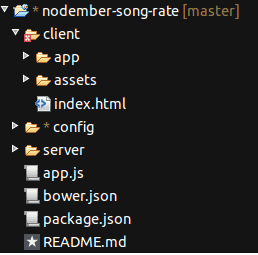
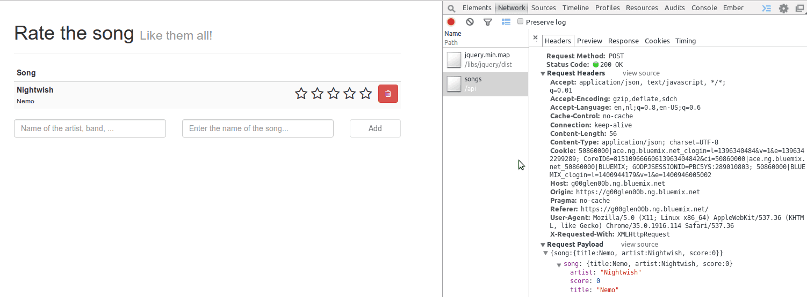
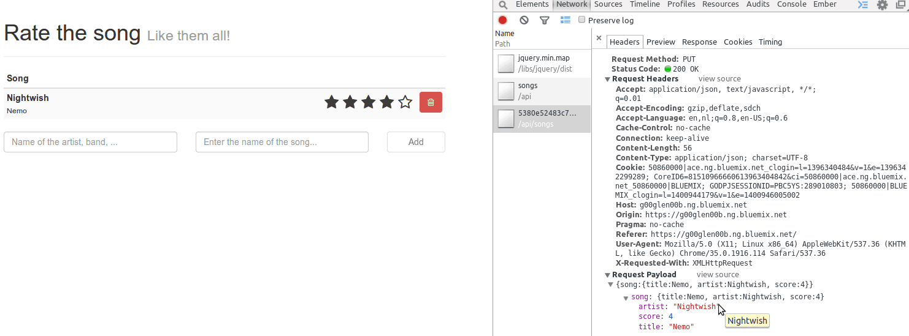
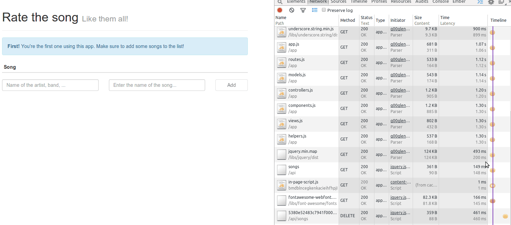

A while back I wrote a tutorial about writing a small app using Ember.js by storing its data inside the HTML5 LocalStorage. In this tutorial I will be using Node.js REST webservice and store the data into a MongoDB database. By writing both front-end and back-end in JavaScript, I'm able to write an entire application using JavaScript. The data will be stored inside MongoDB, which makes it easy as well, because that data is being stored by using a JSON structure.

People refer to this application design as the Nodember stack, it consists mainly out of 4 parts:

- **MongoDB**: Persisting of our business data,
- **Node.js**: Platform for writing JavaScript apps
- **Express**: Node.js framework for writing web applications
- **Ember.js**: MVC framework for client-side applications

### Project setup

I recently wrote a REST API already for my tutorial about writing an application using the [MEAN stack](/mean-stack/ "Working with the MEAN stack"). You can in fact use the same REST API (by modifying a few things) so I suggest starting of with [this project](https://github.com/song-rate-mvc/mean-song-rate) to setup your REST API. If you're interested in how to setup your own REST API using Node.js + MongoDB + Express, I recommend reading the following tutorials:

- [Application setup](/mean-application-setup/ "Working with the MEAN stack: Application setup")
- [Writing a REST API using Express](/mean-mvc/ "Working with the MEAN stack: MVC")

If you finished setting up your application, you can now replace the client folder by the client-folder of the application we wrote in Ember.js using the local storage. Copy the contents from [this repository](https://github.com/song-rate-mvc/ember-song-rate) into the client folder. Remove **bower.json** from the parent directory and replace it by the one from the ember.js project.

If you want to know how to write your own application using Ember.js I suggest reading my tutorial about [Ember.js in action](/ember-js-action/ "Ember.js in action").

If you're done, your project structure should look like:



### Changing the REST API

Ember.js requires a different structure when writing your REST API. While using the MEAN stack you can work with plain objects like:

```json
[{
  "id": 1,
  "title": "Master of puppets",
  "artist": "Metallica",
  "score": 3
}]
```

This won't work when using Ember.js. When using Ember.js you also have to indicate which model you're going to use, for example:

```json
{
  "song": [{
    "id": 1,
    "title": "Master of puppets",
    "artist": "Metallica",
    "score": 3
  }]
}
```

This means we have to wrap all responses and also make sure we change our requests (when adding or updating a song), because that one also changes.

So, to change that we have to open up **server/controllers/rest.js** and look for all places where the following is written:

```javascript
res.send(songs);
```

Replace it by:

```javascript
res.send({
  song: songs
});
```

The same has to be done for:

```javascript
res.send(song);
```

Which you will have to replace by:

```javascript
res.send({
  song: song
});
```

And finally we also have to replace the request as well by replacing `req.body` by `req.body.song`. You have to do this for both the `add()` and `update()` function.

### Changing the front-end

Our entire front-end part is written already as well. The only thing we have to change is the adapter we use. One thing I really like about Ember.js (specially Ember-data) is the use of adapters that require no changes to change the back-end source. Because of this we don't really have to change a lot.

First open **bower.json** because we no longer need the LocalStorage adapter. This means we can remove the following entry from the Bower configuration:

```json
"ember-localstorage-adapter": "latest"
```

Finally we also have to change the adapter we use by opening up **app.js** and replacing:

```javascript
App.ApplicationAdapter = DS.RESTAdapter.extend({
  host: '/api'
});
```

Now we have combined our existing RESTful webservice and the Ember.js front-end application and made it work using the Nodember stack.

### Testing it out

So now we can run our app and test it out. To run the application you first use the following command:

```
npm install
```

Then you use the `bower` command to retrieve the front-end dependencies:

```
bower install
```

And finally you can run the app by using:

node app.js

If you now open up your browser and go to [http://localhost:3000](http://localhost:3000), you should see the app in its full glory. So let's try it out by adding a song. If we do that and open our console, you will see that a network request has been sent to our REST API, including the JSON structure of the song.



If you change the score of the song, you can see that another request has been sent (this time it has PUT as request method) and that the updated object has been sent as request payload.



If we refresh the page, you can see that (among the other requests) a request has been sent to the REST API to retrieve all existing songs.


And finally, if we remove the song, you can see that it sends the DELETE request with the ID of the song to the RESTful webservice.



#### Achievement: Worked with Nodember

Seeing this means you finished the Working with Nodember tutorial. If you're interested in the full code example, you can find it on [GitHub](https://github.com/song-rate-mvc/nodember-song-rate). If you want to try out the code yourself, you can download an archive from [Github](https://github.com/song-rate-mvc/nodember-song-rate/archive/master.zip).
