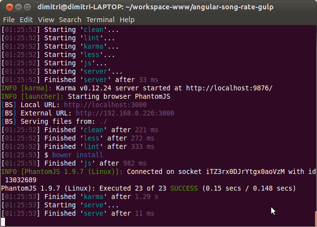
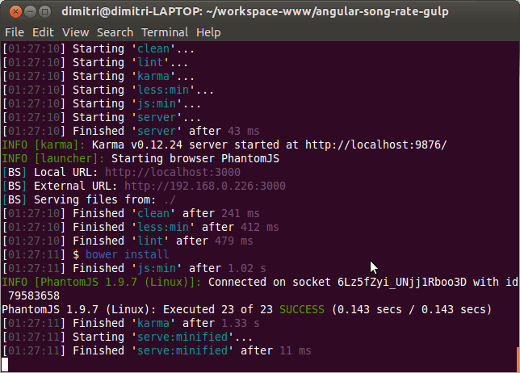
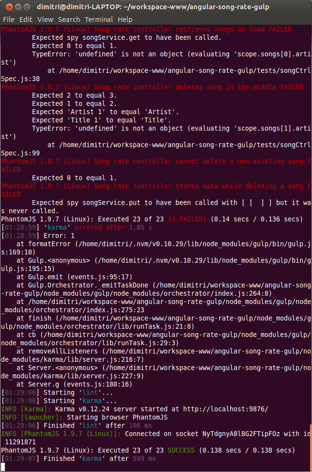
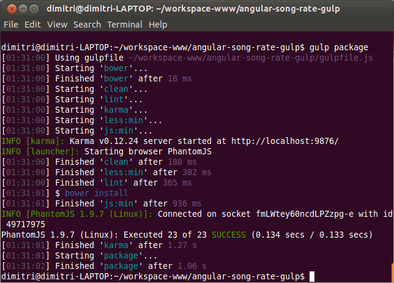
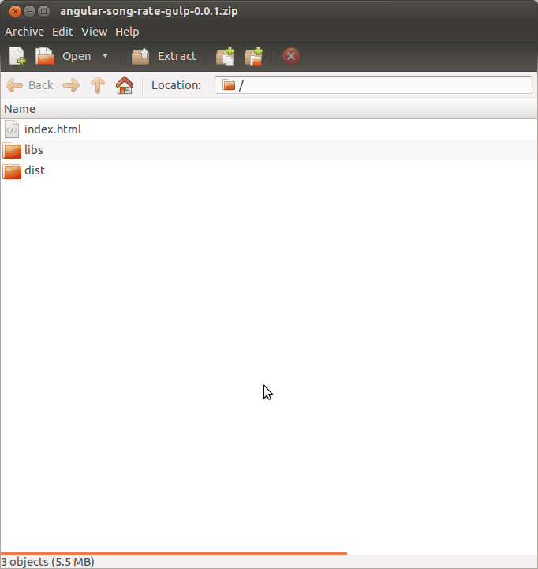

A while back I wrote an article about how to use [Grunt to build your application](/angular-grunt/ "Making your AngularJS application grunt"). However, recently there's a new player on the market called [Gulp](http://gulpjs.com). I'm not going to compare the two and tell you which one is better, but I'm going to use the same application and try to achieve the same thing using Gulp. Before we start with that, let me explain what Grunt and Gulp can do. Both these tools allow you through configuration/APIs to execute certain steps to convert your source code into code that can be deployed. Some common use cases are:

- Less/Sass compiling
- Coffeescript/Typescript compiling
- Resource minification
- Running a preview webserver
- ...

The major difference between Gulp and Grunt is that Gulp works with streams while Grunt works with files. It might be confusing at first, but once you get the hang of it, you will be happy that you know tools like Gulp or Grunt.

### Installation

Installation is quite simple, simply run the following command, and you're set:

npm install -g gulp

In this article I will be using the code from my previous AngularJS application, which you can find on [Github](https://github.com/song-rate-mvc/angular-song-rate). I simply removed the Grunt related modules from the npm configuration and removed the Grunt configuration file (though this is not necessary if you want to support both build systems).

You don't need this project if you don't like it. You can use any project you like with a similar scructure:


### Loading some modules

We installed the Gulp CLI now, but we also need to load Gulp locally and several modules/plugins to do all kinds of things. I ended up using the following modules:

- **gulp**: Gulp has to be installed locally in your project as well, this makes the API's available.
- **gulp-run**: With the gulp-run plugin you can run commands. I'm going to use this to run Bower from within my Gulp build task.
- **gulp-less**: Like the name proposes, this plugin is used to compile the Less files in my project.
- **gulp-concat**: This module will be used to concatenate my resources like JavaScript and CSS files.
- **gulp-ng-templates**: Since this is an AngularJS project, I would like to compile my AngularJS templates, which I can do by using this module.
- **gulp-uglify**: To minify/uglify my JavaScript files for production packaging, I will be using the gulp-uglify plugin.
- **gulp-minify-css**: The CSS alternative for gulp-uglify. I'm using this to minify my compiled CSS files.
- **gulp-zip**: I would also like to create an archive of my compiled resources, so with the gulp-zip plugin I can create a .ZIP archive.
- **gulp-if**: Gulp uses streams, but some small tasks should be executed only in several cases of a pipe. To do that, I can use the gulp-if plugin. I will talk about this more into detail later.
- **gulp-htmlmin**: Before I compile my AngularJS templates, I'm going to minify them using this module.
- **gulp-jshint**: To validate if your JavaScript code does meet certain quality rules, I'm using JSHint. With gulp-jshint I can automate JSHint code validation.

Gulp also has an entirely different vision on what modules should do. If there's a task that's easily reproducable by another Node.js package, then that package should be used instead.

So, there are several modules I'm going to use in my Gulp configuration, but are not solely a Gulp plugin, for example:

- **del**: This plugin can be used to delete folders and directories. In this case I'm going to use it to clear my folder containing all compiled resources.
- **browser-sync**: This module can be used to start a (live reload) server for your web application.

In the end, my package.json looked like this:

```json
{
  "name": "angular-song-rate-gulp",
  "version": "0.0.1",
  "devDependencies": {
    "gulp": "latest",
    "gulp-run": "latest",
    "gulp-less": "latest",
    "gulp-concat": "latest",
    "gulp-ng-templates": "latest",
    "gulp-uglify": "latest",
    "gulp-minify-css": "latest",
    "gulp-zip": "latest",
    "gulp-if": "latest",
    "gulp-htmlmin": "latest",
    "gulp-jshint": "latest",
    "browser-sync": "latest",
    "del": "latest",
    "karma": "~0.12.0",
    "karma-jasmine": "~0.1.0",
    "karma-phantomjs-launcher": "~0.1.4",
    "karma-ng-html2js-preprocessor": "~0.1.0"
  }
}
```

### Preparing your Gulp configuration file

When you installed all Node.js modules, you can start configuring your project with Gulp by creating a **gulpfile.js**. This file will contain all our tasks, so in this tutorial it will be the only file that is going to be used.

First of all, we're going to include all the Node.js packages we need, by writing:

```javascript
var gulp = require('gulp'),
    del = require('del'),
    run = require('gulp-run'),
    less = require('gulp-less'),
    htmlmin = require('gulp-htmlmin'),
    ngTemplates = require('gulp-ng-templates'),
    cssmin = require('gulp-minify-css'),
    uglify = require('gulp-uglify'),
    karma = require('karma').server,
    concat = require('gulp-concat'),
    jshint = require('gulp-jshint'),
    gulpif = require('gulp-if'),
    zip = require('gulp-zip'),
    path = require('path'),
    browserSync = require('browser-sync'),
    pkg = require('./package.json'),
    reload = browserSync.reload;
```

Then we can start writing our tasks down, for example:

```javascript
gulp.task('serve', function() {
 // Task contents
});
```

If you need to write multiple tasks, you can chain them like this:

```javascript
gulp.task('serve', function() {

})
.task('serve:minified', function() {

});
```

So let's create some tasks!

### Bower dependency management

To reload the Bower managed dependencies, you usually enter the `bower install` command. To automate this we can be using the gulp-run plugin:

```javascript
gulp.task('bower', function() {
  run('bower install').exec();
})
```

### Cleaning the dist/ folder

We have some other small tasks as well, for example clearing the dist folder:

```javascript
.task('clean', function(cb) {
  del(['dist/**'], cb);
})
```

### Running a webserver

Running a webserver to view our application can be done using the browser-sync module:

```javascript
.task('server', function() {
  browserSync({
    server: {
     baseDir: './' 
    }
  });
})
```

### Let's start piping by compiling our Less resources

These previous tasks did some interesting things already, but the next task will show you the strengths of Gulp. If you remember Grunt, you know that to compile the Less resources, we had to do several things:

- We had to compile the Less resources into CSS (obviously)
- We had to concatenate the compiled CSS files into one file
- We had to minify the compiled CSS code

For each individual step, you usually create a temporary file and delete that file afterwards.

With Gulp on the other hand, you will be using streams, so you can in fact run several tasks before you write the stream to your filesystem.

For compiling our Less resources we will have two tasks, one that minifies and one that doesn't (for development):

```javascript
.task('less', function() {
  return gulp.src('assets/less/*.less')
  .pipe(less())
  .pipe(concat('style.css'))
  .pipe(gulp.dest('dist'));
})
.task('less:min', function() {
  return gulp.src('assets/less/*.less')
  .pipe(less())
  .pipe(concat('style.css'))
  .pipe(cssmin())
  .pipe(gulp.dest('dist'));
})
```

As you can see here, we run the `less()`, the `concat()` and the `cssmin()` tasks before we actually say that it should be written into the dist folder.

To do this, we pipe the sources into these several tasks and at the end we use `gulp.dest()` to define the destination.

### JSHint validation

The pipes return in almost all tasks. For JSHint validation we will be using:

```javascript
.task('lint', function() {
  return gulp.src('./app/*.js')
  .pipe(jshint())
  .pipe(jshint.reporter('default'));
})
```

### Running our unit tests with Karma

The Karma module already allows us to run the Karma runner without having to install a seperate Gulp plugin like we had to do with Grunt.

You can simply run the following tasks to start the Karma runner:

```javascript
.task('karma', function(done) {
  karma.start({
    configFile: __dirname + '/config/karma.conf.js',
    singleRun: true
  }, done);
})
.task('karma:watch', function(done) {
  karma.start({
    configFile: __dirname + '/config/karma.conf.js'
  }, done);
})
```

We have two seperate tasks again here as well. The Karma runner allows us to continuously test our code for test driven development by watching several files. However, for running our code we only need to run our tests once, so we have two tasks.

### JavaScript compilation

The most complex task will be the JavaScript compilation task. Similar to the Less compilation tasks, we will have two tasks here as well:

```javascript
.task('js', function() {
  return gulp.src(['app/*.js', 'app/templates/*.html'])
  .pipe(gulpif(/\.html$/, htmlmin({ collapseWhitespace: true })))
  .pipe(gulpif(/\.html$/, ngTemplates()))
  .pipe(concat('app.js'))
  .pipe(gulp.dest('dist'));
})
.task('js:min', function() {
  return gulp.src(['app/*.js', 'app/templates/*.html'])
  .pipe(gulpif(/\.html$/, htmlmin({ collapseWhitespace: true })))
  .pipe(gulpif(/\.html$/, ngTemplates()))
  .pipe(uglify({ mangle: false }))
  .pipe(concat('app.js'))
  .pipe(gulp.dest('dist'));
})
```

What happens here is not that hard to understand though. First of all we will load both the JavaScript source code as the AngularJS HTML templates as our sources (`gulp.src`).

Our AngularJS templates have to follow some different steps though, because they have to be minified first using `htmlmin()` and then they have to be compiled into JavaScript files using `ngTemplates()`.

To execute certain tasks only in several cases, we can use the `gulpif()` plugin. We simply provide a regular expression that matches the HTML files and as the second parameter we provide the actual task.

After everything is compiled into JavaScript files, we can use the `uglify()` task to minify our JavaScript code. Be aware that if you use the Angular depdendency injection without strings, for example:

```javascript
angular.module("myApp.controllers").controller("MyCtrl", function($scope, MyService) {
  // Your code ...
});
```

You will have to disable the `mangle` option. This option will rename all variables to one letter variables, which will confuse the AngularJS dependency injection.

After minifying we can concatenate all files using `concat()` and then we can write it to the dist folder, similar to what we did in the Less task.

### All together... the serve task

We now made all kind of useful tasks, but you don't want to run these all manually (it's possible though). You can define tasks that depend on other tasks. To do that, we provide a special second parameter with an array of the tasks we would like to run, for example:

```javascript
.task('serve', ['bower', 'clean', 'lint', 'karma', 'less', 'js', 'server'], function() {
  return gulp.watch([
    '*.js', 'app/*.js', '*.html', 'assets/**/*.less'
  ], [
   'lint', 'karma', 'less', 'js', browserSync.reload
  ]);
})
```

So, the serve task will run the bower, clean, lint, karma, less, js and server tasks first.

When it's done, it will watch certain files. By watching our source files, we can run certain tasks when a file change. In this case we will run the lint, karma, less and js task again.

It will also have to reload the browser, to do that we can use the `browserSync.reload` task.

### What about minification?

Another task we will define is the serve:minified tasks which will do exactly the same as our previous task, but it will serve minified versions of our source code:

```javascript
.task('serve:minified', ['bower', 'clean', 'lint', 'karma', 'less:min', 'js:min', 'server'], function() {
  return gulp.watch([
    '*.js', 'app/*.js', '*.html', 'assets/**/*.less'
  ], [
   'lint', 'karma', 'less:min', 'js:min', browserSync.reload
  ]);
})
```

### What about test driven development (TDD)?

When you're using test driven development, it's more important to see if the tests run, than looking at the application each time you change your code. In this case we will have to validate our code again and run the Karma unit tests:

```javascript
.task('tdd', ['bower', 'lint'], function() {
  return gulp.watch([
    '*.js', 'app/*.js', '*.html', 'assets/**/*.less'
  ], [
    'lint', 'karma'
  ]);
})
```

### Creating an archive

Almost there, the last task I would like to add is a task that creates a ZIP archive of our minified compiled resources. Obviously, this task will depend on several tasks as well, like the Bower, clean, lint, karma, less:min and js:min task. This is similar to the serve:minified task, except that it doesn't have to run a webserver.

After loading all these tasks, we have to use the `zip()` task:

```javascript
.task('package', ['bower', 'clean', 'lint', 'karma', 'less:min', 'js:min'], function() {
  return gulp.src(['index.html', 'dist/**', 'libs/**'], { base: './' })
  .pipe(zip(pkg.name + '-' + pkg.version + '.zip'))
  .pipe(gulp.dest('dist'));
})
```

First of all we load our sources. Important to see here is the second argument, in which we pass `{ base: './' }`. If we leave this away, all sources are passed without referencing the folder they're in.

If we create a ZIP archive in that case, our folder structure will be gone. To preserve the folder structure, we can define the base folder.

The `zip()` task will create a ZIP archive with the name of our application and its version. We will retrieve this information from the package.json file by adding its contents by using `require('./package.json')`.

### Testing it out

All our tasks are written, so now we can start things out. First of all let's call the serve task by using the following command:

gulp serve

This will compile all our resources and should pop up a browser window afterwards. If you change something in your code, the browser window should automatically refresh.



The `gulp serve:minified` should do something quite similar, except that it will run the less:min and js:min tasks.



Then we have the `gulp tdd` task, that will run each unit test again as soon as the code changes. For example, when we changed something so that the code would fail, we could see the errors. When we fixed the code again, all tests ran successfully again.



Then finally we have the `gulp package` task, which can be used to create a ZIP archive.



When the task is completed, you will be able to find a .ZIP file inside the dist/ folder containing your application sources.



#### Achievement: Made your AngularJS application run even smoother with Gulp

Seeing this means you finished this tutorial about using Gulp to build your AngularJS web application. If you're interested in the full code example, you can find it on [Github](https://github.com/song-rate-mvc/angular-song-rate-gulp). If you want to try out the code yourself, you can download an archive from [Github](https://github.com/song-rate-mvc/angular-song-rate-gulp/archive/master.zip).
