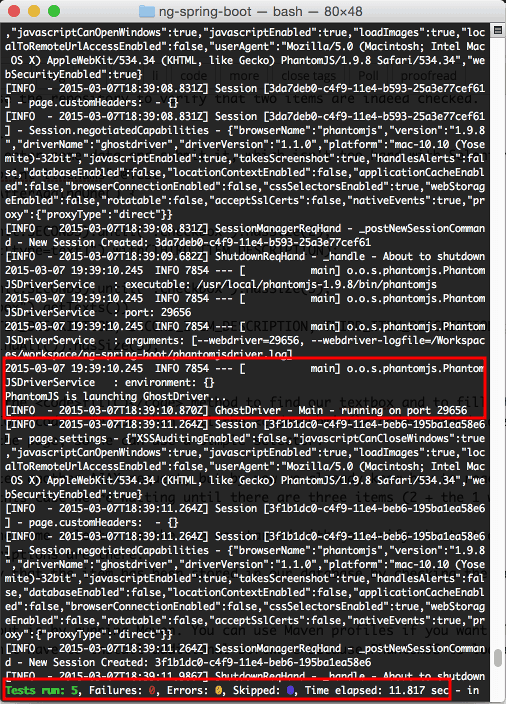
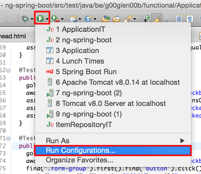
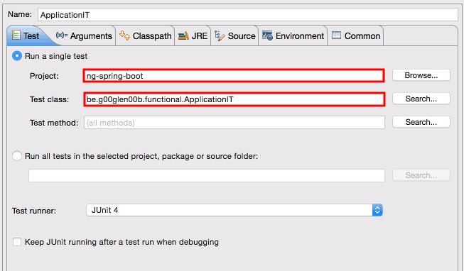
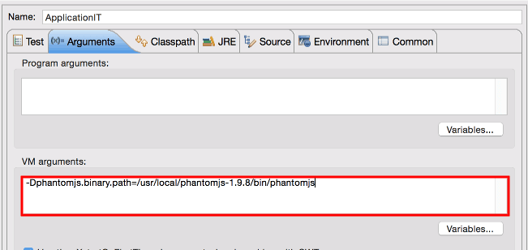
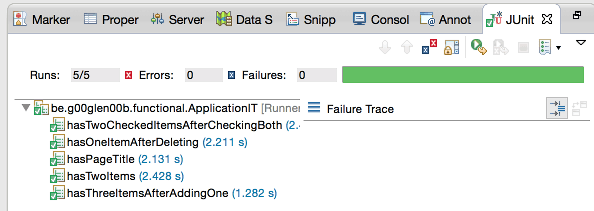

The past couple of weeks I wrote several kind of tests for [my Spring Boot application](/prototyping-spring-boot-angularjs/ "Rapid prototyping with Spring Boot and AngularJS"), we started of with some [integration tests for our REST service](/spring-boot-rest-assured/ "Easy integration testing with Spring Boot and REST-Assured"), and today I'm writing the last part of the series with some functional/integration tests for the application using Selenium.

### Maven dependencies

When you ask a developer about functional testing, a lot of them will probably think "Selenium", and in this case it's not different. We will be using [Selenium](http://www.seleniumhq.org/), but we will also use [FluentLenium](https://github.com/FluentLenium/FluentLenium), a framework that acts as a wrapper around Selenium, but provides more a more fluent API to make it a lot easier to test your web application.

Selenium is not a testing framework though, Selenium is a browser automation framework, so we we will need two additional things:

- A web browser
- A testing framework

For our web browser I will be using [PhantomJS](http://phantomjs.org/), a scriptable/CLI based browser running on the same engine as Safari and previously also Google Chrome, called WebKit. Selenium works with drivers, and so we need to install an additional WebDriver for PhantomJS, called [Ghost Driver](https://github.com/detro/ghostdriver). The testing framework I will be choosing is [AssertJ](http://joel-costigliola.github.io/assertj/). The dependencies I have to add are the following:

```xml
<dependency>
  <groupId>org.fluentlenium</groupId>
  <artifactId>fluentlenium-assertj</artifactId>
  <version>0.10.3</version>
</dependency>
<dependency>
  <groupId>com.github.detro</groupId>
  <artifactId>phantomjsdriver</artifactId>
  <version>1.2.0</version>
</dependency>
<dependency>
  <groupId>xml-apis</groupId>
  <artifactId>xml-apis</artifactId>
  <version>1.4.01</version>
</dependency>
```

The following dependencies are also necessary, but if you followed any of my other recent tutorials, you probably already have these:

```xml
<dependency>
  <groupId>org.springframework.boot</groupId>
  <artifactId>spring-boot-starter-test</artifactId>
  <scope>test</scope>
</dependency>
<dependency>
  <groupId>junit</groupId>
  <artifactId>junit</artifactId>
  <scope>test</scope>
</dependency>
<dependency>
  <groupId>org.assertj</groupId>
  <artifactId>assertj-core</artifactId>
  <version>1.7.0</version>
  <scope>test</scope>
</dependency>
```

### Maven plugin

To run your integration tests using PhantomJS, you can use the [phantomjs-maven-plugin](http://kylelieber.com/phantomjs-maven-plugin/). I already used this plugin before in my tutorial about [executing Jasmine tests using Maven](/jasmine-tests-maven/ "Executing Jasmine tests with Maven"), but you will also need it here.

```xml
<plugin>
  <groupId>com.github.klieber</groupId>
  <artifactId>phantomjs-maven-plugin</artifactId>
  <version>0.4</version>
  <executions>
    <execution>
      <goals>
        <goal>install</goal>
      </goals>
    </execution>
  </executions>
  <configuration>
    <version>1.9.8</version>
  </configuration>
</plugin>
```

### Preparing the integration test

I already wrote a Spring Boot integration test before, and the setup is quite similar as I explained in that tutorial. Before actually writing the test we will need to tell the test to run our application first, which we can do by specifying some annotations on top of our test, like this:

```java
@RunWith(SpringJUnit4ClassRunner.class)
@SpringApplicationConfiguration(classes = Application.class)
@WebAppConfiguration
@IntegrationTest("server.port:0")
public class ApplicationIT extends FluentTest {

}
```

By adding these annotations we're telling our test that it should be ran using the `SpringJUnit4ClassRunner` which allows you to run your tests using a Spring context. The `@SpringApplicationConfiguration` annotation tells the runner how to bootstrap the application, while the other annotations are necessary for setting up the integration test.

Finally, we're also inheriting from `FluentTest`, which provides the Fluentlenium API.

By using the `@IntegrationTest` annotation together with `server.port:0`, we're telling Spring Boot to use a random port on startup. This means we have to retrieve the portnumber somehow, which we can do by writing the following code:

```java
@Value("${local.server.port}")
private int serverPort;
```

We also have to set up our WebDriver:

```java
private WebDriver webDriver = new PhantomJSDriver();
```

To use this driver inside our tests, we will have to override the `getDefaultDriver()` method from `FluentTest`:

```java
@Override
public WebDriver getDefaultDriver() {
  return webDriver;
}
```

Then I'm going to set up some model objects which I can insert into our datasource, this is what I used:

```java
private static final String FIRST_ITEM_DESCRIPTION = "First item";
private static final String SECOND_ITEM_DESCRIPTION = "Second item";
private static final String THIRD_ITEM_DESCRIPTION = "Third item";
private static final Item FIRST_ITEM = new ItemBuilder()
  .description(FIRST_ITEM_DESCRIPTION)
  .checked()
  .build();
private static final Item SECOND_ITEM = new ItemBuilder()
  .description(SECOND_ITEM_DESCRIPTION)
  .build();
```

We also have to autowire the repository:

```java
@Autowired
private ItemRepository repository;
```

And finally, we can insert `FIRST_ITEM` and `SECOND_ITEM` before each test:

```java
@Before
public void setUp() {
  repository.deleteAll();
  repository.save(Arrays.asList(FIRST_ITEM, SECOND_ITEM));
  repository.flush();
}
```

### Writing a Sele.. err... FluentLenium test

Let's start by writing an easy test first. Our application has a header called "A checklist", to verify that the header indeed exists, we can write the following test:

```java
private String getUrl() {
  return "http://localhost:" + serverPort;
}
  
@Test
public void hasPageTitle() {
  goTo(getUrl());
  assertThat(find(".page-header").getText()).isEqualTo("A checklist");
}
```

First of all we use the `goTo()` method to tell Selenium where to go. We're using a seperate method `getUrl()` for this so that we can use this again in our other tests. Then we use the `find()` method, providing a CSS selector to find our header. Then we can verify if the text is equal to the text inside our header using `assertThat()`.

As you can see you can write some really easy to read tests using FluentLenium.

### Waiting for a response

The application I'm going to test, uses AJAX to load the data. Obviously, this data is not immediately available, so we will have to wait for it. We can use `await()` to wait for a specific thing to happen:

```java
@Test
public void hasTwoItems() {
  goTo(getUrl());
  await().atMost(5, TimeUnit.SECONDS).until(".checkbox").hasSize(2);
  assertThat(find(".checkbox").getTexts()).containsOnly(FIRST_ITEM_DESCRIPTION, SECOND_ITEM_DESCRIPTION);
  assertThat(find(".checkbox").first().find(":checked")).isNotEmpty();
  assertThat(find(".checkbox").get(1).find(":checked")).isEmpty();
}
```

What happens here is that we wait 5 seconds at most, until there are at least two checkbox items. Which makes sense, since we inserted two records in our datasource before.

We can then test if the description matches and if the first item is checked and the second isn't.

### Testing a specific action

The next thing you can do is test certain actions, for example clicking on a button. In our application we have a delete button next to each item to delete it. The delete button causes a serverside action again, so we're going to wait for it to happen as well:

```java
@Test
public void hasOneItemAfterDeleting() {
  goTo(getUrl());
  await().atMost(5, TimeUnit.SECONDS).until(".checkbox").hasSize(2);
  find(".form-group").first().find("button").click();
  await().atMost(5, TimeUnit.SECONDS).until(".checkbox").hasSize(1);
  assertThat(find(".checkbox").getTexts()).containsOnly(SECOND_ITEM_DESCRIPTION);
  assertThat(repository.findAll()).hasSize(1);
}
```

So, what happpens here is that we look for the first item, then click the button (which is the delete button). After clicking it, we wait for at most 5 seconds again until there is only one item left.

We can then test if the remaining item has the correct item description (so we didn't delete the wrong one) and we can even use the `repository` to verify that an item has actually been deleted.

A similar thing can be done for checking/unchecking an item:

```java
@Test
public void hasTwoCheckedItemsAfterCheckingBoth() {
  goTo(getUrl());
  await().atMost(5, TimeUnit.SECONDS).until(".checkbox").hasSize(2);
  find(".checkbox").get(1).find("input[type=checkbox]").click();
  assertThat(find(".form-group :checked")).hasSize(2);
  assertThat(repository.findChecked()).hasSize(2);
}
```

In this case we're clicking a specific checkbox and we're verifying that there are now indeed 2 items checked. Finally we can use the repository to verify that two items are indeed checked.

### Submitting a form

One specific action is to enter some data and submit it, which isn't too hard with Selenium/FluentLenium either:

```java
@Test
public void hasThreeItemsAfterAddingOne() {
  goTo(getUrl());
  await().atMost(5, TimeUnit.SECONDS).until(".checkbox").hasSize(2);
  fill(".input-group input[type=text]").with(THIRD_ITEM_DESCRIPTION);
  submit("form");
  await().atMost(5, TimeUnit.SECONDS).until(".checkbox").hasSize(3);
  assertThat(find(".checkbox").getTexts())
    .containsOnly(FIRST_ITEM_DESCRIPTION, SECOND_ITEM_DESCRIPTION, THIRD_ITEM_DESCRIPTION);
  assertThat(repository.findAll()).hasSize(3);
}
```

In thise case we're using the `fill()` method to find our textbox and to fill it with `THIRD_ITEM_DESCRIPTION`. We can then call the `submit()` method to submit the form. We have only one form on the page, so we can use a simple selector.

Submitting the form executes another AJAX request, but by now we already know how to react on it by using `await()`. In this case we're waiting until there are three items (2 + the 1 we just added).

Then finally we can use the same selector as the one we started with to verify the text of those items and check that all three descriptions are there. Finally we can also verify that the item has been stored in our database by checking the repository.

### Testing it out

The first way to test it out is by running Maven. You can use Maven profiles if you want (like I did), and then run the test. You don't have to install additional software because PhantomJS is loaded through the plugin.



If you want to run them from within your IDE you will have to install [PhantomJS](http://phantomjs.org/) manually. You then have to add an additional VM argument, if you're using Eclipse you can do that by opening the **Run Configurations...** window:



Then you create a new **JUnit** configuration and tell it which project and test class it has to run:



Additionally you will have to configure a specific VM argument containing the location of your PhantomJS executable, for me it is:

```
-Dphantomjs.binary.path=/usr/local/phantomjs-1.9.8/bin/phantomjs
```



After saving it you can test your configuration out, which should give you the same result:



#### Achievement: Master in testing applications

If you're seeing this and you read [my other tutorials about testing](/testing-modern-web-applications/), then you can call yourself a real testing master. If you're interested in the full code example, you can find it on [GitHub](https://github.com/g00glen00b/ng-spring-boot/tree/feature-tests). If you want to try out the code yourself, you can download an archive from [GitHub](https://github.com/g00glen00b/ng-spring-boot/archive/feature-tests.zip).
