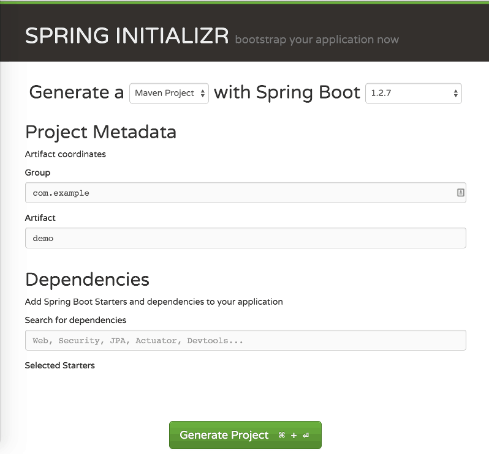
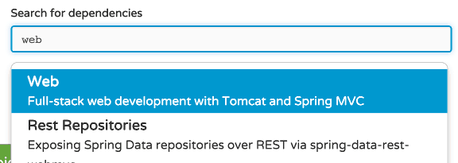

Three years ago I wrote this tutorial. Things have changed in the Java and Spring landscape, so let's see how much easier it is now to write a simple Spring webapplication.

### Project setup

A while back you had to setup your own Maven project, import all the dependencies you need, set the correct Maven plugins, ... . With Spring Boot it's a lot easier. You go to [start.spring.io](http://start.spring.io) and you just select the dependencies you want, you import the project and you're done! Neat, don't you think? According to [Josh Long](https://youtu.be/SFDYdslOvu8?t=10m2s) it is the second greatest place on the web and you should keep it under your pillow!



Now, since I'm going to create a web project, all I need to do is to enter "Web" in the dependencies textbox and click the **Web** dependency to add it to your application. 



Do the same now for "Thymeleaf" and then you can generate the project, unzip it and import it in your IDE. You now have a completely working Spring application! You don't even have to download Maven, because it comes with a Maven wrapper (mvnw) that can be executed and will install Maven for you.

### Model

For this application I'm going to write a simple model class called **Superhero**, in which I will define four fields with getters/setters and a constructor to initialize the fields:

```java
public class Superhero {
  private String firstName;
  private String lastName;
  private String name;
  private boolean good;
  
  public Superhero(String firstName, String lastName, String name, boolean good) {
    super();
    this.firstName = firstName;
    this.lastName = lastName;
    this.name = name;
    this.good = good;
  }
  
  public String getFirstName() {
    return firstName;
  }
  public void setFirstName(String firstName) {
    this.firstName = firstName;
  }
  
  public String getLastName() {
    return lastName;
  }
  public void setLastName(String lastName) {
    this.lastName = lastName;
  }
  
  public String getName() {
    return name;
  }
  public void setName(String name) {
    this.name = name;
  }
  
  public boolean isGood() {
    return good;
  }
  public void setGood(boolean good) {
    this.good = good;
  }
}
```

### Controller

The next part is the controller. With Spring Web MVC you can easily follow the MVC design pattern. Simply create a new class called **SuperheroController** and annotate it with `@Controller`.

Another annotation I'm going to add to the class is `@RequestMapping("/superhero")` to make sure that the requests for the controller are all beneath the `"/superhero"` path.

Inside the controller I'm going to write a single method to return two superheroes/villains:

```java
@RequestMapping
public ModelAndView getSuperheroes() {
  return new ModelAndView("superheroes", "superheroes", Arrays.asList(
     new Superhero("Clark", "Kent", "Superman", true),
     new Superhero("Siobhan", "McDougal", "Silver Banshee", false)
  ));
}
```

Obviously in real life code you will create proper services to encapsulate the data, but in this tutorial I'm just gonna use it this way. We use `ModelAndView` to define:

- the view name, which is the HTML template that we will define later. In this case we use `"superheroes"` which will resolve to a file called **superheroes.html** inside the **src/main/resources/public** folder
- The model name, which is the name of the model (in this case the list of superheroes) that can be referred to in the view
- The model itself, in this case a list of two superheroes/villains.

### View

The last part of the application is the view itself. If you used start.spring.io you will already have a folder called **src/main/resources/templates**, create a file called superheroes.html inside it, open it and add the following content:

```html
<!DOCTYPE html>
<html lang="en">
  <head>
    <link rel="stylesheet" href="https://maxcdn.bootstrapcdn.com/bootstrap/3.3.5/css/bootstrap.min.css" />
  </head>
  <body>
    <div class="container">
      <table class="table">
        <thead>
          <tr>
            <th>#</th>
            <th>Hero name</th>
            <th>Real name</th>
            <th>Good</th>
          </tr>
        </thead>
        <tbody>
          <!-- TODO: Content -->
        </tbody>
      </table>
    </div>
  </body>
</html>
```

I'm using a simple table here to show the list of heroes and villains. There's nothing special yet in this HTML file. We're just using Twitter Bootstrap here to make our page look a bit decent.

Anyways, inside the `<tbody>` tag we now have to dynamically add rows. With Thymeleaf you use the `th:each` attribute for that. Inside the row we have to show each property, which can easily be done with the `th:text` attribute.

To show the row I use the following code:

```html
<tr th:each="hero, status : ${superheroes}">
  <td th:text="${status.count}">1</td>
  <td th:text="${hero.name}">Hero name</td>
  <td th:text="${hero.firstName + ' ' + hero.lastName}">Real name</td>
  <td>
    <span class="glyphicon glyphicon-ok" th:if="${hero.good}"></span>
    <span class="glyphicon glyphicon-remove" th:unless="${hero.good}"></span>
  </td>
</tr>
```

As you can see, we use `th:each` to loop over the superheroes. The name `${superheroes}` comes from the model name, which we provided earlier in the controller. Also, we define `hero` to be the current hero during the loop, and with the `status` object we can easily retrieve extra information, like `${status.count}` to have a counter for each iteration.

The bottom side uses `th:if` and `th:unless` to show a different icon for when the `${hero.good}` property is `true` or not.

### Running the application

Running the `Application` class as a Java application, or executing the `mvn spring-boot:run` command will run the application. For several IDE's you can also download a plugin that allows you to run the application as a Spring boot app. 


If you go to [http://localhost:8080/superhero](http://localhost:8080/superhero), you'll see that the application already works.


### Configuring Spring Boot

While the application isn't really fancy, we only wrote about 70 lines of Java code, of which more than half of it are getters and setters and other code that could be generated, but we have a functional web application without having to install anything else except an IDE and a JDK.

Spring Boot does a lot of stuff out of the box, but you can usually configure this as well.

For example, if you look at the **src/main/resources** folder you'll see that there is an application.properties file. If we edit this file and add the following properties:

```
server.context-path=/my-app
server.port=9000
```

And you run the application again, you'll see that the previous URL will no longer work, in stead of that you have to go to [http://localhost:9000/my-app/superhero](http://localhost:9000/my-app/superhero).

Also, Thymeleaf can be strict sometimes, and it caches the templates which makes development a bit harder. To disable caching you can add the following property:

```
spring.thymeleaf.cache=false
```

If you don't close a tag (for example `<br>` or `<link rel="" href="">`), or you use a custom element or a custom attribute (like AngularJS directives as `ng-app`, `ng-if`, ...), it will fail to compile. To make it less strict you can use the following property:

spring.thymeleaf.mode=LEGACYHTML5

You will also have to add the **nekhohtml5** dependency:

```xml
<dependency>
  <groupId>net.sourceforge.nekohtml</groupId>
  <artifactId>nekohtml</artifactId>
  <version>1.9.15</version>
</dependency>
```

If you would be using special HTML attributes, or you're not properly closing your elements, then your code will now be working again! You can test it out by changing the `<link />` tag for the Bootstrap CSS, remove the `/>` and simply replace it by `>`. While browsers can perfectly render it, Thymeleaf will throw an error (unless you use **LEGACYHTML5**).

### Conclusion

Three years ago I wrote a similar article to this, but using vanilla Spring 2.5, XML bean configurations, web descriptors, ... . The world change a lot and became a lot easier. In the next few months I will be rewriting most of my old Spring-related articles, translating them from Dutch to English and updating the content to reflect the current state of the Spring framework.

#### Achievement: Wrote your first web application with the Spring framework

If you’re seeing this, then it means you successfully managed to make it through this article. If you’re interested in the full code example, you can find it on [GitHub](https://github.com/g00glen00b/spring-samples/tree/master/spring-boot-webapp).
