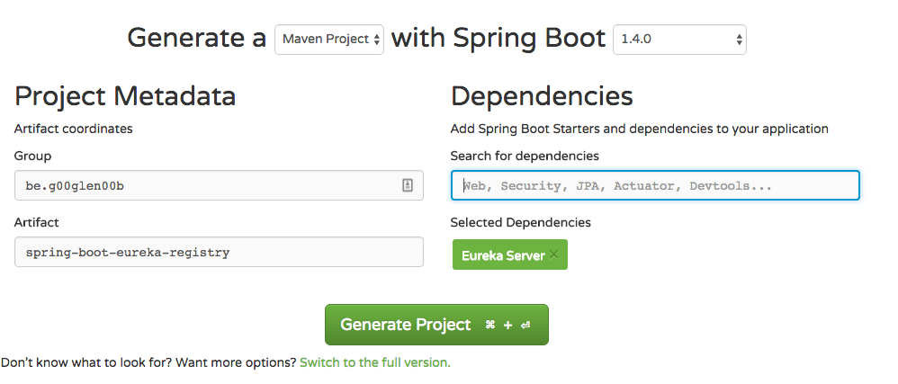
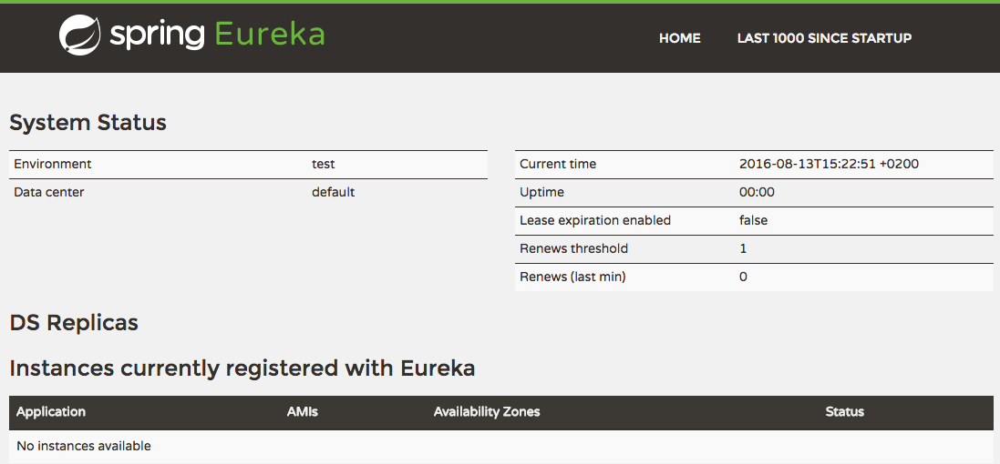
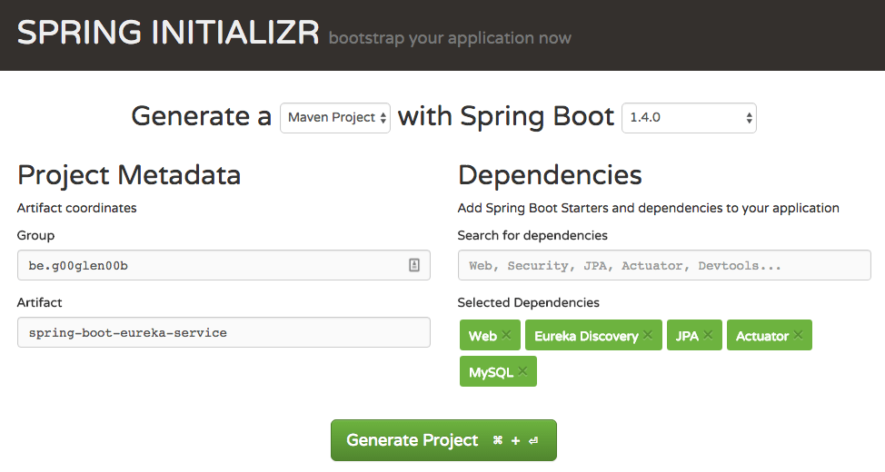
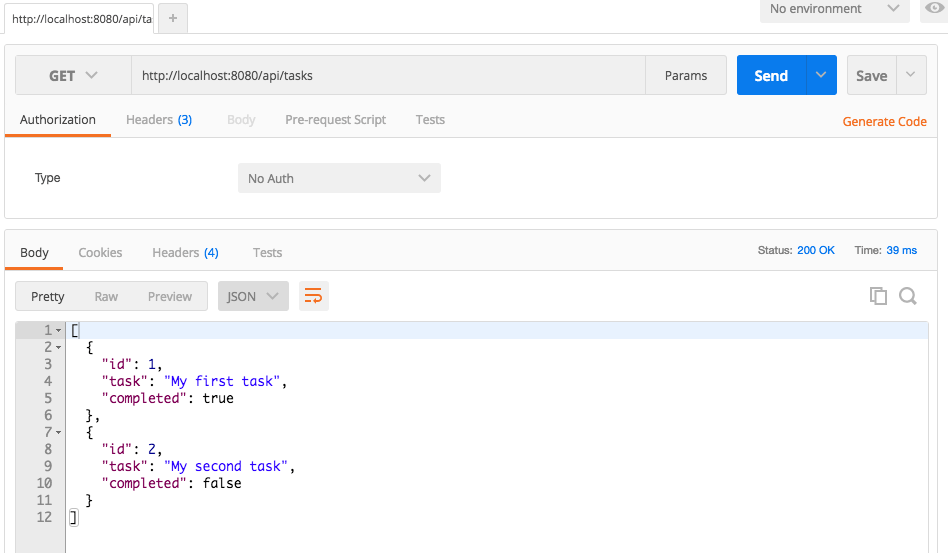
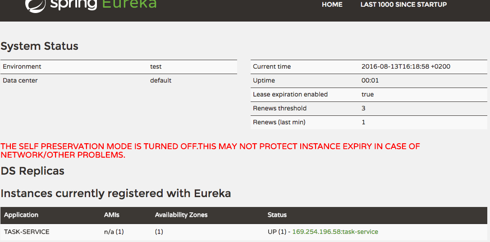

A while back I wrote [a simple REST service](/producing-rest-apis-with-spring/) with [Spring boot](http://projects.spring.io/spring-boot/). While this is quite common, we're also seeing the word "microservice" [pop up more often](https://www.google.com/trends/explore?q=microservice) as well. But what is a microservice and what does [Netflix](https://www.netflix.com) has to do with it and more specifically, what is [Eureka](https://github.com/Netflix/eureka)? Well, in this article I will show you how you can use Eureka with Spring boot and how it relates to microservices.

### What is SOA?

Before I can explain what Eureka does, it's important to know what microservices are. You probably already heard about the term Service Oriented Architecture (SOA). Using this architecture, you will implement business logic as services, so that they can be consumed over the network (using HTTP for example) using a specific protocol (REST, SOAP, ...) rather than writing it all as a whole (monolithic).

This improves reusability, as the business logic does not have to be rewritten every time you need it, but you can just call that service.

Over the years, people learnt how to deal with SOA, and introduced middleware such as an Enterprise Service Bus (ESB) to make common tasks with a service oriented architecture easier, such as messaging, data translation, ... .

### What are microservices?

Well, microservices are pretty much a specific implementation of SOA. With SOA we already know that we should provide services, but how big/small should these services be? Well, if you believe in microservices, you should keep your microservices as small as possible, having a very specific scope.

Let's say we have a todo application where users can sign up/log in to create some tasks/todo items, we can first try to define the basic concepts within the application:

- Users
- Tasks
- Authentication

Well, these three concepts can be seen as microservices. You have a task service to retrieve tasks, a user service to retrieve the user his details (profile picture, name, ...) and you have an authentication service that can be used to sign up/sign in using your credentials.

Why would you create all these services? Well, in an organization, things like users and authentication are commonly used. You might have 30 applications, all calling the same user table in the same database, doing similar requests (looking up by username, finding all users, ...), they'll all have to authenticate somehow. Well, rather than rewriting all these things, you can provide them as services. Microservices are based on a principle most of us were spoon-fed during college times; loose coupling. By introducing loose coupling to webservices aka microservices, we can easily change the entire technology stack without having to change everything, it's easier to understand what the specific microservice does, ... .

So... what's the difference with SOA? Well, the philosophy behind microservices goes beyond defining small, isolated services, they also take a look at their lifecycle. Microservices also come with a whole DevOps philosophy, should be automatically deployed, should be able to be scaled easily, ... . The DevOps philosophy becomes really important when you have to deal with a lot of services, which is very common in a microservice oriented architecture.

### What is Eureka?

Now, if you imagine all these tiny services, you'll probably realize that you will end up with **a lot** of services. Depending on how fine grained your microservices are and how far you go, you can end up with hundreds of microservices.

But what if you change the location and port of your microservice? Are you going to change it everywhere you use the microservice? If we take a look back at the task application and you have a user microservice, it will probably be used very commonly, are you really going to change the location in all applications? Also, how are you going to keep track of which microservices there are?

Well, what if we had the possibility to make all microservices register themself in some kind of a list, containing their name, IP and port, then those problems are gone as well. Well, that's exactly what Eureka does. Eureka is a service registry microservice, which allows all microservices to sign themself up to that list.

Now, most of the questions we introduced at the start of this article are solved... except, what does Netflix has to do with this? You probably already know Netflix. Well, Netflix uses microservices behind their streaming service, and has millions of people using those microservices indirectly. They have a huge [open source portfolio](https://github.com/netflix) as well, and have introduced several components they use that help tackling problems that rise when using microservices and one of these components is [Eureka](https://github.com/Netflix/eureka).

### Setting up a service registry with Spring boot

Now that we know what Eureka is, it's time to combine the powers of Spring and Netflix!


Let's open the [Spring Initializr](http://start.spring.io/) and create a project with the **Eureka Server** dependency and import it in your IDE.



Open the main class and add the `@EnableEurekaServer` annotation to it, like this:

```java
@SpringBootApplication
@EnableEurekaServer
public class SpringBootEurekaRegistryApplication {

}
```

After that, open the **application.properties** or **application.yml** file and add the following properties:

```
# application.properties
server.port=8761

eureka.instance.hostname=localhost
eureka.client.registerWithEureka=false
eureka.client.fetchRegistry=false
eureka.server.enableSelfPreservation=false
```

```yaml
# application.yml
server:
  port: 8761

eureka:
  instance:
    hostname: localhost
  client:
    register-with-eureka: false
    fetch-registry: false
  server:
    enable-self-preservation: false
```

Now, if we run this application now and go to [http://localhost:8761](http://localhost:8761), you'll see there's something there already.



Well, that is our service registry dashboard, up & running, without much trouble.

### Creating a REST service

Now, a service registry without a service is obviously not really useful at all. So, let's create another project with the [Spring Initializr](http://start.spring.io/), but this time add the dependencies **Web**, **Eureka Discovery**, **JPA**, **MySQL** and **Actuator**. Did I already tell you how much I like the Spring Initializr? It feels like I'm shopping in a developer world "Let's have this, and that, and that as well..".



Now, import this project in your IDE as well, and let's get started!

### Setting up the data model

I'm going to rush this part a bit since I already explained most of this in my previous tutorial about writing REST services with Spring, but if you know how to make REST services with Spring, you should feel familiar with this.

First, let's create an entity called `Task`:

```java
@Entity
public class Task {
    @Id
    @GeneratedValue(strategy = GenerationType.IDENTITY)
    private Long id;
    @Column
    private String task;
    @Column
    private boolean completed;
  
    public Task() {
    }

    public Task(String task, boolean completed) {
        this(null, task, completed);
    }

    public Task(Long id, String task, boolean completed) {
        this.id = id;
        this.task = task;
        this.completed = completed;
    }

    public Long getId() {
        return id;
    }

    public String getTask() {
        return task;
    }
    public void setTask(String task) {
        this.task = task;
    }

    public boolean isCompleted() {
        return completed;
    }
    public void setCompleted(boolean completed) {
        this.completed = completed;
    }
}
```

And create a repository as well with Spring Data JPA:

```java
public interface TaskRepository extends JpaRepository<Task, Long> {
}
```

### Creating a service

Now that we have our data model and repository, it's time to create our DTO:

```java
public class TaskDTO {
    private Long id;
    private String task;
    private boolean completed;

    public TaskDTO() {
    }

    public TaskDTO(String task, boolean completed) {
        this(null, task, completed);
    }

    public TaskDTO(Long id, String task, boolean completed) {
        this.id = id;
        this.task = task;
        this.completed = completed;
    }

    public Long getId() {
        return id;
    }

    public String getTask() {
        return task;
    }
    public void setTask(String task) {
        this.task = task;
    }

    public boolean isCompleted() {
        return completed;
    }
    public void setCompleted(boolean completed) {
        this.completed = completed;
    }
}
```

If you wonder why I didn't provide a setter for my ID in both my entity and my DTO, well that's because you should never be able to edit the ID, so a setter is not necessary. The only time you might want to provide an ID is during the creation of the object, so that's why I only allow to provide an ID with a constructor and nowhere else.

Now, the next part is the service itself, which will use the repository, and map all the entities to their DTO:

```java
@Service
public class TaskServiceImpl {
    @Autowired
    private TaskRepository repository;

    public List<TaskDTO> findAll() {
        return repository.findAll().stream()
            .map(entity -> new TaskDTO(entity.getId(), entity.getTask(), entity.isCompleted()))
            .collect(Collectors.toList());
    }
}
```

### Writing the REST controller

Now, for the last part of our REST service, we'll have to create a REST controller that uses the service:

```java
@RestController
@RequestMapping("/api/tasks")
public class TaskController {
    @Autowired
    private TaskServiceImpl service;

    @RequestMapping(method = RequestMethod.GET)
    public List<TaskDTO> findAll() {
        return service.findAll();
    }
}
```

### Connecting to the database

Now, before our service is ready, we have to connect to our database. Open **application.properties** (or **application.yml**) and add the properties to connect to your database. I have a local MySQL running, so I'm going to enter these details:

```
# application.properties
spring.datasource.url=jdbc:mysql://localhost:3306/demo?useSSL=false
spring.datasource.username=dbuser
spring.datasource.password=dbp4ss
spring.datasource.platform=mysql
```

```yaml
# application.yml
spring:
  datasource:
    url: jdbc:mysql://localhost:3306/demo?useSSL=false
    username: dbuser
    password: dbp4ss
    platform: mysql
```

Since I'm not going to create endpoints for creating/updating/deleting tasks, I'll insert some mock data and I'll also create the schema using Spring boot.

First of all create a file called **schema.sql** in the **src/main/resources** folder:

```sql
CREATE TABLE IF NOT EXISTS task (
  id INT(11) NOT NULL AUTO_INCREMENT,
  task VARCHAR(32) NOT NULL,
  completed bit(1),
  PRIMARY KEY (id)
) ENGINE=InnoDB  DEFAULT CHARSET=latin1;
```

Now create a file called **data.sql** in the same folder:

```sql
DELETE FROM task;
INSERT INTO task (task, completed) VALUES
  ('My first task', true),
  ('My second task', false);
```

Now that we have that, it's time to run our application. If you go to [http://localhost:8080/api/tasks](http://localhost:8080/api/tasks), you'll see that your REST API is working fine.



### Registering your service with Eureka

Now that we have a working REST service, it's time to register the service with Eureka. First of all, open the main class and add the `@EnableEurekaClient` annotation:

```java
@SpringBootApplication
@EnableEurekaClient
public class SpringBootEurekaServiceApplication {

    public static void main(String[] args) {
        SpringApplication.run(SpringBootEurekaServiceApplication.class, args);
    }
}
```

if we have that annotation, add the following properties to **application.properties** (or **application.yml**):

```
# application.properties
spring.application.name=task-service
eureka.client.serviceUrl.defaultZone=http://localhost:8761/eureka/
eureka.client.healthcheck.enabled=true
eureka.instance.statusPageUrlPath=/info
eureka.instance.healthCheckUrlPath=/health
```

```yaml
# application.yml
spring:
  application:
    name: task-service
eureka:
  client:
    healthcheck:
      enabled: true
    service-url:
      default-zone: http://localhost:8761/eureka/
  instance:
    status-page-url-path: /info
    health-check-url-path: /health
```

As you can see, we gave the application a name (task-service) and provided details to the Eureka service registry, and also the info and health path, allowing Eureka to correctly remove the service instance when it's down. To make this work, you need the **spring-boot-starter-actuator** dependency like we used.

Now, if you run the application again and go back to the Eureka dashboard ([http://localhost:8761/](http://localhost:8761/)), you'll see that our new REST service is now registered:



Now, if we stop the service, you'll see that the task service is unregistered, so any client using Eureka will not use a service that is no longer existing.

If you run the application twice, but using a different port you'll see that Eureka registers both instances.


This is already quite nice, since we now have a single dashboard showing what microservices there are and where they are running. You can also provide additional metadata with your application, which can be useful if you're using Swagger for example and you want to add the location to the Swagger tester to the metadata of your microservice.

In the next article I will be using Spring's RestTemplate with Netflix's Ribbon to show you some more advantages of using a service registry like Eureka.

#### Achievement: Eureka! We can use microservices now!

If you’re seeing this, then it means you successfully managed to make it through this tutorial. As usual, the code can be found on [GitHub](https://github.com/g00glen00b/spring-samples/tree/master/spring-boot-eureka).
