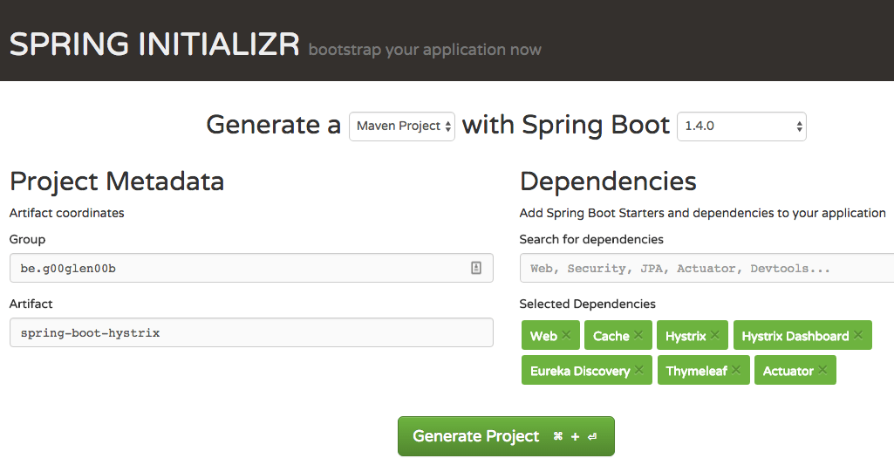
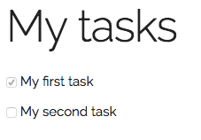
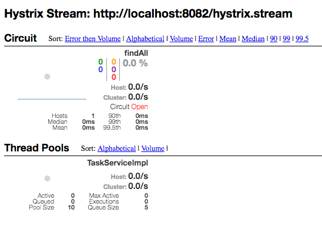
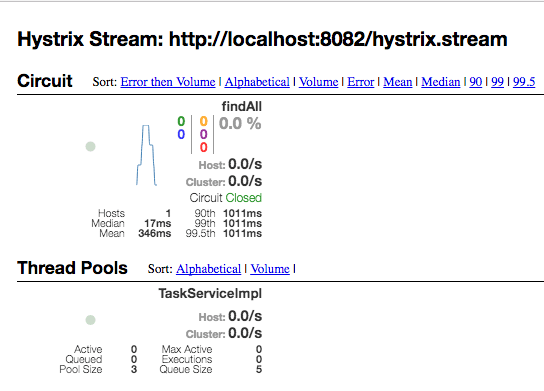
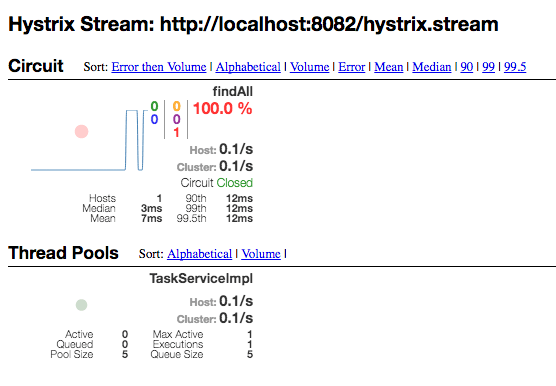
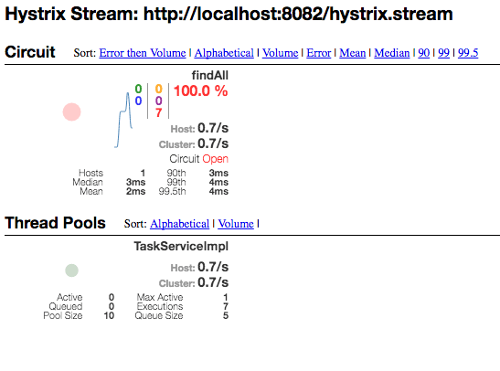

Recently [I wrote](/using-netflix-stack-spring-boot-ribbon/) [some articles](/using-the-netflix-stack-with-spring-boot-eureka/) about the various Netflix components and how they fit into a microservice architecture. In this article I will talk about the next component that is usable with Spring boot and that's Hystrix.

An issue that occurs when having a microservice architecture is the possibility of failures to happen. With many services communicating over the network, a network issue might occur. You don't want users to be stumbling over a page loading very slowly (due to network timeouts) and then arriving on an error page.

Hystrix does more than that though. It allows you to configure many things, such as the thread pool, the circuit breaker itself and has various metrics as well and a dashboard.

### Setting up a project

In this project I will work upon the [Eureka example](https://github.com/g00glen00b/spring-samples/tree/master/spring-boot-eureka) I made earlier. I'll re-use both the service registry and the service itself. However, for the client project I will use a complete new project with several dependencies such as **Web**, **Eureka Discovery**, **Thymeleaf**, **Hystrix**, **Hystrix Dashboard**, **Cache** and **Actuator**.



After opening the project it's time to create a basic application up and running.

### Creating a web application

Before we start creating the application itself, we need to configure Eureka. As you [might recall](/using-the-netflix-stack-with-spring-boot-eureka/), Eureka is our service registry, containing a list of all our microservices and where they're running. So, open **application.properties** (or **application.yml**) and add the following properties to configure the Eureka location:

```
eureka.client.healthcheck.enabled=true
eureka.client.serviceUrl.defaultZone=http://localhost:8761/eureka/
eureka.instance.statusPageUrlPath=/info
eureka.instance.healthCheckUrlPath=/health
```

Using YAML:

```yaml
eureka:
  client:
    healthcheck:
      enabled: true
    service-url:
      default-zone: http://localhost:8761/eureka/
  instance:
    status-page-url-path: /info
    health-check-url-path: /health
```

The way Spring boot + Eureka works is that microservices are registered with their application name. To configure an application name we use the `spring.application.name` property like this:

```
spring.application.name=task-app
```

Using YAML:

```yaml
spring:
  application:
    name: task-app
```

I'm also going to use Thymeleaf with the **LEGACYHTML5** mode so I configured that as well:

```yaml
spring:
  thymeleaf:
    cache: false
    mode: LEGACYHTML5
```

I do have to add an additional dependency called **nekohtml** to make the Thymeleaf mode work though:

```xml
<dependency>
    <groupId>net.sourceforge.nekohtml</groupId>
    <artifactId>nekohtml</artifactId>
</dependency>
```

### Setting up the service

To communicate with our microservice, we need to enable Eureka discovery by adding the `@EnableEurekaClient` annotation to our main class:

```java
@SpringBootApplication
@EnableEurekaClient
public class SpringBootHystrixApplication {
     // ...
}
```

We also have to add a `RestTemplate` bean like this:

```java
@Bean
@LoadBalanced
public RestTemplate restTemplate() {
    return new RestTemplate();
}
```

We'll also need a DTO that contains the structure of the data that is sent through our microservice. In this case I'll just copy the DTO from the microservice itself, called `TaskDTO`:

```java
public class TaskDTO {
    private Long id;
    private String task;
    private boolean completed;

    public TaskDTO() {
    }

    public TaskDTO(String task, boolean completed) {
        this(null, task, completed);
    }

    public TaskDTO(Long id, String task, boolean completed) {
        this.id = id;
        this.task = task;
        this.completed = completed;
    }

    public Long getId() {
        return id;
    }

    public String getTask() {
        return task;
    }
    public void setTask(String task) {
        this.task = task;
    }

    public boolean isCompleted() {
        return completed;
    }
    public void setCompleted(boolean completed) {
        this.completed = completed;
    }
}
```

The service itself will use `RestTemplate` to make a call to the service using the Ribbon interceptor to look up the hostname through Eureka:

```java
@Service
public class TaskServiceImpl {
    @Autowired
    private RestTemplate restTemplate;
    private final Logger logger = LoggerFactory.getLogger(getClass());

    public TaskDTO[] findAll() {
        logger.info("Calling microservice");
        return restTemplate.getForObject("http://task-service/api/tasks", TaskDTO[].class);
    }
}
```

### Writing a controller

Now, before we write our controller, we need a template (using Thymeleaf). I'm going to recycle this template form one of my earlier articles, so here it is:

```html
<!DOCTYPE html>
<html lang="en" xmlns="http://www.w3.org/1999/xhtml" xmlns:th="http://www.thymeleaf.org">
<head>
  <link rel="stylesheet" href="//fonts.googleapis.com/css?family=Raleway:400,300,600" />
  <link rel="stylesheet" href="//cdnjs.cloudflare.com/ajax/libs/normalize/4.0.0/normalize.min.css" />
  <link rel="stylesheet" href="//cdnjs.cloudflare.com/ajax/libs/skeleton/2.0.4/skeleton.min.css" />
  <title>Task application</title>
</head>
<body>
  <div class="container">
    <h1>My tasks</h1>
    <div th:each="task : ${tasks}">
      <input type="checkbox" name="completed" th:checked="${task.completed}" disabled />
      <span th:text="${task.task}"></span>
    </div>
  </div>
</body>
</html>
```

And finally, our controller looks like:

```java
@Controller
@RequestMapping("/")
public class TaskController {
    @Autowired
    private TaskServiceImpl service;

    @RequestMapping(method = RequestMethod.GET)
    public ModelAndView findAll() {
        return new ModelAndView("tasks", "tasks", service.findAll());
    }
}
```

So, if we run the application now (and the Eureka registry and the task service as well), you'll see that it properly works.



However, what happens when the REST API becomes unresponsive? To test this behaviour out by yourself add a breakpoint in your service and keep it there for a while. Currently, the application will keep loading, however we can fix that by configuring some timeouts to the `RestTemplate`:

```java
@Bean
@LoadBalanced
public RestTemplate restTemplate(ClientHttpRequestFactory factory) {
    return new RestTemplate(factory);
}

@Bean
public ClientHttpRequestFactory clientHttpRequestFactory() {
    HttpComponentsClientHttpRequestFactory factory = new HttpComponentsClientHttpRequestFactory();
    factory.setReadTimeout(5000);
    factory.setConnectTimeout(5000);
    return factory;
}
```

If we would run the application now and wait 5 seconds, we get the default error page:


However, it's not really a nice solution. Users visiting your application will have to wait 5 seconds to get served an error page. But what if we could improve that by using Hystrix?

### Enabling Hystrix

To enable Hystrix, all we have to do is add a simple annotation to our main class called `@EnableHystrix`:

```java
@SpringBootApplication
@EnableEurekaClient
@EnableHystrix
public class SpringBootHystrixApplication {
    // ...
}
```

Now we open the `TaskServiceImpl` and add the `@HystrixCommand` annotation:

```java
@HystrixCommand(fallbackMethod = "findAllFallback")
public TaskDTO[] findAll() {
    logger.info("Calling microservice");
    return restTemplate.getForObject("http://task-service/api/tasks", TaskDTO[].class);
}
```

With this command we tell Hystrix to use the `findAllFallback()` method as a fallback when the `findAll()` method fails. For now, let's add the following method:

```java
public TaskDTO[] findAllFallback() {
    return new TaskDTO[] { new TaskDTO("A dummy task", true) };
}
```

So, if we run the application again and make it time out again, we'll see a completely different result. The application shows us our dummy task now, rather than showing us an error page.


So, this means the Hystrix fallback is executed quite nicely, but it's very hard to see what's happening under the hood, so it's time to add the Hystrix dashboard to the application and finetune the Hystrix command a bit.

Since we've set the timeout to 5 seconds, it would probably be better if we set the timeout of the Hystrix command to about 5 seconds as well. I'm also going to set a lower error threshold percentage (10%) and a sleep time frame of 20 seconds:

```java
@HystrixCommand(fallbackMethod = "findAllFallback", commandProperties = {
    @HystrixProperty(name = "circuitBreaker.sleepWindowInMilliseconds", value = "20000"),
    @HystrixProperty(name = "execution.isolation.thread.timeoutInMilliseconds", value = "5000"),
    @HystrixProperty(name = "circuitBreaker.errorThresholdPercentage", value = "10")
})
public TaskDTO[] findAll() {
    logger.info("Calling microservice");
   return restTemplate.getForObject("http://task-service/api/tasks", TaskDTO[].class);
}
```

Now, by doing this, initially users will have to wait 5 seconds as well to get the fallback, but if the amount of errors reaches the threshold value, the circuit will open and the fallback will be used as the default for a certain time window. This gives the normal mechanism some time to recover, after which the circuit will close again.

### Monitoring Hystrix

Now, to enable the Hystrix dashboard we have to add another annotation to the main class called `@HystrixDashboard`:

```java
@SpringBootApplication
@EnableEurekaClient
@EnableHystrix
@EnableHystrixDashboard
public class SpringBootHystrixApplication {
     // ...
}
```

Now, restart the application and next to opening the application, open the Hystrix Monitor as well by going to [http://localhost:8082/hystrix/](http://localhost:8082/hystrix/) (in my case I'm running the application on port 8082). On that page you have to provide an URL to an Hystrix stream, for running locally you should be able to use [http://localhost:8082/hystrix.stream](http://localhost:8082/hystrix.stream).

Once opened, you should see something like this:



Now, let's see what happens if we open the application again without setting any breakpoints. If we refresh a few times we see that the Hystrix monitor shows us that there were a few successfully loaded requests.



The important thing to notice here is that the error count is still zero and that the circuit itself is closed. Now, if we make the requests fail (by either adding a breakpoint or by completely turning off the REST service), you'll see the error count go up:



Even though we received an error, we can see that the circuit is still closed. However, when we send a few more failed requests, you'll see that the circuit goes open.



When the circuit goes open, it means that by default all traffic will directly go to the fallback method rather than trying on the original method first. This allows the REST service to restore itself if it was getting too much traffic. You can notice this by taking a look at the log when the circuit is open. Normally you should see a log entry for each call, but when the circuit is open this will not happen.

### Implementing a proper fallback

In this case, our fallback doesn't make much sense. However, we could store the results in a cache somewhere and restore the results from the cache in the fallback method.

To do that, we first have to add a cache provider like Ehcache:

```xml
<dependency>
    <groupId>net.sf.ehcache</groupId>
    <artifactId>ehcache-core</artifactId>
    <version>2.6.5</version>
</dependency>
```

Now we have to configure Ehcache by creating an **ehcache.xml** file in **src/main/resources**:

```xml
<?xml version="1.0" encoding="UTF-8"?>
<ehcache xmlns:xsi="http://www.w3.org/2001/XMLSchema-instance" xsi:noNamespaceSchemaLocation="http://www.ehcache.org/ehcache.xsd"
         updateCheck="true" monitoring="autodetect" dynamicConfig="true">

    <cache name="tasks"
           maxElementsInMemory="100" eternal="true"
           overflowToDisk="false"
           memoryStoreEvictionPolicy="LFU" transactionalMode="off">
    </cache>
</ehcache>
```

After that we have to configure Spring boot to use this caching config file by adding the `spring.cache.ehcache.config` property to our application properties:

```
spring.cache.ehcache.config=classpath:ehcache.xml
```

Or using YAML:

```yaml
spring:
  application:
    name: task-app
  cache:
    ehcache:
      config: classpath:ehcache.xml
```

The last step is to enable caching by adding the `@EnableCaching` annotation to the main class:

```java
@SpringBootApplication
@EnableEurekaClient
@EnableCaching
@EnableHystrix
@EnableHystrixDashboard
public class SpringBootHystrixApplication {
     // ...
}
```

The next step is to add caching to the `findAll()` method in `TaskServiceImpl` by adding the `@CachePut` annotation. I explained most of these annotations in my previous article about caching:

```java
@CachePut("tasks")
@HystrixCommand(fallbackMethod = "findAllFallback", commandProperties = {
    @HystrixProperty(name = "circuitBreaker.sleepWindowInMilliseconds", value = "20000"),
    @HystrixProperty(name = "execution.isolation.thread.timeoutInMilliseconds", value = "5000"),
    @HystrixProperty(name = "circuitBreaker.errorThresholdPercentage", value = "10")
})
public TaskDTO[] findAll() {
    logger.info("Calling microservice");
    return restTemplate.getForObject("http://task-service/api/tasks", TaskDTO[].class);
}
```

The fallback method is a bit trickier since there is no annotation that simply retrieves from the cache, but we can write it ourself. First of all autowire the `CacheManager` in our service:

```java
@Autowired
private CacheManager cacheManager;
```

Make sure you're importing the one from Spring and not the one from EhCache. After that we should reimplement the fallback method like this:

```java
public TaskDTO[] findAllFallback() {
    if (cacheManager.getCache("tasks") != null && cacheManager.getCache("tasks").get(SimpleKey.EMPTY) != null) {
        return cacheManager.getCache("tasks").get(SimpleKey.EMPTY, TaskDTO[].class);
    } else {
        return null;
    }
}
```

In this method I'm checking if the tasks cache exists and if it has an entry for `SimpleKey.EMPTY`. The Spring cache abstraction usually uses the method parameters to generate a key, but when you have no arguments it uses `SimpleKey.EMPTY`. If the cache manager has a tasks cache and it has an entry for `SimpleKey.EMPTY` I'm returning that, otherwise I'm returning `null`.

If you rerun the application now and fire a few requests and then stop the REST service, you'll see that you still get a proper response. In stead of retrieving our dummy task, it will now load the same tasks from cache. You might still want to show a warning to the users that some functionality may no longer work, but fetching the tasks from cache in case of a failure might be a proper way to handle failures in this case.

#### Achievement: No failures with Hystrix!

If you’re seeing this, then it means you successfully managed to make it through this tutorial. As usual, the code can be found on [GitHub](https://github.com/g00glen00b/spring-samples/tree/master/spring-boot-hystrix).
