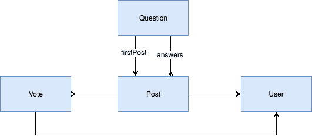
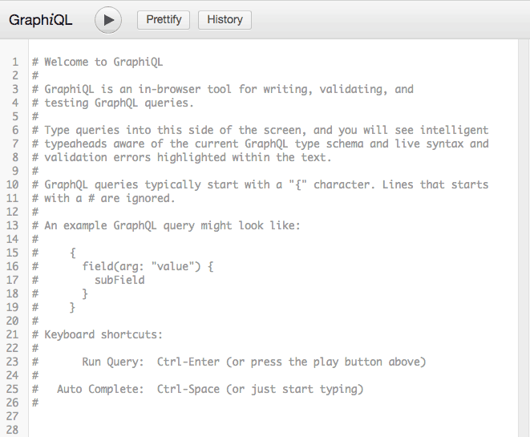
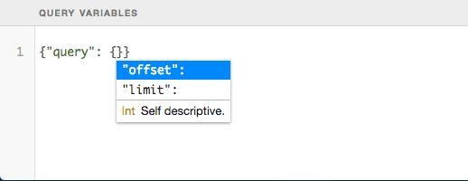

A while back, I wrote [a tutorial](/graphql-spring-boot/) about creating a GraphQL API using Java, followed by a web application using Angular and Apollo. Back then, I also mentioned that Apollo has a server-side part as well, which allows you to create GraphQL API's on Node.js. And today, we're going to explore that option!


### Setting up a Node.js project

To set up a Node.js project from scratch, we need to install a few dependencies:

```
npm install --save apollo-server-express body-parser express graphql graphql-tools graphql-tag mongoose
```

These dependencies are mostly related to Express, a library which allows us to bootstrap a webserver and to Apollo + GraphQL. The only exception is Mongoose, which is a Node.js MongoDB client, which we'll use for persistence.

I'm also going to install a few dev dependencies, mostly Babel-related so that I can use the newest JavaScript features:

```
npm install --save-dev babel-cli babel-preset-node6 babel-preset-stage-2 nodemon
```

After that, you can use the following start script to run the application:

```
nodemon --watch src --exec babel-node src/index.js
```

This script will watch the source directory, and run Babel + Node.js to run our project. The next step to make this work is to create the actual **src/index.js** file. Within this file I'm opening a connection to MongoDB, and I'm creating two endpoints with Express:

1. A `/graphql` endpoint which will be the entrypoint for our GraphQL API
2. A `/graphiql` endpoiont which contains a visual GraphQL tester to test out the API

```javascript
import express from 'express';
import bodyParser from 'body-parser';
import mongoose from 'mongoose';
import schema from './schema';
import {graphiqlExpress, graphqlExpress} from 'apollo-server-express';

const app = express();
mongoose.connect('mongodb://localhost:27017/local');
app.use('/graphql', bodyParser.json(), graphqlExpress({schema}));
app.use('/graphiql', graphiqlExpress({endpointURL:'/graphql'}));
app.listen(3000, () => console.log('Application started on port 3000'));
```

As you can see, we're using the the Apollo library to bootstrap both endpoints. The `graphqlExpress` endpoint does require a `schema` property though, which we'll create in a moment.

### Defining our schema

Now that the application is set up, it's time to create the GraphQL schema itself. To do this, we need to create a file called **schema/index.js** and define our type definitions. In my case, I want to create some kind of Q&A platform where people can ask questions, and other people can answer them. In order to do this, I created the following schema:

```javascript
const typeDefs = `
  type Query {
    questions(query: Pagination!): [Question]
    questionCount: Int
    question(id: ID!): Question
    user(id: ID!): User
  }
  
  type Mutation {
    createQuestion(input: QuestionInput!): Question
    createAnswer(input: PostInput!): Post
    createUser(input: UserInput!): User
    createVote(input: VoteInput!): Vote
  }
  
  type Question {
    _id: ID!
    title: String
    firstPost: Post
    answers: [Post]
  }
  
  type Post {
    _id: ID!
    content: String
    createdAt: String
    author: User
    votes: [Vote]
    voteCount: Int
    question: Question
    isQuestion: Boolean
  }
  
  type User {
    _id: ID!
    username: String
    posts(query: Pagination!): [Post]
    postCount: Int
  }
  
  type Vote {
    _id: ID!
    author: User
    type: String
  }
  
  input Pagination {
    offset: Int
    limit: Int    
  }
  
  input QuestionInput {
    title: String!
    content: String!
    authorId: ID!
  }
  
  input PostInput {
    questionId: ID!
    content: String!
    authorId: ID!
  }
  
  input UserInput {
    username: String!
  }
  
  input VoteInput {
    postId: ID!
    type: String
  }
`;
```

Visually, it means that my model looks like this:



Each question contains one or multiple posts. Each answer and question becomes a post, containing information about the author, the votes it had and the content itself. To group these posts per questions, there is also a question model, which contains both the `firstPost` property, which is a link to the actual question post, and a list of zero or many answer posts.

### Defining a Mongoose schema

Mongoose, a popular Node.js library for MongoDB, requires a schema to work against, so we'll have to properly map our model. In this case, I'll be using three separate collections; a question, post and user schema. Only the votes won't get their own schema, they'll remain embedded within the post documents.

This is an example of how I'll define the Mongoose models:

```javascript
import mongoose from 'mongoose';

const Schema = mongoose.Schema;

const questionSchema = new Schema({
  title: String,
  firstPostId: Schema.Types.ObjectId,
  answerIds: [Schema.Types.ObjectId]
}, {collection:'Question'});

export default mongoose.model('Question', questionSchema);
```

Rather than using a single document, I defined multiple documents, and linked those using the IDs as you can see here. The same applies to the other schemas as well:

```javascript
import mongoose from 'mongoose';

const Schema = mongoose.Schema;

const postSchema = new Schema({
  content: String,
  authorId: Schema.Types.ObjectId,
  createdAt: {type: Date, default: Date.now},
  questionId: Schema.Types.ObjectId,
  votes: [{
    userId: Schema.Types.ObjectId,
    status: String
  }]
}, {collection:'Post'});

export default mongoose.model('Post', postSchema);
```

```javascript
import mongoose from 'mongoose';

const Schema = mongoose.Schema;

const userSchema = new Schema({
  username: String,
  postIds: [Schema.Types.ObjectId]
}, {collection:'User'});

export default mongoose.model('User', userSchema);
```

### Writing resolvers

GraphQL requires us to set up two things, our type definitions and resolvers. These resolvers allow us to create a custom mapping for certain properties. As we've just seen, we'll use IDs to link documents from various MongoDB collections. In our GraphQL endpoint on the other hand we want to link these objects together, so we'll use a resolver to do that.

Our root queries (which can be found within the `Query` type) and our mutations (which can be found in the `Mutation` type) also require resolvers to properly make the calls.

Since these resolvers tend to grow, I'm going to define them in separate files, for example, for the query resolver, this will look like this:

```javascript
import Question from '../models/Question';
import User from '../models/User';
import {promisify} from '../helpers';

const resolvers = {
  questions: (_, args) => promisify(Question.find({}).skip(args.query.offset).limit(args.query.limit)),
  question: (_, args) => promisify(Question.findById(args.id)),
  questionCount: () => promisify(Question.count()),
  user: (_, args) => promisify(User.findById(args.id))
};

export default resolvers;
```

These resolvers match the properties of the `Query` type. The arguments (for example for pagination), are passed as the second parameter (`args`). These can be used with Mongoose to skip and limit the collection.

Since these results will come in asynchronously, we need to use promises so that Apollo can handle those. By default, Mongoose doesn't work with promises, so I defined a custom helper called `promisify` to convert the query to a promise:

```javascript
const promisify = query => new Promise((resolve, reject) => {
  query.exec((err, data) => {
    if (err) reject(err);
    else resolve(data);
  });
});

export {promisify};
```

This function will call the `exec()` function for the given query, and if it returns an error, it will reject the promise, and if it contains results, it will resolve the given promise.

### Registering the resolvers

The final step is to register the resolvers for each type. Since I defined these in separate JavaScript files, I'll have to import them into the **schema/index.js** file and use them properly:

```javascript
const resolvers = {Query, Mutation, Question, Post, User, Vote};
```

If you name the imports similar to the type definitions (eg. the query resolver becomes `Query`, ...), you can use the enhanced object literals and just list the resolvers that way. Now that we have the `typeDefs` and `resolvers`, we can export the schema:

```javascript
export default makeExecutableSchema({typeDefs, resolvers});
```

### Writing mutations

Mutations are very similar to queries, you define a type (`Mutation`), and write resolvers for them. These type definitions usually rely on input parameters, so you'll probably have to define one or multiple input type like we did before (`QuestionInput`, `PostInput`, `UserInput`, `VoteInput`).

So, just like before, we'll create a separate resolver file for mutations, and make our calls in here. If we use creating questions as an example, we know we'll have to do three things:

1. Create a question document
2. Create a post document
3. Link the post document to the user document

To handle these three steps, I defined three separate functions:

```javascript
const createQuestion = (id, title, firstPostId) => new Promise((resolve, reject) => {
  Question.create({title, firstPostId, _id: id}, (err, result) => {
    if (err) reject(err);
    else resolve(result);
  });
});

const createPost = (id, content, authorId, questionId, isQuestion) => new Promise((resolve, reject) => {
  Post.create({content, authorId, questionId, isQuestion, _id: id}, (err, result) => {
    if (err) reject(err);
    else resolve(result);
  });
});

const appendPostToUser = (authorId, postId) => new Promise((resolve, reject) => {
  User.update({_id: authorId}, {$push: {postIds: postId}}, (err, result) => {
    if (err) reject(err);
    else resolve(result);
  });
});
```

Now that we have these, we can start to define our resolver:

```javascript
const resolvers = {
  createQuestion: (_, args) => {
    const questionId = mongoose.Types.ObjectId();
    const postId = mongoose.Types.ObjectId();
    return Promise.all([
      createQuestion(questionId, args.input.title, postId),
      createPost(postId, args.input.content, args.input.authorId, questionId, true),
      appendPostToUser(args.input.authorId, postId)
    ]).then(result => result[0]);
  }
};

export default resolvers;
```

What happens here is that we pre-generate the object IDs for both the question and the post by using `mongoose.Types.ObjectId`. After that, we can use `Promise.all()` to resolve all three actions. Since we want to return a question (and not the post or the user), we'll then map `result` to `result[0]`. This is all we have to do to create a simplified version of a mutation resolver.

### Testing it out

To test it out, you can run the application using the script that was provided earlier, and then we can go to [http://localhost:3000/graphiql](http://localhost:3000/graphiql). As explained before, this opens the tester for your GraphQL API, and provides useful information such as auto-completion of both type definitions and input variables.



Now that we have our tester, we can try to obtain a list of all questions containing just their title and their vote count. The GraphQL query I'll be using is:

```javascript
query QuestionPage($query: Pagination!) {
  questions(query: $query) {
    _id
    title
    firstPost {
      _id
      voteCount
    }
  }
  questionCount
}
```

Additionally to the title and the vote count, I'm also returning the `_id` fields because they can be useful later on, and the `questionCount` so that I know how many "pages" of content there are.

To provide the pagination input, we define a `$query` variable of the `Pagination` type on the root level, so that we can pass it to the `questions()` call.

This means we'll also have to provide the query variables, which can be done at the bottom of the GraphiQL tester:



In my case I'll be using the following query variables:

```json
{"query": {"offset": 0, "limit": 10}}
```

At this moment, the results will be empty, but we can create a new question through the `createQuestion` mutation.

### Testing out a mutation

Similar to a query, we can test mutations. Before we can create questions, we'll have to create a user first though. This can be done by using the following query:

```graphql
mutation CreateUser($input: UserInput!) {
  createUser(input: $input) {
    _id
    username
  }
}
```

In this case, we can use the query variables to provide the username. Once the user has been saved, we'll return both the `_id` and the `username` field.

After that, you can do another mutation to create a question.

### Why GraphQL

The advantage of GraphQL compared to alternatives like REST is that the consumer can choose which data he wants to fetch. This will solve certain problems, one of these problems being **overfetching**.

Overfetching happens commonly in REST APIs because you can't control which data you want to obtain, and thus, you are usually fetching more information than you actually need. This consumes more bandwidth, and isn't always the best option. With GraphQL on the other hand, you explicitly define which fields you want to obtain.

Another problem that often occurs with REST is **invoking multiple REST APIs**. If you properly designed your REST interface, domains within your application tend to use different REST endpoints. That means that if you want to obtain data over these domains, you'll have to invoke multiple REST calls. With GraphQL you only have a single API, and you use the relations between those types to obtain the proper data.

While GraphQL is great, it certainly isn't the silver bullet for all occasions. An issue you may encounter is the **N + 1 problem**. Due to the nature of resolvers, if you want to obtain the username for all questions, you'll fetch the user object from the database separately for all questions. This will lead to N + 1 database calls. A solution to this problem is **data loaders**. Data loaders will invoke multiple calls at once, so that you no longer have the N + 1 problem.

Another issue is **recursion**. Let's say you have an application that allows nested comments. If you would define a GraphQL query for this, you can't recurse all the way through these comments, because you have to explicitly define which fields to obtain. For example:

```graphql
query Post {
  comments {
    id
    comments {
      id
      comments {
        ...
      }
    }
  }
}
```

Due to this, you are retrieving a fixed amount of levels, and can't obtain all levels recursively. A solution to this problem is to not fetch all levels. When we obtain a list of data, we use pagination to obtain the next batch of items. Shouldn't we apply the same to nested comments? Take a look at Reddit, when a post has too many levels of comments, you'll see a link to view the rest of the comment section, and even there you can have links to go even deeper.

While I didn't post all the code I used to complete this tutorial, you can, as always, find it on [GitHub](https://github.com/g00glen00b/apollo-express-vue-example).
