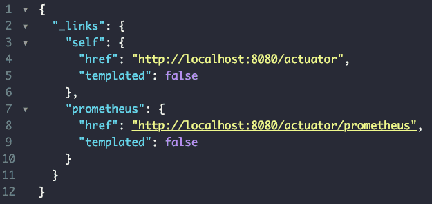
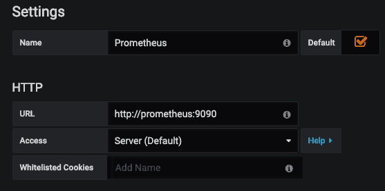

Monitoring is an essential aspect to the maintainability of applications, it’s no surprise that there are many platforms out there that allow you to properly monitor your applications. Usually, monitoring platforms work by using a time series database, which is a database optimised for time-based information, such as application metrics. Then on the other hand you have a visualization part, which allows you to show time-based charts to visualize the data.

Some products offer both combined (eg. Graphite, [Prometheus](https://prometheus.io/)), while other platforms either manage the database part (InfluxDB) and other platforms manage the visualization ([Grafana](https://grafana.com/)). In this example I’ll be combining Prometheus and Grafana and use them to monitor an existing Spring boot application.


### Configuring Spring boot

With Spring boot 2.0, adding Prometheus support to Spring boot became a lot easier thanks to the integration of [Micrometer](https://micrometer.io/). Micrometer can be compared to what slf4j does for logging, but for monitoring in stead. It provides a clean API that can be accessed, and has a bridge to many monitoring platforms, including Prometheus.

To be able to monitor our application within Spring boot, we need to add the following dependencies:

```xml
<dependency>
    <groupId>org.springframework.boot</groupId>
    <artifactId>spring-boot-starter-actuator</artifactId>
</dependency>
<dependency>
    <groupId>io.micrometer</groupId>
    <artifactId>micrometer-registry-prometheus</artifactId>
</dependency>
```

Now you can configure Actuator to expose the Prometheus endpoint by configuring the following property within **application.properties**:

```
management.endpoints.web.exposure.include=prometheus
```

If you run your application now, and you visit [http://localhost:8080/actuator](http://localhost:8080/actuator), you'll see that it exposes a Prometheus endpoint:



If you click that link, you'll see a lot of metrics being exposed in a format that can be easily read by Prometheus.

### Setting up Prometheus and Grafana

Setting up Prometheus and Grafana can be done in various ways. In this example I’ll be using Docker to set up my containers. Both [Prometheus](https://hub.docker.com/r/prom/prometheus/) and [Grafana](https://hub.docker.com/r/grafana/grafana/) have their own, official images ready to be used. I'm not going to cover how to create a Docker container for your application though, as that is already covered within [this tutorial](/docker-spring-boot/).

The setup I’ll be using is the following (using **Docker compose**):

```yaml
version: '3.7'

services:
  movie-quote-service:
    image: g00glen00b/movie-quote-service:0.0.1
    ports:
      - 8080:8080
    networks:
      monitoring:
        aliases:
          - movie-quote-service
  grafana:
    image: grafana/grafana:5.4.3
    ports:
      - 3000:3000
    volumes:
      - ./grafana:/var/lib/grafana
    environment:
      - GF_SECURITY_ADMIN_USER=admin
      - GF_SECURITY_ADMIN_PASSWORD=password
    networks:
      monitoring:
        aliases:
          - grafana
  prometheus:
    image: prom/prometheus:v2.6.1
    ports:
      - 9090:9090
    volumes:
      - ./config/prometheus.yml:/etc/prometheus/prometheus.yml
      - ./prometheus:/prometheus
    networks:
      monitoring:
        aliases:
          - prometheus
networks:
  monitoring:

```

For the Grafana container, I've configured the Grafana username and password by configuring the `GF_SECURITY_ADMIN_USER` and `GF_SECURITY_ADMIN_PASSWORD` environment variables.

Additionally, I've set a volume for **/var/lib/grafana** as this directory will contain all data. This means we can safely delete the container and all data will still remain.

For the Prometheus container we've done a similar thing, by creating a volume for **/prometheus**, we can guarantee that all data will remain.

I've also created a volume for a configuration file called **prometheus.yml**, which will contain the endpoints that Prometheus should poll for data. More about that later.

The final thing I want to mention about this configuration file is that I'm using a network called "monitoring", so that both containers can access each other. The reason why I need two-way communication (in stead of using `depends_on`) is that:

- The Grafana container needs access to the Prometheus database to visualize the data.
- The Prometheus container needs access to Grafana so that it can monitor Grafana as well.

### Configuring Prometheus

As I mentioned earlier, Prometheus has to be configured separately, by creating a **prometheus.yml** file. In this case, I'm going to set up Prometheus so that it will scan the following locations:

- Our Spring boot application
- Prometheus itself
- The Grafana web application

For that purpose, I've created the following configuration file (**prometheus.yml**):

```yaml
scrape_configs:
  - job_name: 'prometheus'
    scrape_interval: 1m
    static_configs:
      - targets: ['localhost:9090']
  - job_name: 'movie-quote-service'
    scrape_interval: 1m
    metrics_path: '/actuator/prometheus'
    static_configs:
      - targets: ['movie-quote-service:8080']
  - job_name: 'grafana'
    scrape_interval: 1m
    metrics_path: '/metrics'
    static_configs:
      - targets: ['localhost:3000']
```

This configuration will scrape all **/prometheus** endpoints every minute, and add the data to its time series database.

### Checking, double checking, ...

If you have the Docker containers running, you should now be able to visit [http://localhost:9090/targets](http://localhost:9090/targets) to see if it's successfully scraping the Prometheus endpoints of your application. For example:


### Setting up Grafana

The next step is to log on to Grafana. Grafana should be running on port 3000 if you used the same Docker configuration, so by visiting [http://localhost:3000/login](http://localhost:3000/login) you should be able to log in as the administrator with the credentials we configured before.

The first step after logging in is to create a datasource, which in our case will be Prometheus. All you have to do is to configure the URL to be **http://prometheus:9090**, for example:



### Creating your own dashboard

After that, you can create a new dashbaord and add a graph to it. If you selected Prometheus as the default datasource, you can now start adding metrics, such as `jvm_memory_used_bytes`, which will contain the memory usage for your application.

If you add this within your query, you'll notice that you get multiple graphs. The reason for this is that Spring boot exposes this under various tags, such as **area** which could be "heap" or "nonheap" and **id** which could be "PS Eden Space", "PS Old Gen" and so on.

If you want to make a graph for all heap memory usage, you could do something like this:


As you can see, you can use a dynamic legend (in this case by using the ID tag) byb using `{{id}}`.

If you save the graph and the dashboard, you can now see your beautiful graphs at work:


Additionally to graphs, you can also configure single stats, which can be interesting for metrics like the uptime of your application:


And there you have it, the start of your own dashboard to monitor your own Spring boot applications.
