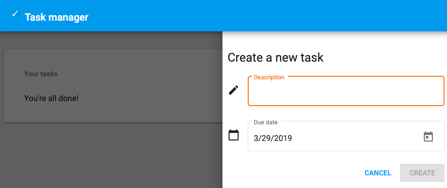
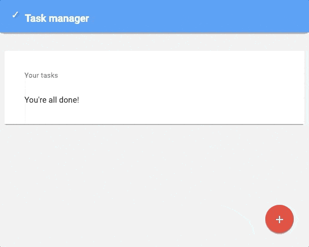

A few years ago, I explored the capabilities of the router framework within [Angular](https://angular.io/). One of the aspects I didn't cover are named router outlets. These outlets are very interesting when it comes to working with master-detail user interfaces. Within this tutorial I'll show you how you can use them to either activate or deactivate a sidebar component within [Angular Material](https://material.angular.io/).



### Defining the main route

The first step, is to define our main routes. In this case, I'm going to develop an application with just one page. Within my **app.module.ts** I created a single route to redirect immediately to **/tasks**.

```typescript
const routes: Route[] = [
  {path: '', pathMatch: 'full', redirectTo: 'tasks'}
];
```

To load this route, I used the `RouterModule.forRoot(routes)` syntax. Additionally, I defined my main route within a separate module called **tasks.module.ts**:

```typescript
const routes: Route[] = [{
  path: 'tasks',
  component: PageOverviewComponent
}];
```

Just like before, I loaded this route using `RouterModule`, but this time I had to use the `RouterModule.forChild(routes)` API. Nothing really special here.

### Defining a child route

Now, to be able to load content within a sidebar, you have to define some child routes. For example, if I want a sidebar within my `PageOverviewComponent`, I'll have to add a child route to the route I just defined.

For example:

```typescript
const routes: Route[] = [{
  path: 'tasks',
  component: PageOverviewComponent,
  children: [
    {path: 'create', component: PageCreateComponent, outlet: 'side'}
  ]
}];
```

Now, child routes look very similar to normal routes, except that we tell Angular which outlet to use. In my case, I'm going to create an outlet for my sidebar, which I'll call `side`.

### Creating the sidebar

Now that our route configuration is complete, we have to add our sidebar to our `PageOverviewComponent`. With Angular Material, I can use the [sidenav](https://material.angular.io/components/sidenav/overview) component to make my life slightly easier:

```html
<mat-sidenav-container>
  <mat-sidenav-content>
    <!-- TODO: Implement actual content -->
  </mat-sidenav-content>
  <mat-sidenav mode="over" position="end" disableClose="true">
    <router-outlet name="side"></router-outlet>
  </mat-sidenav>
</mat-sidenav-container>
```

While this would work great, it would always show the sidebar, which is something I don't really like. To solve this, I'm going to use the `(activate)` and `(deactivate)` events from the router outlet, to toggle the `[opened]` state of the sidenav. For example:

```html
<mat-sidenav-container>
  <mat-sidenav-content>
    <!-- TODO: Implement actual content -->
  </mat-sidenav-content>
  <mat-sidenav mode="over" [opened]="openSidebar" position="end" disableClose="true">
    <router-outlet name="side" (activate)="openSidebar = true" (deactivate)="openSidebar = false"></router-outlet>
  </mat-sidenav>
</mat-sidenav-container>
```

Great, we now have a sidebar that will open if the side route is activated, and close when that route is deactivated. We do have to initialize the `openSidebar` within our component to `false` though, and make sure we import the necessary components from Angular Material.

### Navigating

With our sidebar complete, it's time to be able to actually navigate within our application.

To open the sidebar, I'm going to show a simple button within the overview component, like this:

```html
<a [routerLink]="['/tasks', {outlets: {side: ['create']}}]" mat-fab>
  <mat-icon>add</mat-icon>
</a>
```

We could add this to the `<mat-sidenav-content>` element we used earlier.

To close the sidebar, I'm going to programmatically change the route as soon as the "save" or "cancel" button within my `PageCreateComponent` is clicked:

```typescript
this.router.navigateByUrl('/tasks');
```

### Responsive design

While the following isn't necessary, I applied some styling to make sure the width of the sidebar would be 450px when opened:

```css
[mat-fab] {
  position: fixed;
  z-index: 20;
  right: 30px;
  bottom: 30px;
}

mat-sidenav-container {
  position: absolute;
  top: 0;
  bottom: 0;
  left: 0;
  right: 0;
  background-color: #EEEEEE;
}


mat-sidenav {
  width: 450px;
}
```

One issue with this though is that when we open the application on our mobile devices, we'll notice that the sidebar will overlap like 99% of the content we have.



So, for mobile devices I went the extra mile and added some styling that would make sure our sidebar overlaps the entire application:

```css
@media (max-width: 599px) {
 mat-sidenav {
   width: 100%;
 }
}
```

And there you have it, Angular routes within sidebars. The result of this application can be viewed at [https://pwa.g00glen00b.be/tasks](https://pwa.g00glen00b.be/tasks) and the code is available at [GitHub](https://github.com/g00glen00b/angular-cli-pwa).
