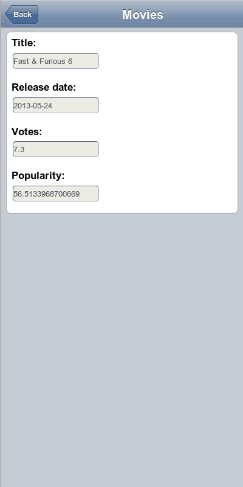
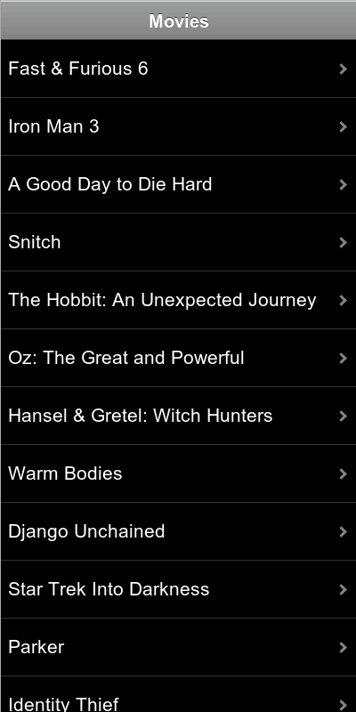
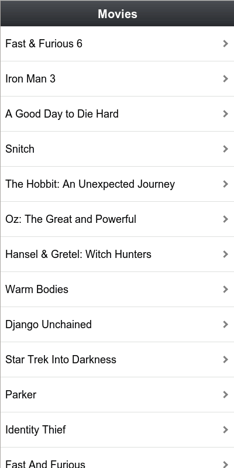
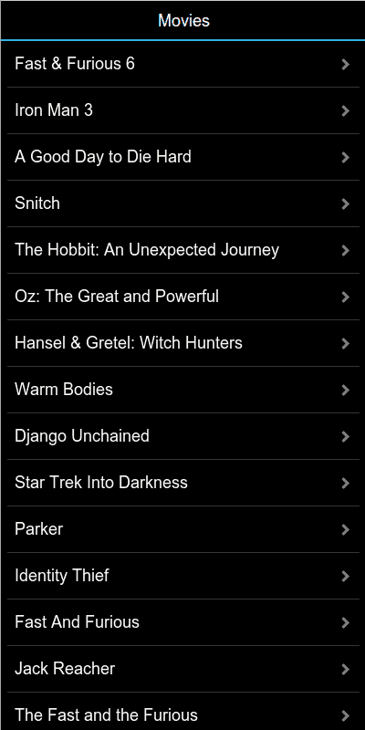
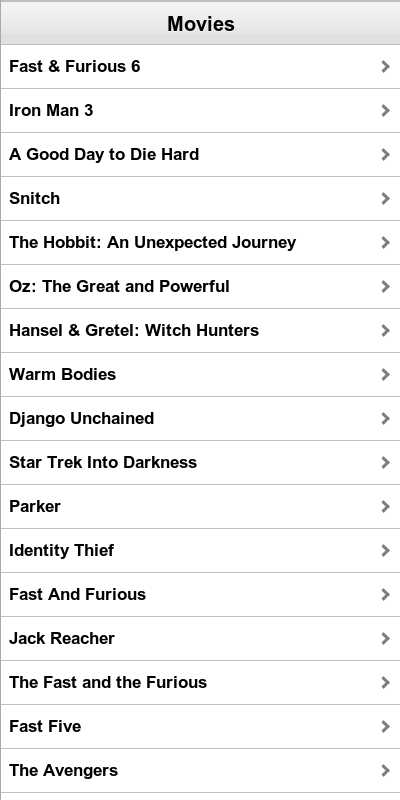
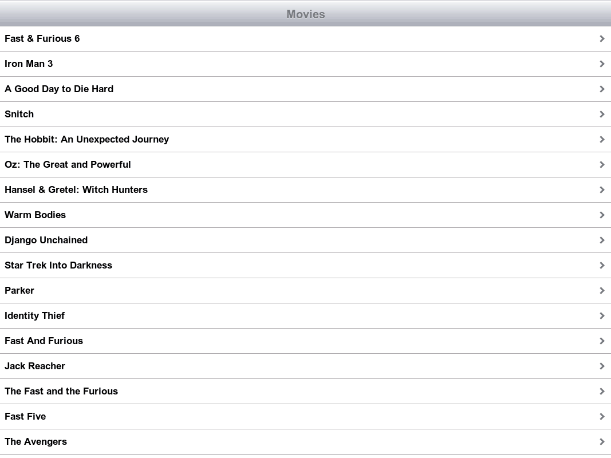

After all these tutorials it's finally time to write our controllers and with it, also our views. There are two controllers in this example, the first one (`MoviesController`) will give us a list of all movies, while the second one (`MovieController`) will give us a detailed view of one movie. Since all routing, storing and template inheritance work is completed, this will be quite easy.

### Movies item

The first controller will make it possible to show a list of all controllers. In our first tutorial we already made the story, so the only thing we need to do is to loop this store and show a list containing these movies.

Before we can do that however, we need to provide a component that shows our movie. In this case we will extend a `ListItem` to do so. The code of our component (must be placed in **components/MovieListItem.js** can be found below:

```javascript
define([ "dojo/_base/declare", "dojox/mobile/ListItem" ], function(declare, ListItem) {
    return declare([ListItem], {
        movie: null 
    });
});
```

If you ask me, this code should be quite self-explanatory. We inherit from a `ListItem` and the only thing we do is adding a property called `movie`. This makes it easier for when a list item is clicked, to indicate which movie was selected.

### Movies view

The next part is that we're going to define the movies view. This is actually a HTML template that will contain an `EdgeToEdgeList` widget which is used to display a list. The HTML template (**movies.html**) is:

```html
<ul data-dojo-type="dojox/mobile/EdgeToEdgeList" data-dojo-attach-point="listNode"></ul>
```

As you can see, we also provided an attach point here called `listNode`. This allows us to manipulate the list in our controller using the `listNode` property.

### Movies controller

The hardest code parts are already finished now, so our controller is also quite easy.

```javascript
define([
    "./_ControllerMixin", "../store/MovieStore", "../components/MovieListItem", "../routes/router",
    "dojo/_base/lang", "dojo/_base/declare", "dojo/text!../views/movies.html", "dojo/dom-construct",
    "dojox/mobile/EdgeToEdgeList"
], function(_ControllerMixin, MovieStore, MovieListItem, Router, lang, declare, template, domConstruct) {

    return declare([_ControllerMixin], {
        innerTemplate: template,
        postCreate: function() {
            this.inherited(arguments);
            MovieStore.query({}).forEach(lang.hitch(this, function(movie) {
                var controller = this;
                this.listNode.addChild(new MovieListItem({
                    label: movie.title,
                    onClick: function(evt) {
                        controller.transition("movie", evt, movie);
                    },
                    href: "#"
                }, domConstruct.create("li")));
            }));
        }
    });
});
```

This code is quite easy as well, just as in our previous tutorials we define the modules we need first, then we declare our own module and in this case we will inherit from `_ControllerMixin`, the mixin we declared in our previous tutorial containing the code for transitioning and to provide a main template containing a header.

In the `postCreate` function that we override, we first say that we want to call the `postCreate` function of the inherited modules, in this case the `_ControllerMixin` which will register our controller as a route.

We then query our movie store for all objects (we leave the filter object empty `{}`) and for each movie in our store we create a `MovieListItem` and add it to the `listNode`. As you can see we also create an `onClick` event handler which will perform a transition to the movie controller using the current movie as the model data that is passed through.

Each widget must be mapped to a DOM node, and that's why the second argument of the `MovieListItem` is a DOM node we create using the `domConstruct` module.

### Movie view

We're now able to display a list of movies (quite easy, don't you think?), the second part is to create our movie view and controller which will give us more details about a specified movie. The HTML template (**movie.html**) is:

```html
<div data-dojo-type="dojox/mobile/RoundRect">
    <div data-dojo-type="dojox/mobile/FormLayout">
        <div>
            <label>Title:</label>
            <fieldset>
                <input type="text" data-dojo-type="dojox/mobile/TextBox" data-dojo-attach-point="titleNode" data-dojo-props="disabled: true" />
            </fieldset>
        </div>
        <div>
            <label>Release date:</label>
            <fieldset>
                <input type="text" data-dojo-type="dojox/mobile/TextBox" data-dojo-attach-point="dateNode" data-dojo-props="disabled: true" />
            </fieldset>
        </div>
        <div>
            <label>Votes:</label>
            <fieldset>
                <input type="text" data-dojo-type="dojox/mobile/TextBox" data-dojo-attach-point="voteNode" data-dojo-props="disabled: true" />
            </fieldset>
        </div>
        <div>
            <label>Popularity:</label>
            <fieldset>
                <input type="text" data-dojo-type="dojox/mobile/TextBox" data-dojo-attach-point="popularityNode" data-dojo-props="disabled: true" />
            </fieldset>
        </div>
    </div>
</div>
```

This template is a bit longer than the previous ones, but there's nothing special about it either. We in fact have four text boxes for the name of the movie, the release date, the votes and the popularity. All four text boxes have an attach point so we can retrieve them from our movie controller.

### Movie controller

One of the last pieces of our mobile app puzzle is the movie controller. Just like the other controller, this one is quite easy as well. The code for it being:

```javascript
define([
    "./_ControllerMixin", "../routes/router",
    "dojo/_base/declare", "dojo/dom-construct", "dojo/text!../views/movie.html",
    "dojox/mobile/ToolBarButton", "dojox/mobile/RoundRect", "dojox/mobile/FormLayout", "dojox/mobile/TextBox"
], function(_ControllerMixin, Router, declare, domConstruct, template, ToolBarButton) {
    return declare([_ControllerMixin], {
        innerTemplate: template,

        onBeforeTransitionIn: function() {
            this.inherited(arguments);
            if (this.model !== null) {
                this.titleNode.set("value", this.model.title);
                this.dateNode.set("value", this.model.release_date);
                this.voteNode.set("value", this.model.vote_average);
                this.popularityNode.set("value", this.model.popularity);
            }
        },

        postCreate: function() {
            this.inherited(arguments);
            var controller = this;
            this.headerNode.addChild(new ToolBarButton({
                label: "Back",
                arrow: "left",
                moveTo: "",
                onClick: function(evt) {
                    controller.transitionBack(evt);
                },
                href: "#"
            }, domConstruct.create("li")));
        }
    });
});
```

In this controller there are two functions we actually override. Let's start with the last one, the `postCreate`. As we know by now is that this function is called when the widget (or in this case the view/controller) is created. So if we want to add a button once, the best solution is to provide that code here. We will use that code to add a back-button to our header, using the `ToolBarButton` widget. We will add an `onClick` event handler to it so when it's clicked, we will call the `transitionBack` function we defined in the controller mixin.

The second function is quite easy as well. The `onBeforeTransitionIn` event handler is executed right after the router dispatches its transition event. Which means we could use this event handler to read the model data and to put it in the text boxes of our view. We do that by using the `set` function which allows us to set any value of the textbox widget, in this case the `value` property itself.

### Index page

We now wrote most code of our application. We made some controllers, views, the model data (store) and we made some extra code for transitioning between controllers by having a publisher (controller mixin) and the subscriber (router). The next part is to put this all together by putting it all in our main HTML page.

The code of this page is quite easy, it only contains the code necessary to include Dojo from a CDN and to provide the declarative markup of the movies and movie controller. The HTML code for it is:

```html
<!DOCTYPE HTML PUBLIC "-//W3C//DTD HTML 4.01 Transitional//EN" "http://www.w3.org/TR/html4/loose.dtd">
<html xmlns="http://www.w3.org/1999/xhtml">
    <head>
        <meta http-equiv="Content-Type" content="text/html; charset=utf-8" />
            <meta name="viewport" content="width=device-width,initial-scale=1,maximum-scale=1,minimum-scale=1,user-scalable=no" />
        <title>Movies</title>

            <script src="http://ajax.googleapis.com/ajax/libs/dojo/1.9.1/dojox/mobile/deviceTheme.js"></script>
        <script type="text/javascript">
            dojoConfig = {
                parseOnLoad : true,
                async: true,
                packages: [{
                    name: 'app',
                    location: location.pathname.replace(/\/[^/]+$/, '') + '/app'
                }]
            }
        </script>

        <script src="http://ajax.googleapis.com/ajax/libs/dojo/1.9.1/dojo/dojo.js"></script>
    </head>
    <body>
        <div data-dojo-type="app/controllers/MoviesController" id="movies"></div>
        <div data-dojo-type="app/controllers/MovieController" id="movie"></div>

        <script type="text/javascript" src="app/application.js"></script>
    </body>
</html>
```

We define some extra configuration to Dojo using the `dojoConfig`. What we do here is saying that Dojo can asynchronously load modules (`async` property), that it can convert all declarative markup into widgets immediately when the DOM is loaded (`parseOnLoad` property) and finally we define a `app` namespace containing all our modules. We're going to use a CDN hosted version of Dojo, this means it will usually look for namespaces at that CDN itself, which we obviously don't want. To make sure it's using our local host as the place of the `app` namespace, we use the `location.pathname` so it won't look at the CDN.

In the body of our HTML we will use declarative markup to instantiate our controllers and give them a proper ID. Finally we add a reference to our main JavaScript file called **application;js**.

### Application JavaScript

The only file we left untouched is `application.js`. It doesn't really contain much code, except that it imports the controller modules so the declarative markup of the controllers on our index HTML page can be parsed. The code for it is quite easy:

```javascript
require([
    "app/controllers/MoviesController",
    "app/controllers/MovieController",
    "dojo/parser"
]);
```

Next to the controllers it also imports the parsing module, which is used to parse the index HTML page (hence the name). Also notice that we're using `require()` now and not `define()`. We use `define()` when defining modules, while we use `require()` in our main JavaScript file.

### Testing our application

We did it, we finally wrote a mobile app using Dojo mobile. If we open our browser now and go to the mobile app (by opening the index HTML page), we can see the application in its full glory.


If you click on a movie, you will see that it transitions properly to the detailed view and that there's a back button visible in the header. If we click the back button, we're back where we left (and the animation direction should also be different).



If you're using your desktop browser and you want to test the application using different themes, you can add the <code>theme</code> parameter to your URL and give it one of the following values:

- [Android](http://g00glen00b.github.io/dojox-mobile-app/?theme=Android)
- [BlackBerry](http://g00glen00b.github.io/dojox-mobile-app/?theme=BlackBerry)
- [Holodark](http://g00glen00b.github.io/dojox-mobile-app/?theme=Holodark)
- [iPhone](http://g00glen00b.github.io/dojox-mobile-app/?theme=iPhone)
- [iPad](http://g00glen00b.github.io/dojox-mobile-app/?theme=iPad)
- [Custom](http://g00glen00b.github.io/dojox-mobile-app/?theme=Custom)

The results are quite amazing: 









Or we can of course test the same application on our device, where the theme will automatically be detected.

#### Achievement: Tutorial finished

This ends our tutorials series about developing a mobile app using Dojo. If you're interested in the full code example, you can find it on [GitHub](http://github.com/g00glen00b/dojox-mobile-app/) as well as the [demo](http://g00glen00b.github.io/dojox-mobile-app/). If you want to try out the code yourself, you can download an archive from [Github](https://github.com/g00glen00b/dojox-mobile-app/archive/master.zip).

### Building mobile apps with Dojo mobile series

1. [Application structure, stores and model](/dojo-mobile-model/)
2. [Routing between controllers](/dojo-mobile-router/)
3. [Controller mixin](/dojo-mobile-controller-mixin/)
4. [Views, controllers and demo](/dojo-mobile-controllers/)
