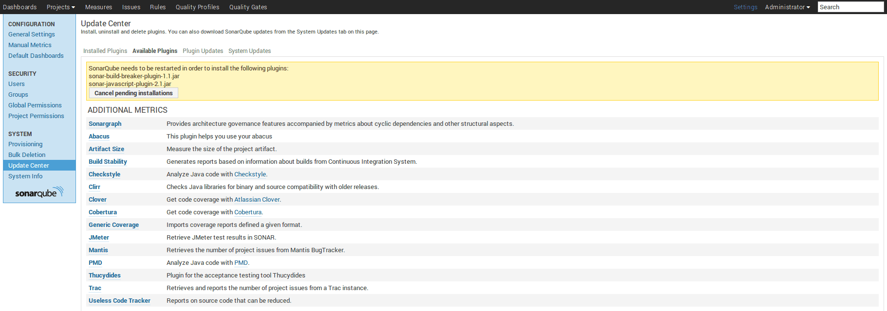
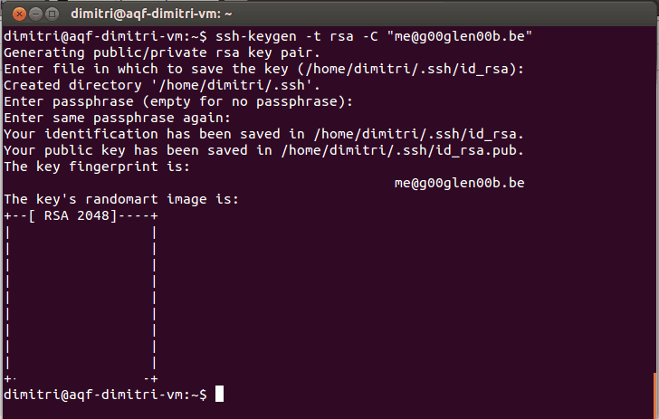
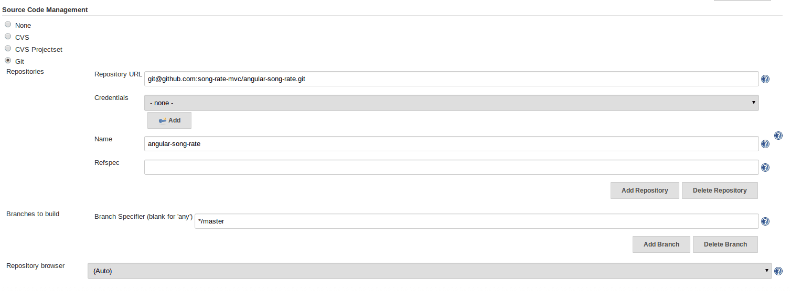
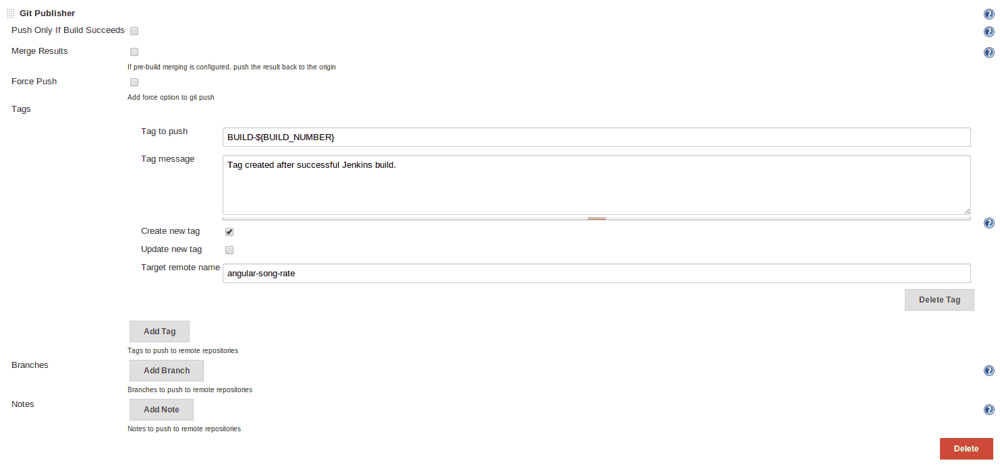
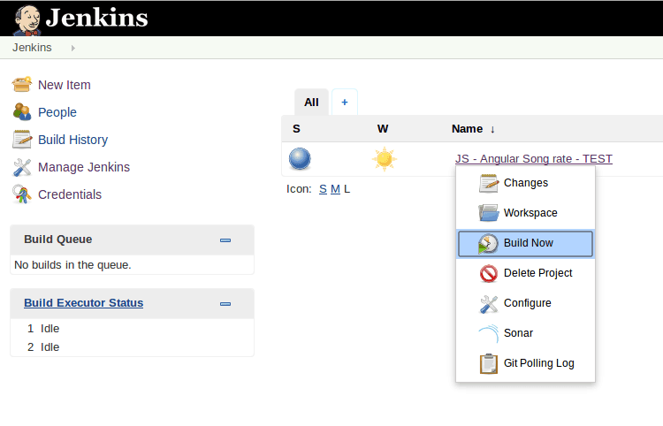
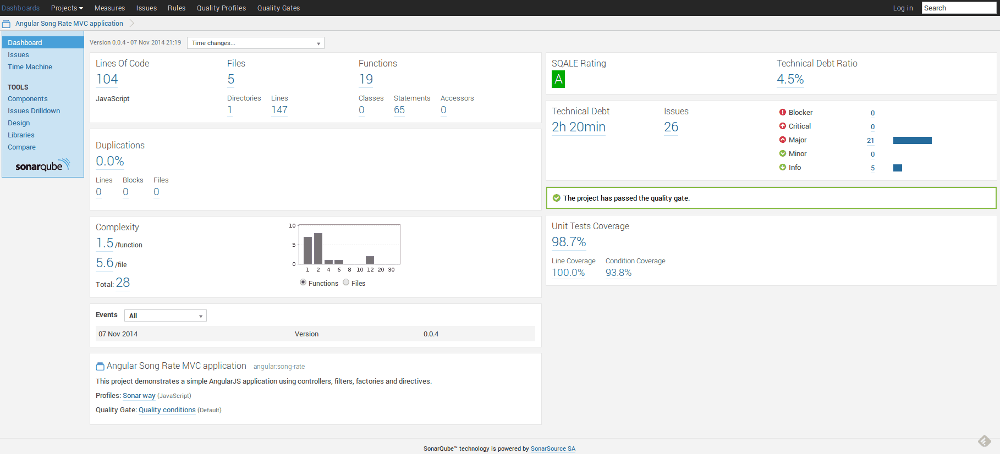
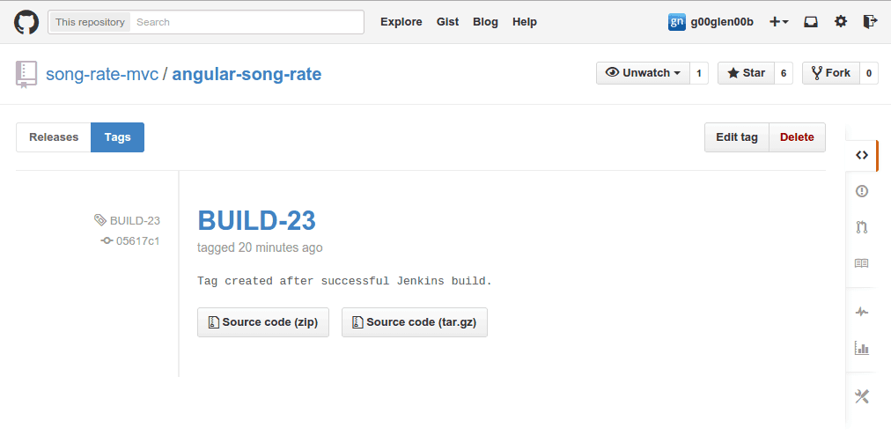
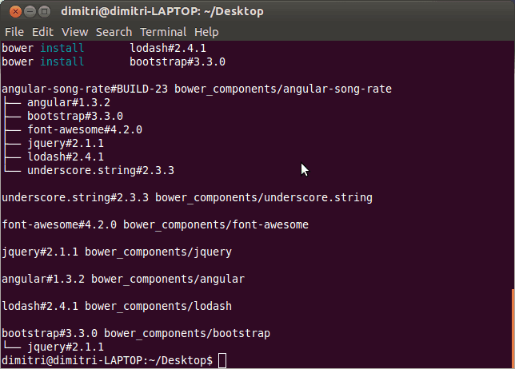

For the past half year I've written several articles about JavaScript frameworks and developing pure JavaScript web applications. In this article I will demonstrate how you could use Jenkins, SonarQube and Bower for continuous integration of your JavaScript applications.

### Setup

First of all you need to download the two main services for our CI platform; [Jenkins](http://jenkins-ci.org/) and [SonarQube](http://www.sonarqube.org/). I'm going to install them on a Ubuntu server, but you're free to use any operating system you'd like. All three services are available on multiple platforms. I installed both Jenkins and SonarQube as a package using apt, by following [http://sonar-pkg.sourceforge.net/](http://sonar-pkg.sourceforge.net/) and[ https://wiki.jenkins-ci.org/display/JENKINS/Installing+Jenkins+on+Ubuntu](https://wiki.jenkins-ci.org/display/JENKINS/Installing+Jenkins+on+Ubuntu). Remember that for these applications to run, you need to install a JDK.

The commands I used are:

#### Jenkins

```
wget -q -O - https://jenkins-ci.org/debian/jenkins-ci.org.key | sudo apt-key add -
sudo sh -c 'echo deb http://pkg.jenkins-ci.org/debian binary/ > /etc/apt/sources.list.d/jenkins.list'
sudo apt-get update
sudo apt-get install jenkins
```

#### SonarQube

```
sudo sh -c 'echo deb http://downloads.sourceforge.net/project/sonar-pkg/deb binary/ > /etc/apt/sources.list.d/sonarqube.list'
sudo apt-get update
sudo apt-get install sonar
sudo service sonar start
```

If installation was successful, you should be able to visit [Jenkins](http://localhost:8080) and [SonarQube](http://localhost:9000).

### SonarQube

#### Installing a SQL database

By default, SonarQube will be installed with a file-based SQL database. This is great for trying out, but if you really want to use SonarQube for production, you will have to install a seperate database. In this article I will be using a MySQL database for SonarQube, by using the following command:

```
sudo apt-get install mysql-server
```

You will be prompted with a wizard to enter a password for the root-user. Choose your password wisely and note it down/remember it, as we will have to enter it again a few times. First of all we have to create a database that Sonar can use. Open up your command line and execute the following command:

```
mysql -u root -p
```

You will be asked to enter your password, so provide the password you entered while installing MySQL. After logging in, enter the following commands:

```sql
CREATE DATABASE sonar;
CREATE USER 'sonar'@'localhost' IDENTIFIED BY 'sonar';
GRANT ALL PRIVILEGES ON sonar . * TO 'sonar'@'localhost';
```

These commands will allow us to create a database for Sonar and create a specific user that can only manage that database. We could use the root-user as well, but if something goes wrong, you only want that user to be able to delete its own stuff. After creating the database you can configure Sonar to use it. Open **/opt/sonar/conf/sonar.properties** and uncomment the following lines:

```
#sonar.jdbc.username=sonar
#sonar.jdbc.password=sonar
```

You also have to uncomment the following line:

```
#sonar.jdbc.url=jdbc:mysql://localhost:3306/sonar?useUnicode=true&characterEncoding=utf8&rewriteBatchedStatements=true&useConfigs=maxPerformance
```

Save the configuration file and restart SonarQube by executing:

```
sudo service sonar restart
```

SonarQube is a great code quality assurance platform, which you can use to detect code that could be improved. However, to do so we have to install the JavaScript language set. To do so, click on the **Login** page and enter your administrator details (by default both username and password are _"admin"_). When you're logged in, go to **Settings** and choosing **Update center**. Here you can see a list of installed plugins. Select the **Available plugins** section and install the JavaScript language plugin. We're also going to add another plugin to improve the integration with Jenkins, namely the **Build breaker** plugin. We will use Jenkins to invoke the Sonar code checker, but by default this will not break the Jenkins job (so everything will look as ok, even when it isn't).



When you selected both plugins, you will have to restart the SonarQube server. To do so, I executed following command:

```
sudo service sonar restart
```

After restarting, log in again and open **Quality gates** (in old versions this was available at the Quality profiles themself). As you can see, the SonarQube way already defines a set of rules. If you're not happy with them, you could create a new quality gate, for example:


Make sure to set it as default after setting up the quality gate.

#### SonarQube runner

To run a project on SonarQube, you have several options, but for general projects you will have to use the SonarQube runner. You can download it from the [official website](http://sonarqube.org), I executed the following commands:

```
wget http://repo1.maven.org/maven2/org/codehaus/sonar/runner/sonar-runner-dist/2.4/sonar-runner-dist-2.4.zip
unzip sonar-runner-dist-2.4.zip
sudo mv sonar-runner-dist-2.4/ /opt/
rm sonar-runner-dist-2.4.zip
```

Now edit the **sonar-runner.properties** configuration file in the conf folder. The configuration is quite similar to SonarQube itself, you have to uncomment the following line:

```
sonar.jdbc.url=jdbc:mysql://localhost:3306/sonar?useUnicode=true&characterEncoding=utf8
```

And you also have to uncomment the following lines:

```
#sonar.jdbc.username=sonar
#sonar.jdbc.password=sonar
```

#### Coverage and testing

SonarQube allows you to verify the quality of your code. You can also tell it to use certain data-files that detail the successful tests and the coverage. To create these files, I had to add the **karma-coverage** and **karma-junit-reporter** plugins to my Karma configuration. I added the following code to **config/karma.conf.js**:

```javascript
junitReporter: {
  outputFile: 'results/TEST-units.xml',
  suite: ''
},
coverageReporter: {
  type : 'lcov',
  dir : 'results/',
  subdir: '.'
},
```

I also had to add a preprocessor:

```javascript
preprocessors: {
  'app/**/*.js': ['coverage']
}
```

Don't forget to load the plugins as well:

```javascript
plugins: [
  'karma-junit-reporter',
  'karma-coverage'
}
```

I also changed my Grunt configuration to create a task that will run the Karma configuration once and use the coverage and junit reporters:

```javascript
karma: {
  junit: {
    singleRun: true,
    reporters: ['junit', 'coverage']
  }
},
```

I also defined a task that runs the JSHint code validation and the Karma unit tests:

```javascript
grunt.registerTask('junit', [ 'clean:dist', 'jshint', 'karma:junit' ]);
```

And ofcourse, I had to load the Karma plugins inside my **package.json**:

```json
"karma-junit-reporter": "~0.2.2",
"karma-coverage": "~0.2.6"
```

### Jenkins

#### Git

Before continuing with this guide, you should first check if you have a Git client installed (preferably the official [Git client](http://git-scm.com/)). After doing so, you will have to setup authentication to your Git provider (Github, BitBucket, ...). Since I'm on Linux, I'm going to use SSH for configuring Git. Follow the guides of your Git provider, for example this article about [generating SSH keys](https://help.github.com/articles/generating-ssh-keys/). However, remember that you have to execute these commands as the Jenkins user. So before entering any commands, use the following:

```
sudo su - jenkins
```



Make sure that after configuring the SSH keys, you also add the host to your **known\_hosts**, this can be done by connecting to your Git remote server using SSH. The following command could be used to do this for Github:

```
ssh -T git@github.com
```

#### Node.js and npm

I'm going to use Grunt for building my project, so I'll need Node.js to be installed on my Jenkins server, to do that I used following commands:

```
wget -O - https://deb.nodesource.com/setup | sudo bash -
sudo apt-get install nodejs
```

I'm going to use Bower and Grunt to build my project, so I installed the following global packages using **npm**:

```
npm install -g bower grunt-cli
```

#### Jenkins

Sonar should be configured fine now, so now it's time for Jenkins. Click on **Manage Jenkins** and then **Manage plugins**. Open the tab **Available plugins** and select two plugins from this list; the Sonar\* plugin for SonarQube integration and the Git plugin for Git integration.

_\* Early versions of SonarQube were called "Sonar", hence the name "Sonar plugin"._

After installing both plugins, it's time to configure them, go to **Manage Jenkins** again but this time select **Configure System**. First of all, choose to add a Git installation.


Then you will also have to add a Sonar(Qube) installation:


After configuring both installations, you can choose to **Save** the settings.

### Creating a new job

After installing both plugins, it's time to go back to the dashboard and to click on **New item**. Give the job a name and select **Freestyle project**.


The first step of configuring the job, is to set the source code management platform correctly. I'm going to use Git here, and because I configured SSH, I can simply enter the following details as my repository URL:

```
git@github.com:song-rate-mvc/angular-song-rate.git
```



Make sure you give the repository a **name**, you can do this by clicking on the **Advanced** button.

The next step is to tell Jenkins when the job should be executed. I'm going to make it poll my Git repository for changes every 15 minutes, and when it detects any changes, it should start building. To do this, I'm going to enter the following scheduling pattern: `H/15 * * * *`.


Now it's time to setup the build process itself. The first thing I did is adding the **Execute shell** build step, and configured it to install all Node.js packages, all Bower dependencies, and to execute the Grunt task.

```
npm install
bower install
grunt junit
```


Then I added another build step called **Invoke standalone Sonar analysis**. This will invoke the SonarQube runner, the only thing you have to do is provide the configuration of your project, which you will have to enter at the **Project properties** field. I used the following properties:

```
# required metadata
sonar.projectKey=angular:song-rate
sonar.projectName=Angular Song Rate MVC application
sonar.projectVersion=1.0.0
 
# optional description
sonar.projectDescription=This project demonstrates a simple AngularJS application using controllers, filters, factories and directives.
 
# path to source directories (required)
sonar.sources=app
 
# The value of the property must be the key of the language.
sonar.language=js
 
# Encoding of the source code
sonar.sourceEncoding=UTF-8

# Coverage
sonar.javascript.lcov.reportPath=results/lcov.info
sonar.javascript.jstest.reportsPath=results/
```

It provides some meta data, the folder that contains your sources, the language of the project and the location of both the coverage file (`results/lcov.info`) and the JUnit report folder (`results/`).

At the moment, the `sonar.javascript.jstest.reportsPath` is not supported yet, it was available, but later removed. When version **2.2** of the SonarQube plugin is released, this should work again. More information can be found at the issue [SONARJS-239](https://jira.codehaus.org/browse/SONARJS-239).


Finally, I also want it to create a tag in my Git repository for a successful build, so I added a **post-build action** called **Git publisher** that creates a new tag with the name `BUILD-${BUILD_NUMBER}`. This will create a tag using the current build number of the Jenkins job. As the **target remote name** you have to enter the same name you provided when you configured the Git repository.



### Testing it out

After saving the job, you can start running it, by clicking the caret symbol next to the job, and clicking **Build now**. You will see that it appears in the build queue, and when done, your job should have run successfully.



Now you can click the job itself and you will see an overview of the job, the workspace, the builds, ... . Now you can click on the **Sonar** link in the left menu which will open the SonarQube dashboard.



As you can see here, the code does meet all quality constraints we made, so everything has run successfully. This should also mean that a new tag was created in the Git repository, and as you can see, [it really did](https://github.com/song-rate-mvc/angular-song-rate/releases/tag/BUILD-23).



Other people in your team can now depend on your library, as they can now include your project as a dependency by using Bower:

bower install song-rate-mvc/angular-song-rate#BUILD-23

This actually completes the circle. If you change your code now, Jenkins will automatically detect this and verify your code. If everything is still well written, it will create a new tag, so other people in your team could use this new version of your library.



Of course, this is just a basic example and the Git tagging build task could be improved. For Bower to be able to properly manage your dependencies, it should follow semantic versioning (and "BUILD-23" clearly doesn't follow these rules). Also, to invoke the SonarQube analysis, we used a static version (<code>sonar.projectVersion=1.0.0</code>) which should be replaced by the correct version as well.
