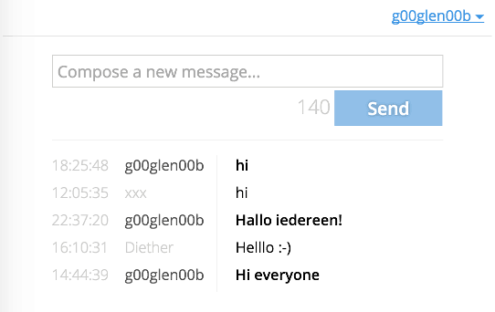
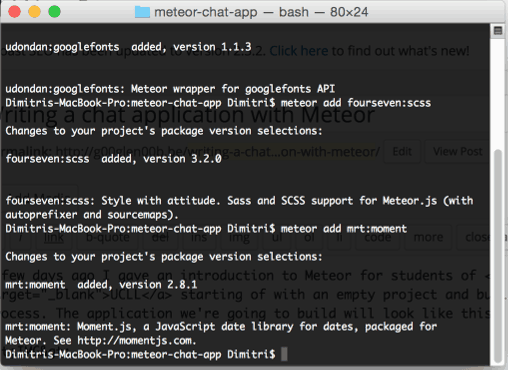
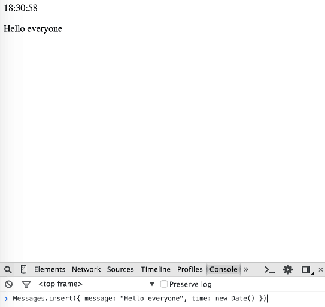
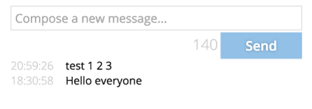
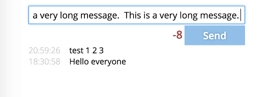
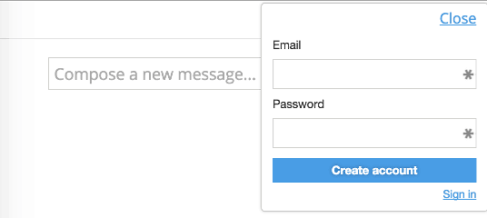
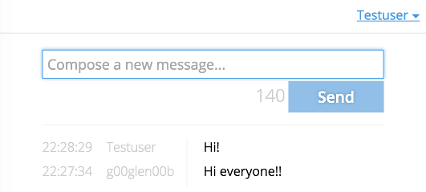
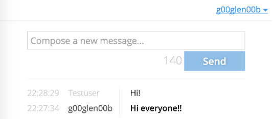
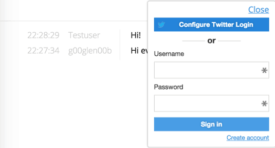

A few days ago I gave an introduction to Meteor for students of [UCLL](http://www.ucll.be/) starting of with an empty project and building a complete chat application in the process. The application we're going to build will look like this:



### Setting up a Meteor project

The first step (after downloading Meteor) is to create a new project using the command line, execute the following command to create a Meteor project:

meteor create meteor-chat-app

After that's done, go to the project and install the following packages:

```
cd meteor-chat-app
meteor add udondan:googlefonts
meteor add fourseven:scss
meteor add mrt:moment
```

These packages will be used for the styling (Google Open Sans font and SCSS) and the Moment library will be used to format a date to a specific string. Meteor has a lot of packages, which you can browse online using [Atmosphere](https://atmospherejs.com/). We now created our project, so it's time to run it using the `meteor` command.



### Meteor project structure

If you open the project in your favourite editor now, you'll see that there are already three files, used for a small dummy application (which you can already see at [http://localhost:3000](http://localhost:3000)). While this is great for small applications, using those three files in large applications will be a pain to maintain, just because these files will grow really quickly. So to start of, remove all three files and start with a blank project.

A meteor project usually contains 3 parts:

- Model: This is the heart of the application. The model represents the data used in your application and updating this will trigger all clients to update their view automatically as well. It glues the server and the client (see below) together.
- Client: A typical web application contains HTML templates, some event handling and some plain JavaScript. The same applies to the client in Meteor, it will also have some HTML templates (with some additional templating logic), event handling and some plain JavaScript.
- Server: All logic that has to be executed on the server (like autorisation of data, calling external services, ...) should happen on the server. Meteor runs on Node.js, so all modules that you usually use within a Node.js application are also available on your Meteor application.

There are also 2 resource folders:

- Public: Public resources are resources that can be used on the client, think about images, fonts, ... .
- Private: All resources that should not be available to the public (think about configuration) can be placed within the private folder.

For this application we're only going to need two parts, the **model** and the **client**.

So let's start by creating the model first. Create a file called **messages.model.js** within a new directory called **model**. Since Meteor uses a NoSQL database (MongoDB) behind the screens, defining the model is as easy as setting it up and giving it a name:

Messages = new Mongo.Collection('messages');

No schema's, indexes, ... have to be made.

The next step is the **client**. Create a folder called **client** and within it we're going to start with a file we all create when making a web application, namely an **index.html** file. The content of this file should look like this:

```html
<head>
  <meta name="viewport" content="width=device-width, initial-scale=1" />
  <title>Chat application UCLL</title>
</head>

<body>
  <div class="container">
    {{> messages}}
  </div>
</body>
```

Most of this is just some plain HTML, but you can also see something else here, `{{> messages}}` is part of the templating language of Meteor, called Spacebars (based on Handlebars). It is actually a placeholder for another template, in this case, the messages template.

### Making a template

A template in Meteor contains two parts, a HTML part and some additional JavaScript.  So for the messages templates we will need two files, **messages/messages.tpl.html** and **messages/messages.js**. To create a HTML template called messages, we first start out HTML file with the following tag:

```html
<template name="messages">
  <!-- Put the messages template here -->
</template>
```

Within those template tags, we define the template itself, for the messages template it will be:

```html
{{#each messages}}
  <div class="message">
    <time>{{time this.time}}</time>
    <p>
      <span>{{this.message}}</span>
    </p>
    <div class="clearfix"></div>
  </div>
{{/each}}
```

Once again we see a lot of HTML, but also some extra things, like `{{#each messages}}`, which means we're going to loop over the messages collection and show the following HTML for each message. `{{this.message}}` on the other hand refers to the message property of a message, while `{{time this.time}}` refers to the time property of a message.

Also note that we're using a helper function called time here, upon `this.time`. The reason for this is that each object will have a time property, containing a Date object. To properly show the time of the Date object as HH:mm:ss, we'll have to use a helper function for that, which we will call `time`.

Now, for the JavaScript part we will first have to define both `messages` (to loop over) and `time` (the function used to format the date objects):

```javascript
function messages() {
  return Messages.find({}, { sort: { 'time': -1 } });
}

function time(time) {
  return moment(time).format("HH:mm:ss");
}
```

As you can see, the `messages()` function is using the `Messages` model we defined earlier. It calls the `find()` function and sort all messages with their time property descending (most recent message first).

This is not everything though, we also need to register both functions as helpers to our messages template. To do that, we use the following code:

```javascript
Template.messages.helpers({
  messages: messages,
  time: time
});
```

We can now open the application, and we'll see that we get a blank screen. Obviously, because we don't have a message yet. However, if we open the developer tools/browser console and enter the following:

```javascript
Messages.insert({ message: "Hello everyone", time: new Date() });
```

We'll see that the application already works quite well. You can also open two windows simultaneous and enter a message in the first window and you'll see that the second window gets updated directly as well. This feature of Meteor, called **live update** is probably the coolest feature of it. If you want to develop something like this using other stacks, it will cost you days, or even weeks if you want to properly secure them with handshakes, with Meteor on the other hand it comes out of the box.



### Adding new messages

Ok, adding messages actually works already, but we would like to create a simple form that allows us to enter a message, in stead of having to go into the console. To do that, we're going to create a new template called **newMessage**. So let's create another two files called **new-message/newMessage.tpl.html** and **new-message/newMessage.js**.

Within the HTML template we're just going to create a simple form like this:

```html
<template name="newMessage">
  <form name="message">
    <input type="text" name="message" placeholder="Compose a new message..." autocomplete="off" />
    <button type="submit">Send</button>
  </form>
</template>
```

Within the JavaScript file we're going to create an event handler that calls `Messages.insert()` for us:

```javascript
function createMessage(evt) {
  Messages.insert({
    message: evt.target.message.value,
    time: new Date()
  });
  evt.target.message.value = '';
  return false;
}
```

This function accepts a form submit event (`evt`), to retrieve the message from it we use `evt.target.message.value`, which receives the message form field value from the form itself (`evt.target`).

After using the message field to insert a new message into the collection, we're clearing the value.

Obviously, this won't be enough. We still have to tell Meteor that this event handler has to be executed as soon as the form is submit. To do that, we're going to add the following code to the JavaScript file:

```javascript
Template.newMessage.events({
  "submit form": createMessage
});
```

Now we have to open the index.html page, and just like the `{{> messages}}` code, we will have to add a similar thing for the new template:

```html
<head>
  <meta name="viewport" content="width=device-width, initial-scale=1" />
  <title>Chat application UCLL</title>
</head>

<body>
  <div class="container">
    {{> newMessage}}
    {{> messages}}
  </div>
</body>
```

If we go back to the application now, we'll see that a form field was added to it. You should also be able to notice that, without refreshing the page, the application updated itself. This hot deploy feature is another cool feature of the Meteor platform.

So, let's test it out and add a new message by using the form, it should work!


So... we actually have a working chat application now, don't we? It sure looks ugly as hell, but we're going to fix that now!

### Adding some CSS

I'm not going into detail about this part of the application since it's not related to Meteor itself, but I'm going to write some SCSS to improve the UI of the application. First create a file called **variables.scss** inside the client folder:

```scss
/** Colors */
$blue: #459BE7;

/** Font weights */
$semiBold: 600;
$light: 100;

$fontFamily: 'Open Sans', sans-serif;

$stylingTransition: .7s;

/** Borders */
$borderColor: #D4D4D1;
$headerBorderColor: #E5E5E5;
$lightBorderColor: #F1F1F1;

/** Text */
$textMutedColor: #CCC;
$textDangerColor: #A94442;
$textPrimaryColor: $blue;

/** Inputs */
$inputBoxShadow: 0 0 5px 0 rgba(69, 155, 231, .75);
$inputFocusBorderColor: $blue;

/** Counter */
$counterDangerWeight: $semiBold;

/** Buttons */
$buttonColor: $blue;
$buttonTextColor: #FFF;
$buttonHoverColor: #1C82DD;
$buttonDisabledColor: #90BFE8;
$buttonTextWeight: $semiBold;

/** Message */
$messageTimeColor: $textMutedColor;
$messageTimeWeight: $light;
$messageTimeWidth: 80px;
$messageAuthorColor: $textMutedColor;
$messageAuthorWeight: $light;
$messageAuthorDividerColor: $lightBorderColor;
$messageOwnerWeight: $semiBold;
$messageOwnerColor: #555;

/** New message */
$newMessageVerticalPadding: .3em;

Now create a file called **style.scss**:

@import 'variables';
@import 'mixins/input.mixin';

body, * {
  font-family: $fontFamily;
  box-sizing: border-box;
}

.container {
  max-width: 1000px;
  margin: 0 auto;
  width: 80%;
}

header {
  width: 100%;
  text-align: right;
  padding: 0 .5em .7em;
  border-bottom: solid 1px $headerBorderColor;
  margin-bottom: 1em;

  #login-buttons {
    text-align: left;
    font-family: $fontFamily;

    .login-link-text,
    .login-close-text {
      color: $textPrimaryColor;
    }

    .accounts-dialog input {
      @include input;
    }

    .login-button {
      @include button;
    }

    .additional-link-container {
      color: $textPrimaryColor;
    }
  }
}
```

I'm also going to define two mixin functions called **mixins/input.mixin.scss** and **mixins/clearfix.mixin.scss**. The input mixin will have the following code:

```scss
@import '../variables';

@mixin input {
  border-radius: 0;
  border: solid 1px $borderColor;
  transition: $stylingTransition;
  font-size: 1.1em;
  padding: $newMessageVerticalPadding;
  margin: 0.2em 0;

  &:focus {
    -webkit-box-shadow: $inputBoxShadow;
    -moz-box-shadow: $inputBoxShadow;
    box-shadow: $inputBoxShadow;
    border-color: $inputFocusBorderColor;
    outline: none;
  }
}

@mixin button {
  background: $buttonColor;
  color: $buttonTextColor;
  font-weight: $buttonTextWeight;
  border: none;
  border-radius: 0;
  text-shadow: 0 0 5px rgba(0, 0, 0, .3);
  cursor: pointer;
  transition: $stylingTransition;

  &:focus {
    outline: none;
  }

  &:hover {
    background: $buttonHoverColor;
  }

  &:disabled {
    background-color: $buttonDisabledColor;
    cursor: not-allowed;
  }
}
```

And the clearfix mixin the following code:

```scss
@mixin clearfix {
  &:after {
    content: "";
    display: table;
    clear: both;
  }
}
```

For both the messages and newMessage template we're also going to apply some styling, so create a file called messages.scss in the messages folder and newMessage.scss in the new-message folder.

The styling for the messages template will be the following:

```scss
@import '../variables';
@import '../mixins/clearfix.mixin';

.message {
  margin: 0;

  .clearfix {
    @include clearfix;
  }

  time {
    width: $messageTimeWidth;
    color: $messageTimeColor;
    display: block;
    float: left;
    font-weight: $messageTimeWeight;
  }

  p {
    width: calc(100% - $messageTimeWidth);
    display: block;
    float: left;
    margin: 0;

    span {
      display: block;
      float: left;
    }

    .author {
      width: 100px;
      font-weight: $messageAuthorWeight;
      color: $messageAuthorColor;
      text-overflow: ellipsis;
      white-space: nowrap;
      overflow: hidden;

      &+span {
        border-left: solid 1px $messageAuthorDividerColor;
        padding-left: 20px;
        padding-bottom: .5em;
        display: inline-block;
      }
    }
  }

  .self {
    font-weight: $messageOwnerWeight;

    .author {
      font-weight: normal;
      color: $messageOwnerColor;
    }
  }
}

hr {
  display: block;
  height: 1px;
  border: 0;
  border-top: solid 1px $lightBorderColor;
  margin: 1em 0;
  padding: 0;
}
```

And the styling for the newMessage template will be:

```scss
@import '../variables';
@import '../mixins/input.mixin';

input[type=text] {
  width: 100%;
  @include input;
  margin: 0.2em 0;
}

.info {
  float: right;
}

form:after {
  display: block;
  content: '';
  clear: both;
}

button {
  @include button;
  padding: $newMessageVerticalPadding 1.9em;
  font-size: 1.2em;
  margin: 0;
}
.count {
  font-weight: 300;
  font-size: 1.35em;
  color: $textMutedColor;
  transition: $stylingTransition;

  &.danger {
    color: $textDangerColor;
    font-weight: $counterDangerWeight;
  }
}
```

If you take a look at the application now, you'll see that it looks way better now, at least, that's what I think. It's not the best user interface, but I'm also just a developer, leave this task to the web designers.

### Adding some validation

The appication works quite well, except that there is no minimum or maximum length. To stop people from adding empty messages, of entire books as a message, we're going to introduce some validations to the newMessage template.

First of all, I'm going to create a few new functions:

```javascript
function countMessageLength(evt) {
  Session.set('messageCount', evt.target.value.length);
}

function getMessageCount() {
  return Session.get('messageCount') || 0;
}

function isValidMessage() {
  return getMessageCount() > 0 && !isMessageTooLong();
}

function isMessageTooLong() {
  return getMessageCount() > MAX_LENGTH;
}

function startup() {
  Session.set('messageCount', 0);
}
```

Quite some functions, let's start from the bottom. First we have the `startup()` function. We will execute this function at the startup of the application, setting a counter called `messageCount` to 0. We're using `Session` for this, which allows us to bind this to a specific session.

Now, the other function, `isValidMessage()` will be used to determine whether or not the given message is valid. We're checking if `getMessageCount()` is higher than 0 and less than `MAX_LENGTH`.

Obviously, we still have to create the `MAX_LENGTH` field, I'm going to choose 140, similar to the length of a tweet.

```javascript
var MAX_LENGTH = 140;
```

Finally, we also wrote an event handler to react on each change in the input field, using the length of the field as the new messageCount value.

Just like before, we have to add this event handler to an event first, so let's change the `Template.newMessage.events()` into this:

```javascript
Template.newMessage.events({
  "submit form": createMessage,
  "keyup input[name=message]": countMessageLength
});
```

We're going to use the `isValidMessage()` function in our HTML template, so we'll have to add it as a helper, similar to how we defined the helpers in the messages template:

```javascript
Template.newMessage.helpers({
  isValidMessage: isValidMessage
});
```

We also have to make sure that when the form is submit, the counter is also reset back to zero, so let's change the `createMessage()` function a bit:

```javascript
function createMessage(evt) {
  Messages.insert({
    message: evt.target.message.value,
    time: new Date()
  });
  evt.target.message.value = '';
  Session.set('messageCount', 0);
  return false;
}
```

And finally, we also have to make sure the startup function is called initially:

```javascript
Meteor.startup(startup);
```

Now we only have to make sure the form button is disabled as soon as `isValidMessage()` is false, so let's edit the **newMessage.tpl.html** file and replace the `<button>` with the following:

```html
<div class="info">
  {{#if isValidMessage}}
    <button type="submit">Send</button>
  {{/if}}
  {{#unless isValidMessage}}
    <button type="submit" disabled>Send</button>
  {{/unless}}
</div>
```

So, what do we have here? A bunch of HTML, but also an `{{#if isValidMessage}}` statement, which will only show the HTML in case if the `isValidMessage` function returns `true`. The `{{#unless isValidMessage}}` on the other hand does the opposite of that and will only show the content in case if `isValidMessage` returns `false`.

So, if the input is valid, we show the button and if the input is invalid, we disable it.

That's all we had to do to create some form validation, let's check it out. If we look at the application, we can see that the button has a slightly different color, indicating that the button is disabled.


As soon as we enter a character in the field, the button will be enabled again:


So that seems to work fine, also, if we enter a very long message, you'll see that the button becomes disabled again.

### Showing the amount of characters left

Ok, the validation works fine, but it's quite annoying since you can't see how much longer your message could be. So let's add a visible counter, like Twitter has. Also, when the message becomes too long, let's make the counter show in red.

Luckily, we have our counter already, now we only have to create a function to calculate the amount of remaining characters:

```javascript
function count() {
  return MAX_LENGTH - getMessageCount();
}
```

Now we only have to add it to the helpers, and also the `isMessageTooLong` function, since this function will be useful to determine if we have to show the counter in red or not:

```javascript
Template.newMessage.helpers({
  isValidMessage: isValidMessage,
  isMessageTooLong: isMessageTooLong,
  count: count
});
```

Finally, we also have to change the HTML template a bit, before the {{#if isValidMessage}} we have to add the following code:

```html
{{#if isMessageTooLong}}
  <span class="danger count">{{count}}</span>
{{/if}}
{{#unless isMessageTooLong}}
  <span class="count">{{count}}</span>
{{/unless}}
```

This will show the count, and when the message is too long, an additional class called **danger** is added. The stylesheets I added earlier already uses this classname to give the text a darker red color.

If we take a look at the application, we'll see that the counter is added properly.



As soon as we start to type, the counter goes down, eventually going negative, which will cause the color to change:



### Who said that?

The application works pretty well already, but if you take a look at the messages, you don't really have a clue who said what. So in order to change that, we're going to add a registration and login process.

First of all we have to add some packages to the application, so close the running server and enter the following commands:

```
meteor add accounts-password
meteor add accounts-ui
```

Also, because we already added some messages without username, we're going to clear the messages we've posted already, so let's do that by using the following command:

```
meteor reset
```

Now, star the application again and open **index.html**. The accounts-ui package allows us to directly use a template with a proper login and registration form. Just append the following to the `<body>` tag (above the `<div class="container">`):

```html
<header>
  {{> loginButtons align='right'}}
</header>
```

If we look at the application now, you'll see that there's a sign in link at the top right corner. However, it requires an e-mail address to sign up, while I would like to enter a username in stead.



To configure Accounts UI to use a username in stead of an e-mail address, we add a JavaScript file called **application.config.js** to the **client** folder and add the following code:

```javascript
Accounts.ui.config({
  passwordSignupFields: 'USERNAME_ONLY'
});
```

If you look at the application again, you'll see that you can now log in using a username in stead of an e-mail address. But before we continue, we're going to change some things first.

On the **index.html** page, we're going to make sure that the newMessage template is only visible for users who signed in by wrapping `{{> newMessage}}` into the following:

```html
{{#if currentUser}}
  {{> newMessage}}
  <hr />
{{/if}}
```

In the **newMessage.js** file, we're going to add an `owner` and `username` property to the inserted message by altering the `createMessage()` function:

```javascript
function createMessage(evt) {
  Messages.insert({
    message: evt.target.message.value,
    time: new Date(),
    owner: Meteor.userId(),
    username: Meteor.user().username
  });
  evt.target.message.value = '';
  Session.set('messageCount', 0);
  return false;
}
```

Both the `Meteor.userId()` and `Meteor.user()` functions are available thanks to the accounts-password package we added earlier on.

And finally, in the **messages.tpl.html** file, we're going to add the following to the `<p>` tag (above the actual message):

```html
<span class="author" title="{{this.username}}">{{this.username}}</span>
```

If we take a look at the application again, you'll see that it's quite empty, which is a good thing. We removed the new message form for unauthenticated users and since we cleared the database, there are no messages to show either. But that's going to change now!

Let's create an account and post a message, and you'll see that everything works well.



### Highlighting your own messages

The application is quite cool already, we can post messages, sign up, log in in about 70 lines of JavaScript code now, which would probably take days using other platforms/frameworks.

Meteor is quite easy, and so let's use the time we won by using Meteor, to add some additional features as well. First of all, it's quite annoying you can't really see a difference in your own messages and messages posted by other people, so let's change that.

First of all, open **messages.js**. We're already saving the user ID of the posted message in the owner property of a message, so if we can compare that to the current user ID, then we're actually done:

```javascript
function isOwner(message) {
  return Meteor.userId() === message.owner;
}
```

Now register it as a helper for the messages template as well:

```javascript
Template.messages.helpers({
  messages: messages,
  time: time,
  isOwner: isOwner
});
```

And finally, let's change the HTML template a bit and wrap the entire `<p>` tag in an if, and unless like this:

```html
{{#if isOwner this}}
  <p class="self">
    <span class="author" title="{{this.username}}">{{this.username}}</span>
    <span>{{this.message}}</span>
  </p>
{{/if}}
{{#unless isOwner this}}
  <p>
    <span class="author" title="{{this.username}}">{{this.username}}</span>
    <span>{{this.message}}</span>
  </p>
{{/unless}}
```

So, what did we do here, we created an `{{#if isOwner this}}` which will be executed when the message was posted by the current user and an `{{#unless isOwner this}}` which does exactly the opposite. The main difference between the two is that we added a class called `self` for messages posted by the current user.

If we look back at the application now, you'll see that your own messages are slightly more visible now:

[

### Sign in with Twitter

I think that by now, you're pretty aware of the strengths of Meteor and its packages. Let's create the possibility to sign in with Twitter as well for our application.

First of all, we have to add another package:

```
meteor add accounts-twitter
```

If you did that, and you're running the application again, then open **newMessage.js** and add the following function:

```javascript
function getUsername(user) {
  if (user.services.twitter != null) {
    return user.profile.name;
  } else {
    return user.username;
  }
}
```

If you are signed in with Twitter, the `Meteor.user()` object will contain slightly different information. The username will no longer be `Meteor.user().username`, but rather be `Meteor.user().profile.name`, so I wrapped that inside a function.

You only have to change the `createMessage()` function a bit to start using this function to set the username property of the message:

```javascript
function createMessage(evt) {
  Messages.insert({
    message: evt.target.message.value,
    time: new Date(),
    owner: Meteor.userId(),
    username: getUsername(Meteor.user())
  });
  evt.target.message.value = '';
  Session.set('messageCount', 0);
  return false;
}
```

Now, go over to [apps.twitter.com](https://apps.twitter.com/) and create a new application (or use an existing application). If you have an application prepared on Twitter, you can open your Meteor application, and when you click on the menu to sign in (you have to be logged out), you'll see a button to configure the Twitter login.



Enter the consumer key and consumer secret (which you can find on Twitter) and you can now log in using Twitter in just a few lines of extra code!

#### Achievement: Wrote a chat application with Meteor

If you're seeing this, then it means you successfully managed to make it through this article. If you're interested in the full code example, you can find it on [GitHub](https://github.com/craftworkz/ucll-workshop-meteor). If you want to try out the code yourself, you can download an archive from [GitHub](https://github.com/craftworkz/ucll-workshop-meteor/archive/master.zip).

A live demo of the application can be found on [Meteor](http://ucll-demo-meteor.meteor.com/).
