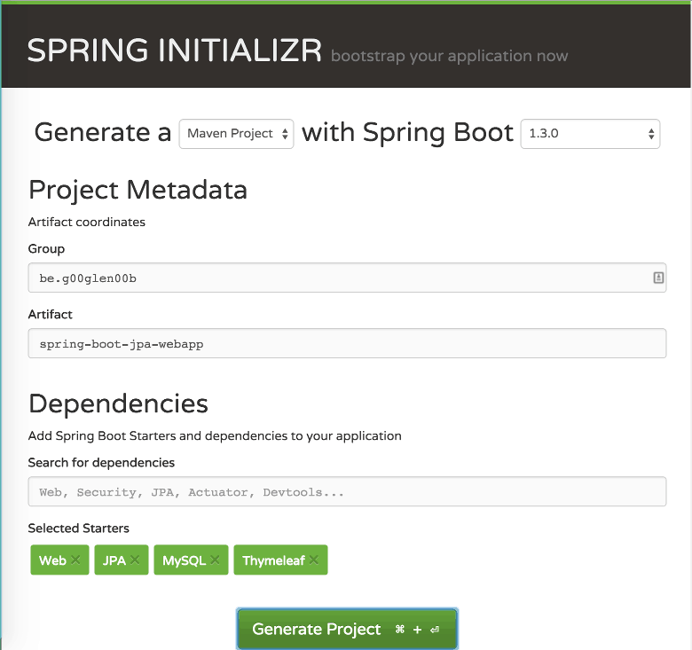

In [my previous tutorial](/spring-webapp/) I made a simple application to show some superheroes and supervillains. While the application did what it should do it was pretty statically because I used some mock data.

With [Spring Data](http://projects.spring.io/spring-data/) it's very easy to create a simple CRUD application without the hassle of creating your own DAO's. [Spring Boot](http://projects.spring.io/spring-boot/) makes it even easier for you so you don't even have to create an `EntityManager` by yourself, this was usually the stuff that made my head spin when I just started Java development, but no more!


### Project setup

Like every Spring boot project we start at [start.spring.io](http://start.spring.io). Enter the group ID and artifact ID you like and as dependencies I'm going to select the following:

- **JPA**: Dependency to use Spring Data JPA
- **MySQL**: MySQL JDBC driver for connecting to a database (you could choose another driver as well if you know what you're doing!)
- **Web**: Dependency for creating web applications
- **Thymeleaf**: Template engine



Press the big **Generate project** button, unzip the archive and open the project in your favourite IDE. You're now set to create some cool projects with Spring Boot!

### Database

In this example I will be using a local MySQL database. In case you don't have one, you'll have to install it by yourself. What you also have to do is to create a MySQL database, if you're on the MySQL CLI, you could use the following command:

```sql
CREATE DATABASE test;
```

To select the created database you use the following command:

```sql
USE test
```

Now the next step is that we're going to create a table called superhero:

```sql
CREATE TABLE IF NOT EXISTS `superhero` (
  `id` INT(11) NOT NULL AUTO_INCREMENT,
  `name` VARCHAR(32) NOT NULL,
  `first_name` VARCHAR(32),
  `last_name` VARCHAR(32),
  `good` bit(1),
  PRIMARY KEY (`id`)
) ENGINE=InnoDB  DEFAULT CHARSET=latin1;
```

And finally we're going to insert some records:

```sql
INSERT INTO `superhero` (`name`, `first_name`, `last_name`, `good`) VALUES
  ('Superman', 'Clark', 'Kent', 1),
  ('Silver Banshee', 'Siobhan', 'McDougal', 0);
```

With the database up and running it's time to write some code!

Spring boot allows you to easily setup your tables and insert data on startup using the **schema.sql** and **data.sql** SQL files. No worries, I'll cover that in another tutorial, soon!

### Entity

If you import the generated project into your IDE, you can immediately start adding classes and stuff, without having to do a lot of setup first.

The first thing I'm going to do is to create an entity that resembles the table I just created:

```java
@Entity
@Table(name = "superhero")
public class Superhero {
    @Id
    @GeneratedValue(strategy = GenerationType.AUTO)
    @Column(name = "id")
    private Long id;
    @Column(name = "first_name")
    private String firstName;
    @Column(name = "last_name")
    private String lastName;
    @Column(name = "name")
    private String name;
    @Column(name = "good")
    private boolean good;

    public Long getId() {
        return id;
    }

    public String getFirstName() {
        return firstName;
    }
    public void setFirstName(String firstName) {
        this.firstName = firstName;
    }

    public String getLastName() {
        return lastName;
    }
    public void setLastName(String lastName) {
        this.lastName = lastName;
    }

    public String getName() {
        return name;
    }
    public void setName(String name) {
        this.name = name;
    }

    public boolean isGood() {
        return good;
    }
    public void setGood(boolean good) {
        this.good = good;
    }
}
```

At first sight this class is a simple POJO with some fields and getters/setters for every field except for the ID. We don't want people to allow updating the ID, so if you leave out the setter, there is no way you can edit the field. Obviously for instantiation you'll have to find another mechanism, being either a builder or a constructor with the possibility to add the ID. Or in this case we have an auto-generated ID, so in theory you don't need any way to set the field, though for testing you still might want to keep a constructor or a builder.

Anyways, next to the fields themselves there are also some JPA annotations. Above the class we can find two of them, called `@Entity` and `@Table`. With the first annotation we tell JPA that this class is an entity, while with the second one you tell which table it resembles. If the table name is the same as the class name, you could leave this one away.

Now, for each field we have the `@Column` annotation to tell what column the field resembles. For the ID we also have the `@Id` annotation and the `@GeneratedValue` annotation which tells JPA how the ID is created.

### Repository

In the early days you now had to create a DAO class which has methods for creating, updating, deleting and reading data from the table. With Spring Data on the other hand all you need is an interface that extends another interface. For example:

```java
public interface SuperheroRepository extends JpaRepository<Superhero, Long> {
}
```

So in this case we created an interface called `SuperheroRepository`, extending Spring's `JpaRepository`, providing some generics for the entity and the type of the ID, being `Superhero` and `Long`. The reason we have these generics is so the return type and parameter types of the methods can be determined. For example, the `findOne()` method should accept a parameter of type `Long` and should return an entity of type `Superhero`.

### Controller

Now the final piece of code is to write a controller that retrieves all entities and returns a `ModelAndView` to render those superheroes (and villains):

```java
@Controller
@RequestMapping("/superhero")
public class SuperheroController {
    @Autowired
    private SuperheroRepository repository;

    @RequestMapping
    public ModelAndView getSuperheroes() {
        return new ModelAndView("superheroes", "superheroes", repository.findAll());
    }
}
```

All we have to do when we want to use the repository is to autowire it. By extending from `JpaRepository` we already have some predefined methods. One of them being `findAll()`. Now we can simply use that in our controller.

### The view

If you followed my last tutorial you know that, if we use `ModelAndView` in the way we did, the first argument is the name of the view (`"superheroes"`), the second argument is the name of the model (`"superheroes"` as well), and the third one is the model.

To create a view called superheroes, we have to go to the **src/main/resources/templates** folder and create a file called **superheroes.html**. Inside the file you can provide any HTML template you want, enriched with Thymeleaf syntax.

For our application I'm going to be using the following template:

```html
<!DOCTYPE html>
<html lang="en">
<head>
  <link rel="stylesheet" href="https://maxcdn.bootstrapcdn.com/bootstrap/3.3.5/css/bootstrap.min.css" />
</head>
<body>
<div class="container">
  <table class="table">
    <thead>
    <tr>
      <th>#</th>
      <th>Hero name</th>
      <th>Real name</th>
      <th>Good</th>
    </tr>
    </thead>
    <tbody>
    <tr th:each="hero, status : ${superheroes}">
      <td th:text="${status.count}">1</td>
      <td th:text="${hero.name}">Hero name</td>
      <td th:text="${hero.firstName + ' ' + hero.lastName}">Real name</td>
      <td>
        <span class="glyphicon glyphicon-ok" th:if="${hero.good}"></span>
        <span class="glyphicon glyphicon-remove" th:unless="${hero.good}"></span>
      </td>
    </tr>
    </tbody>
  </table>
</div>
</body>
</html>
```

If you look at it, you would htink this is a normal HTML file. But if you look closely, you'll see some special attributes starting with `th:`. These attributes are part of Thymeleaf and allow you to provide an HTML template.

In this case we have the attribute `th:each` to loop over all superheroes in the `${superheroes}` model. Every time we loop over it we use the `hero` model to contain the specific superhero and `status` to contain metadata about the loop itself.

Now, for each table row, we show four cells. The first one contains a number that increases on each loop cycle. We can use the `${status.count}` property for that.

For the other properties we will be using the `${hero.name}` to retrieve the data of the name property of the `Superhero` object, and for the other column we will be using the full name of the superhero, being `${hero.firstName + ' ' + hero.lastName}`, concatenating both the `firstName` and `lastName` properties.

For the final column we're using the `th:if` and `th:unless` attributes to show (or hide )data depending on a boolean condition. In this case we use the `good` property of the `Superhero` object to show a tick or a cross if the hero is actually good or evil (villain).

To show the tick or cross symbol we use the [Glyphicons](http://getbootstrap.com/components/#glyphicons) set, which is included in [Bootstrap](http://getbootstrap.com/) by default.

### Setting some properties

Before we run our application we have to configure our application to be using the given database, and provide the credentials to connect to it. To do that you can open the **application.properties** filed inside the **src/main/resources** folder, or if you prefer using YAML, you can delete the properties file and create a file called **application.yml** in stead.

I prefer YAML because it shows how the properties are linked together hierarchically:

```yaml
spring:
  datasource:
    url: jdbc:mysql://localhost:3306/demo
    username: root
    password: 123456
  jpa:
    database-platform: org.hibernate.dialect.MySQLDialect
```

Using properties it would be:

```
spring.datasource.url=jdbc:mysql://localhost:3306/demo
spring.datasource.username=root
spring.datasource.password=123456
spring.jpa.database-platform=org.hibernate.dialect.MySQLDialect
```

Make sure you replace the properties to the correct details.

### Testing it out

If you run the application now, and you visit [http://localhost:8080/superhero](http://localhost:8080/superhero), you should see the application in its full glory.

The entries we stored inside the database are displayed like they should be: 


With that we made a simple application that connects to a database and shows you the data in a simple table.

#### Achievement: Wrote an application with Spring boot, using Spring Data JPA repositories.

If you’re seeing this, then it means you successfully managed to make it through this article. If you’re interested in the full code example, you can find it on [GitHub](https://github.com/g00glen00b/spring-samples/tree/master/spring-boot-jpa-webapp).
