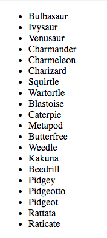
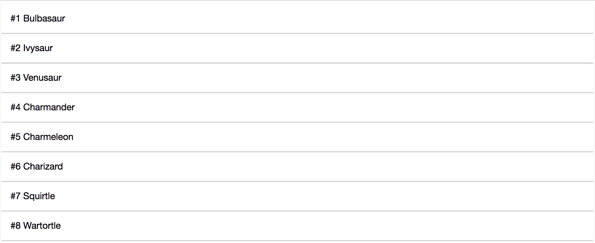
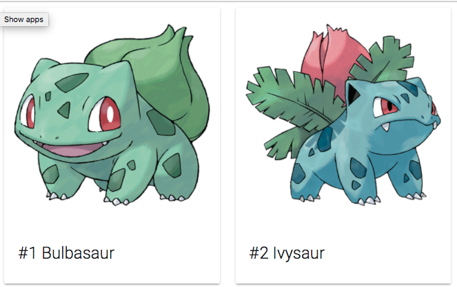

In my [last tutorial](/services-angular-rxjs/), we finished creating [a service](https://github.com/g00glen00b/ng2-pokedex/blob/master/src/app/shared/services/pokemon.service.ts) that has two functions for finding pokémons. First of all we have the `findAll()` function to return multiple pokémons (only basic info though) and secondly, we have the `findOne()` function which will return more detailed information about a single pokémon. Both of these are using the [pokéapi](https://pokeapi.co/) as their backend. In this article we will be using the `findAll()` API to create a pokédex.

### Generating a component

We've seen already how to generate both classes and services with [Angular CLI](https://cli.angular.io/), but you can generate a lot more than that. This time, we'll need to create a component, so I'm going to use the following command:

```
ng g component pokemon-list
```

Which is actually a shorthand for using:

```
ng generate component pokemon-list
```

As you can see in your IDE, this generated four files:

- **app/pokemon-list/pokemon-list.component.css**: This file will contain all the styles for the component. Be aware though that Angular 2 will make sure that the CSS rules are only executed for the given component. Even when you use something like `a { color: pink }`, it will prefix it with a unique identifier for the given component, so that it's only applied to all links within the component.
- **app/pokemon-list/pokemon-list.component.html**: This file will contain the template for the component.
- **app/pokemon-list/pokemon-list.component.spec.ts**: This file will contain the unit tests for the component
- **app/pokemon-list/pokemon-list.component.ts**: This file will contain the component itself

In our case, we won't write any unit test soon, so you can delete the \*.spec.ts file. I won't be adding custom styles to this component either, so you can remove this file as well. However, if you do so, you also have to edit **pokemon-list.component.ts** so that the `styleUrls` parameter to the `@Component` decorator is removed:

```typescript
@Component({
  selector: 'app-pokemon-list',
  templateUrl: './pokemon-list.component.html'
})
export class PokemonListComponent implements OnInit {

  constructor() { }

  ngOnInit() {
  }
```

}

Next to generating these four files, it will also add the component to **app.module.ts**.

### Lifecycle hooks

If we take a closer look at the component, we see a constructor and a function called `ngOnInit()`. This function has to be created when you implement from `OnInit`, like we do in our component. Functions like `OnInit`, `OnChanges`, ... are called [lifecycle hooks](https://angular.io/docs/ts/latest/guide/lifecycle-hooks.html), they're a new feature in Angular 2, but they are also available in AngularJS 1.5 now.

Before AngularJS 1.5, people usually used the `ngInit` directive, or used `$scope.$watch()`, both of these weren't really recommended approaches, and since AngularJS 1.5 and Angular 2 we have a much cleaner solution now.

In our case, we can use the `ngOnInit()` lifecycle hook to call our `PokemonService`, but before we do that, we have to inject it in our component by adding it to the constructor:

```typescript
constructor(private _service: PokemonService) { }
```

Next to that, we also have to add it to the providers of our component:

```typescript
@Component({
  providers: [PokemonService],
  selector: 'app-pokemon-list',
  templateUrl: './pokemon-list.component.html'
})
export class PokemonListComponent implements OnInit {
  // ...
}
```

Make sure that you import the service properly as well. Some IDE's might warn you for that and suggest adding the import, but if that's not the case, this is the import you should add:

```typescript
import {PokemonService} from '../shared/services/pokemon.service';
```

### Setting the model

Now, writing all of the code we need in the `ngOnInit()` function isn't really clean either, your `ngOnInit()` should call the function it needs to initialize the component, so let's create a function called `findAll()` so that it can be called from within the `ngOnInit()` method:

```typescript
findAll(offset: number, limit: number) {
  // TODO    
}
```

If you remember from last time, we also used the parameters `offset` and `limit` to pass which page of pokémons we'll retrieve. We're getting close to 1000 pokémons, so retrieving them all in one call would put a strain on both the API and our webbrowser as well, if we had to render all of them at once.

The question here is, how will we define the offset and the limit, and what will we do with the pokémons that are returned from the service? Well, we define some fields in our components, which will act as our model so that it can be used by the view (the HTML template). So let's create the following fields:

```typescript
pokemons: PokemonEntry[];
count: number = 0;
offset: number = 0;
limit: number = 20;
```

So, we have four fields here, the `pokemons` field will be an array of `PokemonEntry`, which is one of the model classes I made last time. The `offset` and `limit` fields are both used for pagination and are already initialized properly. The last field is the `count` property, which we'll use for calculating how many pages there are as soon as we start writing a pagination component.

### Subscribing to our observable

Last time, we subscribed to the observable from our service to test it out, this time, we'll do a similar thing, but in stead of printing stuff to the console, we will use it to set both the `pokemons` and `count` fields:

```typescript
findAll(offset: number, limit: number) {
  this.pokemons = [];
  this._service.findAll(offset, limit).subscribe(result => {
    this.pokemons = result.pokemons;
    this.count = result.count;
  });
}
```

So, we're using the service here, pass the `offset` and the `limit` as parameters, then we subscribe to this observable with an arrow function that will copy both the pokemons and the count to their respective field.

You might be asking why I'm initializing `this.pokemons` here to an empty array (`[]`). This is because if we call the `findAll()` function later on for a second time, I don't want the data for the first page to remain until the second page is loaded. Rather than that I want to clear the data of the first page, show a loader, and then show the data of the second page. For that reason I'm initializing this field to an empty array.

Now that we have our `findAll()` function, we can call it from within the `ngOnInit()` function like this:

```typescript
ngOnInit() {
  this.findAll(this.offset, this.limit);
}
```

### Using a component

If we take a look at the `@Component` decorator, we'll see that it has three properties now, the `providers` we made, the `templateUrl` referencing to the HTML template and the `selector` property. This property is used to tell which element name should be used for our component. Angular CLI generates this by itself, based on the name of the component, prefixed with `app-`. In this case, if we add an element called `<app-pokemon-list></app-pokemon-list>`, Angular will know that it has to use that specific component here.

So, let's open **app.component.html** and add `<app-pokemon-list></app-pokemon-list>`. Feel free to remove the previous HTML code. If you take a look at the application now in our browser (by default it runs on [http://localhost:4200/](http://localhost:4200/)), you can see that it now says "pokemon-list" works. If you wonder where this comes from, then open the **pokemon-list.component.html** file and you'll see that by default it generated:

```html
<p>
  pokemon-list works!
</p>
```

### Template interpolation

Now, it's great that we can already make our component work, but right now our component is pretty silly. So let's change that. The first thing I want to show is interpolation. This way of one-way binding is often used for visualizing data. In our case, let's try to show the total count.

Open **app/pokemon-list/pokemon-list.tpl.html** and replace the template with the following:

```html
<p>Gotta catch all {{count}} pokémons</p>
```

The `{{count}}` is what we call template interpolation. In this case, Angular will use the field called `count` inside the component to render this. If you run the application, you'll see that it first shows "Gotta catch all 0 pokémons" and when the Http call is finished, it should show "Gotta catch all 811 pokémons" (this number might change if there are new pokémons released). This also shows clearly that when you update the model (eg. by changing `this.count` to a different value), the view will also update.

### Using ngFor

It's already cool that we can show the total amount of pokémons, but I'm more interested in visualizing the pokémons themselves. However, we have to loop over an array here, so we'll have to use something differently here. For cases like this, Angular has a directive called [`NgFor`](https://angular.io/docs/ts/latest/api/common/index/NgFor-directive.html). So let's try it out!

Replace your previous template with the following:

```html
<ul>
  <li *ngFor="let pokemon of pokemons">{{pokemon?.name}}</li>
</ul>
```

If we run the application now, you'll see that it shows the first twenty pokémons now in a list:



If you're wondering why I'm adding a question mark between `pokemon?.name`, well, that's because this will make sure that if `pokemon` is `null` or `undefined` that it will not throw any errors because it can't find the `name` property. This is what we call the **elvis operator**, so if you need to google it one day, there you go! The reason behind this name is that if you looks closely, it looks a bit like Elvis' haircut.

Great! Though it's pretty ugly right now. So let's use [Materialize](http://materializecss.com/cards.html) now. While setting up this project I've installed the `materialize-css` package, and I imported the CSS into the application by adding the following to **styles.css**:

```css
@import '~materialize-css/dist/css/materialize.min.css';
```

Now change the **pokemon-list.component.html** template to this:

```html
<div class="card" *ngFor="let pokemon of pokemons">
  <div class="card-content">
    <span class="card-title truncate" [title]="pokemon?.name">#{{pokemon?.id}} <span class="capitalize">{{pokemon?.name}}</span></span>
  </div>
</div>
```

If you open the application now, you'll see that it looks completely different now:



### Property binding

While it looks great so far and we can loop over a collection to show most fields, it's time to show the sprite/image of every pokémon as well. To do that, we use the following markup:

```html
<div class="card" *ngFor="let pokemon of pokemons">
  <div class="card-image">
    
  </div>
  <div class="card-content">
    <span class="card-title truncate" [title]="pokemon?.name">
      #{{pokemon?.id}} <span class="capitalize">{{pokemon?.name}}</span>
    </span>
  </div>
</div>
```

As you can see, we have added an `` here, but rather than using a normal `src` attribtue, we wrapped it using square brackets until it became `[src]="pokemon?.sprite"`. This is what we call **property binding**, it allows us to bind a value to a poperty of our element, in this case the `src` property of the image.

However, because it's overkill to have only one card on every row, I'm also going to wrap this in a grid, so the template will look like this:

```html
<div class="row">
  <div class="col s3" *ngFor="let pokemon of pokemons">
    <div class="card">
      <div class="card-image">
        
      </div>
      <div class="card-content">
        <span class="card-title truncate" [title]="pokemon?.name">
          #{{pokemon?.id}} <span class="capitalize">{{pokemon?.name}}</span>
        </span>
      </div>
    </div>
  </div>
</div>
```

Except adding the grid I also had to move the `*ngFor` from my card to a grid column, because we will be repeating the column rather than the card itself. If you run the application now, you get something that's looking pretty good already:



### Creating smaller components

We're not done yet though! The goal with component frameworks like Angular is to create components with a small scope and a minimum of logic. In our case the template is growing a bit already, so let's split this into a new component. To create a new component use:

```
ng g component pokemon-list/pokemon-entry
```

Once again it will generate four files, but just like before, I won't need the **pokemon-entry.component.css** or **pokemon-entry.component.spec.ts** file, so I'll remove them.

Now let's move some code of the **pokemon-list.component.html** template to our new template. In this case I want to copy the entire card:

```html
<div class="card">
  <div class="card-image">
    
  </div>
  <div class="card-content">
    <span class="card-title truncate" [title]="pokemon?.name">
      #{{pokemon?.id}} <span class="capitalize">{{pokemon?.name}}</span>
    </span>
  </div>
</div>
```

### Using `@Input`

Whew, that was easy... but we're not there yet! We still have to pass the `pokemon` somehow from one component to another. To do that, we're going to create a new property in our **pokemon-entry.component.ts**:

```typescript
pokemon: PokemonEntry = null;
```

Don't forget to import the `PokemonEntry`:

```typescript
import {PokemonEntry} from '../../shared/models/pokemon-entry';
```

Now that we have a field, it's time to tell Angular that this field is an input for this component. To do that, we use the `@Input` decorator like this:

```typescript
@Input() pokemon: PokemonEntry = null;
```

And again, make sure to import it as well:

```typescript
import {Input} from '@angular/core';
```

That's about everything we had to do on this side, now let's refactor the **pokemon-list.component.tpl.html** to use our newly made component by refactoring the template to this:

```html
<div class="row">
  <div class="col s3" *ngFor="let pokemon of pokemons">
    <app-pokemon-entry [pokemon]="pokemon"></app-pokemon-entry>
  </div>
</div>
```

As you can see, we're using **property binding** here to pass the pokémon to the newly made component, it's as easy as that!

If you run the application again, the result should (hopefully) be the same. If that's the case, then it means that we've successfully written two components! Next time, we'll write yet another component, this time being a pagination component!

#### Achievement: Wrote your first component with Angular 2

If you’re seeing this, then it means you successfully managed to make it through this tutorial. If you're interested in the code, you can check it out at [Github](https://github.com/g00glen00b/ng2-pokedex).
