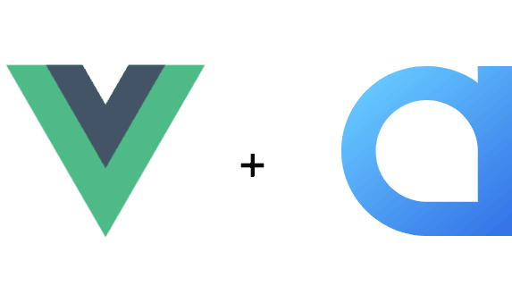
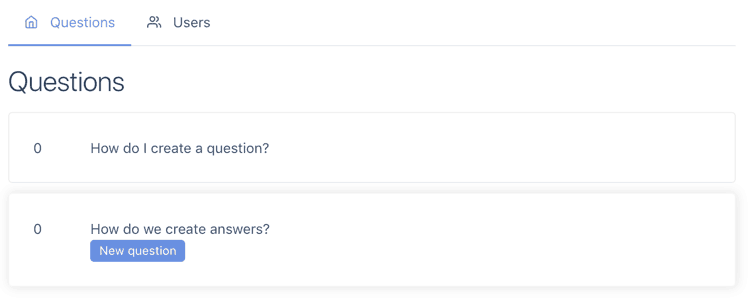

[Vue.js](https://vuejs.org/) gained quite some popularity over the past few years. As a JavaScript framework, it positions itself next to React, Angular and a few other libraries to provide a component-based application structure. In this example, I'll create a Q&A application... with Vue!

[](https://wordpress.g00glen00b.be/wp-content/uploads/2018/05/vue-at-ui-e1525425198368.png)

### What is Vue

Vue is a framework designed to provide structure to a JavaScript application by introducing components. It's similar to Angular as you'll use template-based bindings (in contrary to React, which uses JSX), and many features will come out of the box, such as routing, state management, ... . Vue is **progressive**, since it allows you to use it in certain parts of your application, without having to adopt Vue into your entire application. Additionally to being progressive, it's also **reactive**, which means that it'll change the rendered HTML as soon as the data changes, to do this, Vue uses a virtual DOM to see what impact certain changes have, which makes it more performant than immediately updating the rendered DOM.

### Getting started

The easiest way to get started with Vue is by using the [Vue CLI](https://github.com/vuejs/vue-cli). To install the CLI, you just need to use npm:

```
npm install -g @vue/cli
```

This will install v3.x of the CLI, which is currently in beta. Also note that you need to have at least **v8.x** installed of Node.js in order to work with the new CLI. Alternatively you could install v2.x of the CLI, but in the newest version, things were simplified.

Now, to set up a project, all you need to do is to use the following command:

```
vue create my-project-name
```

The CLI will ask you which settings to apply, which could be either the default (using Babel + ESLint + Webpack) or a custom choice.

I'll also install [AT UI](https://at-ui.github.io/at-ui/#/en/docs/installation), a UI kit for Vue.js applications:

```
npm install -s at-ui at-ui-style
```

The next step is to load the components by importing it and using `Vue.use()`. This can be done by pasting the following code in **src/main.js**:

```
import AtUI from 'at-ui';
import 'at-ui-style';

Vue.use(AtUI);
```

Make sure to do this before bootstrapping your Vue application.

To see if it worked, you can add a simple button to `App.vue`:

```
<template>
  <div id="app">
    <div class="container">
      <at-button type="primary">Test</at-button>
    </div>
  </div>
</template>
```

If you run the application now, you should see a blue button appear. This can be done by running the following command:

```
npm run serve
```

### Creating your own components

In this tutorial, we're going to set up a few components so we can use them in the future. First of all, let's create a header for our application. I'm going to call this component **src/components/core/SiteHeader.vue**:

```
<template>
  <at-menu mode="horizontal" active-name="questions">
    <at-menu-item name="questions"><i class="icon icon-home"></i> Questions</at-menu-item>
    <at-menu-item name="users"><i class="icon icon-users"></i> Users</at-menu-item>
  </at-menu>
</template>

<script>
  export default {

  }
</script>

<style scoped>

</style>
```

A Vue component contains three parts, a template (which is the HTML that should be rendered), a script, containing the logic for each component and the style for each component. You can use CSS in here, but also a CSS preprocessor like Sass. If you would like to use Sass, you do have to install two other node modules though (being **sass-loader** and **node-sass**). You also have to add the `lang="scss"` attribute to the `<style>` element.

In this case, I'm going to keep the component quite simple, routing will be for another time, so the component will only have a template... for now.

### Using components within other components

Now that we have our site header component, it's time to include it within the `App` component. The first step to do this is to import the component:

```
import SiteHeader from '@/components/core/SiteHeader';
```

The next thing is to register it within the `App` component itself, to do this you have to use the `components` section:

```
export default {
  components: {SiteHeader}
}
```

Now that we did this, we can add the header into the template by using the `<SiteHeader>` tag:

```
<template>
  <div id="app">
    <div class="container">
      <SiteHeader></SiteHeader>
      <div class="inner-container">
        <h1 class="page-title">Questions</h1>
      </div>
    </div>
  </div>
</template>
```

I also added a bit CSS to the app component to add some spacing:

```
.inner-container {
  padding: 1em 0;
}

.page-title {
  font-weight: 300;
  font-size: 2em;
}
```

### Working with data

When we'll start with routing (probably in the next tutorial), it's important to keep each page on a separate component. In my example, the most important page will be a page containing all questions, so I'll name it **src/components/questions/QuestionsPage.vue**.

This component will mostly contain references to other components and propagate the data to them. So first, let's create a dummy **src/components/questions/QuestionList.vue** component and include it into the `QuestionsPage` component as we've seen before using the `components` section.

After that, we can create some dummy data by using the `data` section:

```
import QuestionList from './QuestionList';
  
export default {
  components: {QuestionList},
  data () {
    return {
      questions:  [{
        "_id": "5aeb5c6d9be6ec471bcdff30",
        "title": "How do I create a question?",
        "firstPost": {
          "_id": "5aeb5c6d9be6ec471bcdff31",
          "voteCount": 0,
          "createdAt": "Thu Apr 20 2018 21:01:01 GMT+0200 (CEST)"
        }
      }, {
        "_id": "5aebefb06287f50673c1a308",
        "title": "How do we create answers?",
        "firstPost": {
          "_id": "5aebefb06287f50673c1a309",
          "voteCount": 0,
          "createdAt": "Fri May 04 2018 07:29:20 GMT+0200 (CEST)"
        }
      }]
    };
  }
}
```

This data will eventually come from the GraphQL API I wrote before. But for now, we'll just use a dummy result.

### Passing properties to other components

Now, we just created a `QuestionList` component, but our data is within the `QuestionsPage` component... so how do we pass it? To pass properties, you can use the `props` section, and define each property and configure the type and tell if its required or not:

```
export default {
  props: { 
    questions: {
      required: true,
      type: Array
    }
  }
}
```

The next step is to loop over the questions and to show the details of it. To do this, I'm going to create a new component called **src/components/questions/QuestionListItem.vue**. This component will also require a property, but in this case it will be a single question:

```
export default {
  props: {
    question: {
      required: true,
      type: Object
    }
  }
}
```

Within the `QuestionsPage` component, we can now pass the questions by using the following template:

```
<template>
  <QuestionList :questions="questions"></QuestionList>
</template>
```

Buy using the `:questions=questions` property, we assign the data within this component, to the `questions` property of the `QuestionList` component.

### Working with computed properties

Within the `QuestionListItem` component, I want to be able to show a "new question" tag if the question has been posted less than a week ago.

To do this, I want to create a property called `isNew` that will be automatically calculated based on the `question.firstPost.createdAt` property.

To make this work, I'm going to use a library called [Moment.js](https://momentjs.com/), so I'll have to install it first:

```
npm install --save moment
```

After that, I can import it and use it:

```
import moment from 'moment';

export default {
  computed: {
    isNew () {
      return moment(this.question.firstPost.createdAt).isAfter(moment().subtract(1, 'week'));
    }
  },
  props: {
    question: {
      required: true,
      type: Object
    }
  }
}
```

Now that we have our question and the `isNew` property, we can write our template:

```
<template>
  <div class="card-wrapper">
    <at-card>
      <div class="row">
        <div class="col-2">
          {{question.firstPost.voteCount}}
        </div>
        <div class="col-10">
          {{question.title}}<br />
          <at-tag v-if="isNew" color="primary">New question</at-tag>
        </div>
      </div>
    </at-card>
  </div>
</template>
```

### Working with arrays

Back in our `QuestionList` component, we still have to use `QuestionListItem` somehow. To do this, we can use the `v-for` directive to create a `QuestionListItem` component for each question in the array:

```
<template>
  <div>
    <QuestionListItem :question="question" v-for="question in questions" :key="question._id"></QuestionListItem>
  </div>
</template>
```

What happens here is that with the `v-for` directive, the component is repeated for each question, which we can then pass to the right property by using `:question="question"`, similar like what we did within the `QuestionsPage` component.

### Testing it out

If we add the `QuestionsPage` component to the `App` component properly like we did before, you should be able to see the result. The application should look like this:

[](https://wordpress.g00glen00b.be/wp-content/uploads/2018/05/workspaces-vue-app.png)

Depending on the `createdAt` date, you'll see a "New question" tag next to the question or not. The code can, as usual be found on [GitHub](https://github.com/g00glen00b/apollo-express-vue-example).
