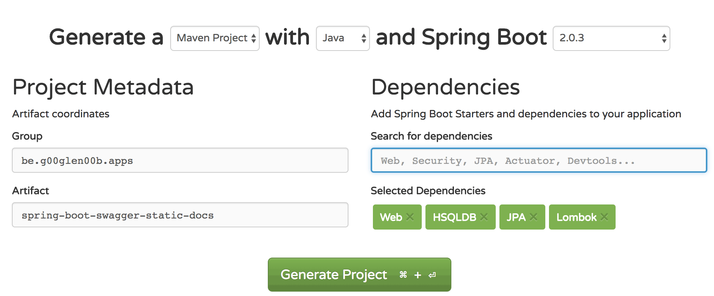
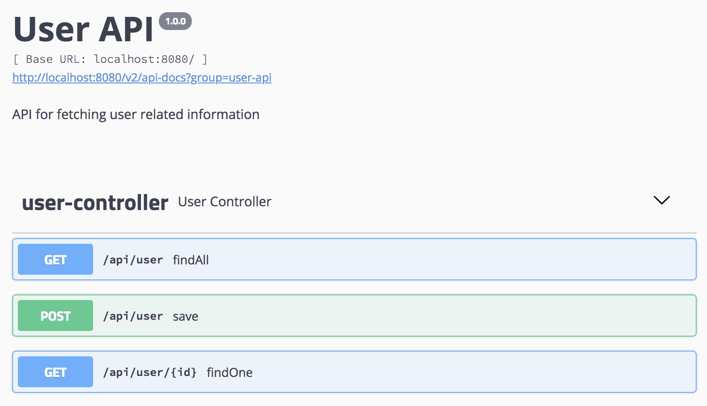
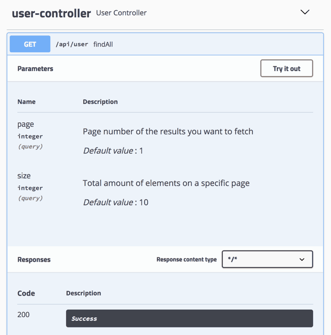
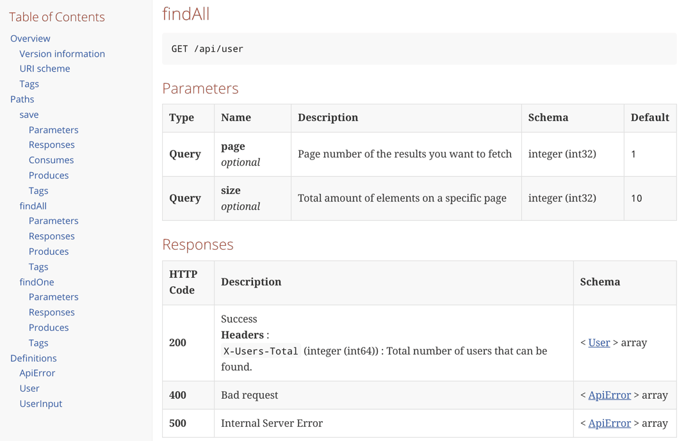

[A while ago](/documenting-rest-api-swagger-springfox/), I used Springfox to include Swagger into our Spring projects. This allows us to use the Swagger UI tester to obtain some live documentation and testing for our REST APIs. However, sometimes you also want to have a static version of the documentation available, so that it can be printed, read without having your application running, ... . In this tutorial we'll see how we can do this.


### Creating a REST API

Before we can actually start documenting our REST API... we need a REST API. For this project, I'll use the same API as [my tutorial about validating your REST API with bean validation](/validating-the-input-of-your-rest-api-with-spring/). In order to create such a project, I'll add **Lombok**, **JPA**, **Web** and **HSQLDB** as my dependencies:



With our project set up, we can create a few model classes representing the API we want to define. In my case, I'm going to write a user API that will allow me to create and find users. That's why I created the following classes:

```java
@Entity
@Data
@NoArgsConstructor
@AllArgsConstructor
public class User {
    @Id
    @GeneratedValue(strategy = GenerationType.IDENTITY)
    private Long id;
    private String lastName;
    private String middleName;
    private String firstName;
    private LocalDate dateOfBirth;
    private Integer siblings;
}
```

```java
@Data
@NoArgsConstructor
@AllArgsConstructor
public class UserInput {
    @NotNull(message = "Last name should not be empty")
    @Size(min = 1, max = 60, message = "Last name should be between 1 and 60 characters")
    private String lastName;
    @Size(max = 60, message = "Middle name should be at most 60 characters")
    private String middleName;
    @NotNull(message = "First name should not be empty")
    @Size(min = 1, max = 60, message = "First name should be between 1 and 60 characters")
    private String firstName;
    @NotNull(message = "Date of birth should not be empty")
    @Past(message = "Date of birth should be in the past")
    private LocalDate dateOfBirth;
    @NotNull(message = "The amount of siblings should ot be empty")
    @PositiveOrZero(message = "The amount of siblings should be positive")
    private Integer siblings;
}
```

```java
@Data
@AllArgsConstructor
public class ApiError {
    private String[] codes;
    private String message;

    public ApiError(String code, String message) {
        this(new String[] {code}, message);
    }
}
```

Since `User` is an entity, I also defined a repostiory using Spring Data JPA:

```java
public interface UserRepository extends JpaRepository<User, Long> {
}
```

And to actually serve some REST APIs, I defined a controller:

```java
@Validated
@RestController
@RequestMapping("/api/user")
@AllArgsConstructor
public class UserController {
    private UserRepository repository;

    @PostMapping
    @Transactional
    public User save(@RequestBody @Valid UserInput user) {
        return repository.saveAndFlush(new User(
            null,
            user.getLastName(),
            user.getMiddleName(),
            user.getFirstName(),
            user.getDateOfBirth(),
            user.getSiblings()));
    }

    @GetMapping
    public ResponseEntity<List<User>> findAll(
        @Valid @Positive @RequestParam(required = false, defaultValue = "1") int page,
        @Valid @Positive @RequestParam(required = false, defaultValue = "10") int size) {
        HttpHeaders headers = new HttpHeaders();
        Page<User> users = repository.findAll(PageRequest.of(page, size));
        headers.add("X-Users-Total", Long.toString(users.getTotalElements()));
        return new ResponseEntity<>(users.getContent(), headers, HttpStatus.OK);
    }

    @GetMapping
    public User findOne(@PathVariable Long id) {
        return repository
            .findById(id)
            .orElseThrow(() -> new UserNotFoundException("User with id '" + id + "' is not found"));
    }

    @ResponseStatus(HttpStatus.BAD_REQUEST)
    @ExceptionHandler(MethodArgumentNotValidException.class)
    public List<ApiError> handleValidationExceptions(MethodArgumentNotValidException ex) {
        return ex.getBindingResult()
            .getAllErrors().stream()
            .map(err -> new ApiError(err.getCodes(), err.getDefaultMessage()))
            .collect(Collectors.toList());
    }

    @ResponseStatus(HttpStatus.NOT_FOUND)
    @ExceptionHandler(UserNotFoundException.class)
    public List<ApiError> handleNotFoundExceptions(UserNotFoundException ex) {
        return Collections.singletonList(new ApiError("user.notfound", ex.getMessage()));
    }

    // Other handlers...
}
```

### Setting up Springfox

Well, we have our REST API now, but no documentation... yet. The first step to be able to do this is to add a few dependencies:

```xml
<dependency>
    <groupId>io.springfox</groupId>
    <artifactId>springfox-swagger-ui</artifactId>
    <version>2.8.0</version>
</dependency>
<dependency>
    <groupId>io.springfox</groupId>
    <artifactId>springfox-swagger2</artifactId>
    <version>2.8.0</version>
</dependency>
```

Springfox is a library that works on top of Swagger/OpenAPI to use our Spring controllers to generate API documentation. After adding these dependencies, we can enable Springfox by adding the `@EnableSwagger2` annotation and some additional configuration:

```java
@Bean
public Docket docket(ApiInfo apiInfo) {
    return new Docket(DocumentationType.SWAGGER_2)
        .groupName("user-api")
        .useDefaultResponseMessages(false)
        .apiInfo(apiInfo)
        .select().paths(regex("/api/.*"))
        .build();
}

@Bean
public ApiInfo apiInfo() {
    return new ApiInfoBuilder()
        .title("User API")
        .description("API for fetching user related information")
        .version("1.0.0")
        .build();
}

@Bean
public UiConfiguration uiConfiguration() {
    return UiConfigurationBuilder.builder()
        .deepLinking(true)
        .validatorUrl(null)
        .build();
}
```

Now that we have all of this, it's time to test it out by running the application and visiting [http://localhost:8080/swagger-ui.html](http://localhost:8080/swagger-ui.html). Normally, you should be able to see your API here now:



The only issue is that our API documentation isn't describing our API properly yet. Luckily, there's nothing we can't fix, so let's add some annotations to our controller to describe the API, for example:

```java
@GetMapping
@Validated
@ApiResponses(value = {
    @ApiResponse(code = 200, message = "Success", response = User[].class, responseHeaders = {
        @ResponseHeader(name = "X-Users-Total", description = "Total number of users that can be found", response = Long.class),
    }),
    @ApiResponse(code = 400, message = "Bad request", response = ApiError[].class),
    @ApiResponse(code = 500, message = "Internal Server Error", response = ApiError[].class)
})
public ResponseEntity<List<User>> findAll(
    @ApiParam("Page number of the results you want to fetch")
    @Valid @Positive @RequestParam(required = false, defaultValue = "1") int page,
    @ApiParam("Total amount of elements on a specific page")
    @Valid @Positive @RequestParam(required = false, defaultValue = "10") int size) {
    HttpHeaders headers = new HttpHeaders();
    Page<User> users = repository.findAll(PageRequest.of(page, size));
    headers.add("X-Users-Total", Long.toString(users.getTotalElements()));
    return new ResponseEntity<>(users.getContent(), headers, HttpStatus.OK);
}
```

By using annotations like `@ApiParam`, `@ApiResponses` and so on, we can provide more detailed information that would otherwise not be there.

If we run the application now, we can see those descriptions in action:



### Obtaining the API specification

While the live API tester/documentation is great, sometimes it's interesting to have these statically generated as well. With Springfox this is also possible, through a small warkaround.

The tool I'm going to use is the [Swagger2markup tool](https://github.com/Swagger2Markup/), and more precisely, the Maven plugin it offers. This Maven plugin will be able to generate our documentation in an AsciiDoc or Markdown format based on the Swagger specification of our API.

However, the first issue is; how do we get this Swagger specification? If you run the application, you can find this specification by going to [http://localhost:8080/v2/api-docs?group=user-api](http://localhost:8080/v2/api-docs?group=user-api) (note that **user-api** is the group name we defined in the configuration earlier on). This JSON specification is used by Swagger UI to generate the online documentation at runtime.

Now, to obtain this specification locally, we'll have to use a small work-around. By writing an integration test that runs the Spring boot application, we can download the JSON file, which can then be used in other Maven plugins for further processing:

```java
@WebMvcTest
@Import(ApiConfiguration.class)
@RunWith(SpringJUnit4ClassRunner.class)
public class SwaggerAPIIntegrationTest {
    @Autowired
    private MockMvc mockMvc;
    @MockBean
    private UserRepository repository;

    @Test
    public void swaggerJsonExists() throws Exception {
        String contentAsString = mockMvc
            .perform(MockMvcRequestBuilders.get("/v2/api-docs")
                .accept(MediaType.APPLICATION_JSON)
                .param("group", "user-api"))
            .andExpect(status().isOk())
            .andReturn()
            .getResponse().getContentAsString();
        try (Writer writer = new FileWriter(new File("target/generated-sources/swagger.json"))) {
            IOUtils.write(contentAsString, writer);
        }
    }
}
```

So, what happened here is that I wrote a test using the `@WebMvcTest` annotation. This will load the web context, but none of the additional configuration. This is an issue, since we defined those beans earlier on in a separate configuration file. That's why I included this configuration file using the `@Import` annotation.

With `MockMvc`, we can call the `/v2/api-docs` path to obtain the specification. Afterwards, we can use [Apache Commons IO](https://commons.apache.org/proper/commons-io/) to save the content within `target/generated-sources/swagger.json`. In order to do this, we need an additional dependency:

```xml
<dependency>
    <groupId>commons-io</groupId>
    <artifactId>commons-io</artifactId>
    <version>2.6</version>
</dependency>
```

### Generating the documentation

The next step is to generate the documentation itself based on the specification. This can be done by the Maven plugin I mentioned earlier. To be able to do this we need to configure it and decide whether we want to generate Markdown or AsciiDoc. In this example I'll be using AsciiDoc since it allows you to write more advanced documentation:

```xml
<plugin>
    <groupId>io.github.swagger2markup</groupId>
    <artifactId>swagger2markup-maven-plugin</artifactId>
    <version>1.3.3</version>
    <configuration>
        <swaggerInput>${project.build.directory}/generated-sources/swagger.json</swaggerInput>
        <outputDir>${project.build.directory}/generated-sources/swagger/</outputDir>
        <config>
            <swagger2markup.markupLanguage>ASCIIDOC</swagger2markup.markupLanguage>
        </config>
    </configuration>
    <executions>
        <execution>
            <phase>prepare-package</phase>
            <goals>
                <goal>convertSwagger2markup</goal>
            </goals>
        </execution>
    </executions>
</plugin>
```

In this example I'm generating the documentation within the **target/generated-sources/swagger/** directory within the **prepare-package** phase. This phase runs after the test phase, so we can use that, since the test will have completed and the file will have been generated.

Be aware, this will generate three AsciiDoc files called **overview.adoc**, **paths.adoc** and **definitions.adoc**.

This plugin will require some dependencies that aren't available in Maven central as far as I know. So you may want to add the following plugin repositories to your **pom.xml**:

```xml
<pluginRepositories>
    <pluginRepository>
        <id>jcenter-snapshots</id>
        <name>jcenter</name>
        <url>http://oss.jfrog.org/artifactory/oss-snapshot-local/</url>
    </pluginRepository>
    <pluginRepository>
        <snapshots>
            <enabled>false</enabled>
        </snapshots>
        <id>jcenter-releases</id>
        <name>jcenter</name>
        <url>http://jcenter.bintray.com</url>
    </pluginRepository>
</pluginRepositories>
```

### Generating HTML documentation

If your goal is to generate HTML files, you have to add an additional step to render the AsciiDoc into HTML. But before we can generate a HTML file, we probably need to merge the generated documentation files into one **index.adoc** file:

```asciidoc
include::{generated}/overview.adoc[]
include::{generated}/paths.adoc[]
include::{generated}/definitions.adoc[]
```

I've stored this file within the **src/main/asciidoc** folder, where you can put all your manually written documentation. After that, we can use the **asciidoctor-maven-plugin** to generate the HTML files:

```xml
<plugin>
    <groupId>org.asciidoctor</groupId>
    <artifactId>asciidoctor-maven-plugin</artifactId>
    <version>1.5.3</version>
    <dependencies>
        <dependency>
            <groupId>org.jruby</groupId>
            <artifactId>jruby-complete</artifactId>
            <version>1.7.21</version>
        </dependency>
    </dependencies>
    <configuration>
        <sourceDirectory>${project.basedir}/src/main/asciidoc/</sourceDirectory>
        <sourceDocumentName>index.adoc</sourceDocumentName>
        <backend>html5</backend>
        <outputDirectory>${project.build.directory}/generated-sources/swagger-html/</outputDirectory>
        <attributes>
            <toc>left</toc>
            <toclevels>3</toclevels>
            <generated>${project.build.directory}/generated-sources/swagger/</generated>
        </attributes>
    </configuration>

    <executions>
        <execution>
            <id>output-html</id>
            <phase>prepare-package</phase>
            <goals>
                <goal>process-asciidoc</goal>
            </goals>
        </execution>
    </executions>
</plugin>
```

In this plugin, we're telling to process the AsciiDoc files as HTML, that it should contain a table of contents at the left side, and that the `{generated}` placeholder that we used within **index.adoc** should resolve to the folder where our automatically generated documentation is stored thanks to the other Maven plugin we used.

### Viewing the documentation

If you're running the Maven using the `mvn clean package` command, you'll be able to find your generated documentation within the **target/generated-sources/swagger-html** directory. You can now deploy this documentation somewhere, or share it, ... . If you prefer PDF, you can use the asciidoc Maven plugin to generate PDFs as well in stead of HTML.



In another project of mine, I used this approach combined with Travis CI to deploy the documentation to the **gh-pages** branch, which you can view on [GitHub](https://aquafinnv.github.io/biodiversity-api/). As usual, the code used in this example can be found on [GitHub](https://github.com/g00glen00b/spring-samples/tree/master/spring-boot-swagger-static-docs) as well.
