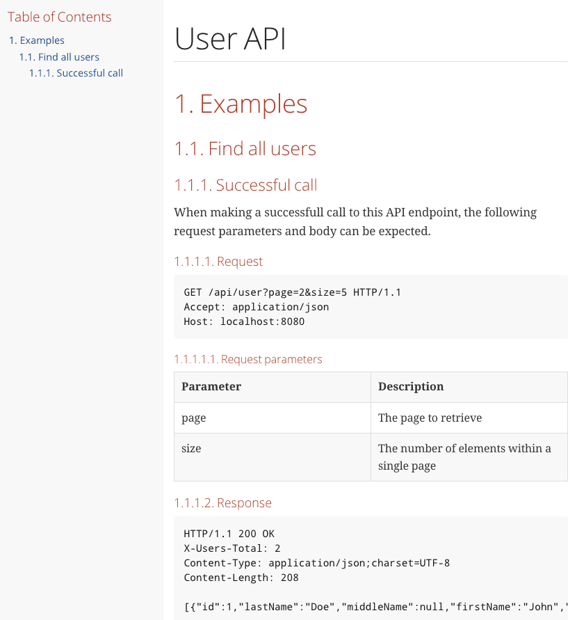
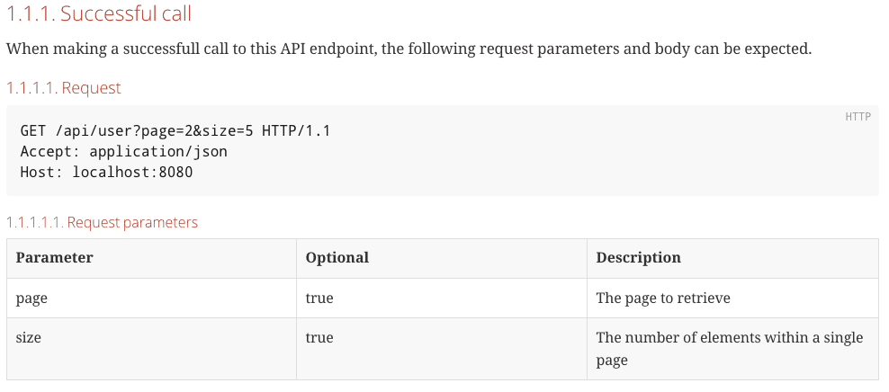
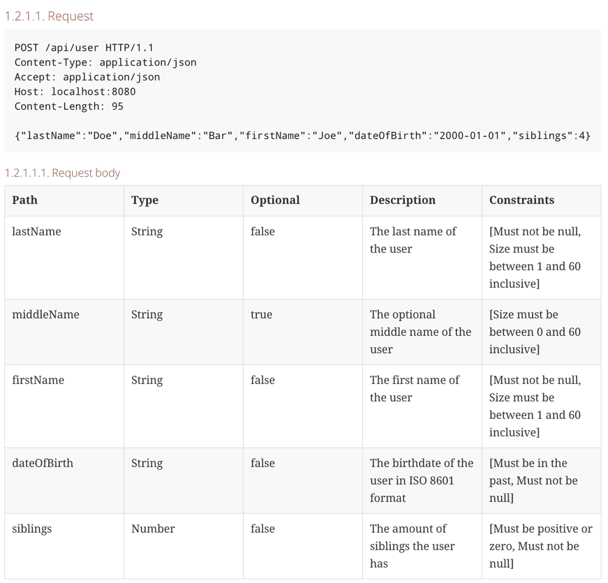

[Last time](https://wordpress.g00glen00b.be/generating-static-documentation-swagger/), we automatically generated documentation for our REST APIs written with Spring using Swagger annotations, Springfox and AsciiDoc. This allowed us to list all possible operations, models and so on. Additionally to such documentation, it could be interesting to have some examples as well. With Spring REST Docs we can automatically generate these examples by writing some integration tests. Let's find out how!

### Setting up a project

Before we can actually generate our documentation, we need a working REST API. So let's start by opening Spring Initializr and adding a few dependencies like **Web**, **HSQLDB**, **JPA**, **Lombok** and also **REST Docs**.

After opening the project in our favourite IDE, we can start writing our models. Just like last time, my API will be about creating and retrieving users.

```
@Entity
@Data
@NoArgsConstructor
@AllArgsConstructor
public class User {
    @Id
    @GeneratedValue(strategy = GenerationType.IDENTITY)
    private Long id;
    private String lastName;
    private String middleName;
    private String firstName;
    private LocalDate dateOfBirth;
    private Integer siblings;
}
```

```
@Data
@NoArgsConstructor
@AllArgsConstructor
public class UserInput {
    @NotNull(message = "Last name should not be empty")
    @Size(min = 1, max = 60, message = "Last name should be between 1 and 60 characters")
    private String lastName;
    @Size(max = 60, message = "Middle name should be at most 60 characters")
    private String middleName;
    @NotNull(message = "First name should not be empty")
    @Size(min = 1, max = 60, message = "First name should be between 1 and 60 characters")
    private String firstName;
    @NotNull(message = "Date of birth should not be empty")
    @Past(message = "Date of birth should be in the past")
    private LocalDate dateOfBirth;
    @NotNull(message = "The amount of siblings should not be empty")
    @PositiveOrZero(message = "The amount of siblings should be positive")
    private Integer siblings;
}
```

```
@Data
@AllArgsConstructor
public class ApiError {
    private String[] codes;
    private String message;

    public ApiError(String code, String message) {
        this(new String[] {code}, message);
    }
}
```

```
public class UserNotFoundException extends RuntimeException {
    public UserNotFoundException(String message) {
        super(message);
    }
}
```

Now that we have these, we can create our repository to access the database:

```
public interface UserRepository extends JpaRepository<User, Long> {
}
```

And also our controller:

```
@Validated
@RestController
@RequestMapping("/api/user")
@AllArgsConstructor
public class UserController {
    private UserRepository repository;

    @PostMapping
    @Transactional
    public User save(@RequestBody @Valid UserInput user) {
        return repository.saveAndFlush(new User(
            null,
            user.getLastName(),
            user.getMiddleName(),
            user.getFirstName(),
            user.getDateOfBirth(),
            user.getSiblings()));
    }

    @GetMapping
    public ResponseEntity<List<User>> findAll(
        @Valid @Positive(message = "Page number should be a positive number") @RequestParam(required = false, defaultValue = "1") int page,
        @Valid @Positive(message = "Page size should be a positive number") @RequestParam(required = false, defaultValue = "10") int size) {
        HttpHeaders headers = new HttpHeaders();
        Page<User> users = repository.findAll(PageRequest.of(page, size));
        headers.add("X-Users-Total", Long.toString(users.getTotalElements()));
        return new ResponseEntity<>(users.getContent(), headers, HttpStatus.OK);
    }

    @GetMapping("/{id}")
    public User findOne(@PathVariable Long id) {
        return repository
            .findById(id)
            .orElseThrow(() -> new UserNotFoundException("User with id '" + id + "' is not found"));
    }

    @ResponseStatus(HttpStatus.BAD_REQUEST)
    @ExceptionHandler(MethodArgumentNotValidException.class)
    public List<ApiError> handleValidationExceptions(MethodArgumentNotValidException ex) {
        return ex.getBindingResult()
            .getAllErrors().stream()
            .map(err -> new ApiError(err.getCodes(), err.getDefaultMessage()))
            .collect(Collectors.toList());
    }

    @ResponseStatus(HttpStatus.BAD_REQUEST)
    @ExceptionHandler(ConstraintViolationException.class)
    public List<ApiError> handleValidationExceptions(ConstraintViolationException ex) {
        return ex.getConstraintViolations()
            .stream()
            .map(err -> new ApiError(err.getPropertyPath().toString(), err.getMessage()))
            .collect(Collectors.toList());
    }

    @ResponseStatus(HttpStatus.NOT_FOUND)
    @ExceptionHandler(UserNotFoundException.class)
    public List<ApiError> handleNotFoundExceptions(UserNotFoundException ex) {
        return Collections.singletonList(new ApiError("user.notfound", ex.getMessage()));
    }

    @ResponseStatus(HttpStatus.INTERNAL_SERVER_ERROR)
    @ExceptionHandler(Exception.class)
    public List<ApiError> handleOtherException(Exception ex) {
        return Collections.singletonList(new ApiError(ex.getClass().getCanonicalName(), ex.getMessage()));
    }
}
```

This controller contains three endpoints:

1. **GET /api/user** to retrieve all users
2. **GET /api/user/{id}** to retrieve a single user
3. **POST /api/user** to create a user

On these calls there are also certain validations. For example, the `findAll()` operation allows you to provide a page number and page size, which should be positive. Additionally, the `save()` operation validates that your input is valid. The `findOne()` operation on the other hand will return a 404 when the user does not exist.

### Setting up an integration test

Writing integration tests with Spring and Mock MVC isn't difficult, but before we can do that, we need to set up our test using some annotations:

```
@RunWith(SpringRunner.class)
@WebMvcTest
@AutoConfigureRestDocs(outputDir = "target/generated-sources/snippets")
public class SpringBootRestDocsApplicationTest {
    @Autowired
    private MockMvc mockMvc;
    @MockBean
    private UserRepository repository;

    // ...
}
```

By using the `@RunWith` annotation, we can tell JUnit to use a specific class to help with running the tests. When you're using an additional framework (Mockito, Spring, ...) you usually do this by using a runner.

Additionally, we're telling Spring to only load the web context by using the `@WebMvcTest`. This is in general faster than loading the entire application context during each test.

One annotation that's specific to generating documentation for your integration tests is the `@AutoConfigureRestDocs` annotation, which will allow us to define the location of where to store these documentation snippets.

Within the test we also autowired `MockMvc` so that we can use it within our tests, and we mocked `UserRepository` since we're using it within our controllers. In real cases you probably have a service sitting between your controller and your repository, and in such cases you only need to mock your service.

### Writing an integration test

Now that we have our test class set up, we can write some integration tests. First, let's get started with the **GET /api/user** operation:

```
@Test
public void findAllShouldReturnListOfUsers() throws Exception {
    when(repository.findAll(any(Pageable.class))).thenReturn(new PageImpl<>(Lists.newArrayList(
        new User(1L, "Doe", null, "John", LocalDate.of(2010, 1, 1), 0),
        new User(2L, "Doe", "Foo", "Jane", LocalDate.of(1999, 12, 31), 2))));
    mockMvc.perform(get("/api/user?page=2&size=5").accept(MediaType.APPLICATION_JSON))
        .andExpect(status().isOk())
        .andExpect(jsonPath("$.[0].id", is(1)))
        .andExpect(jsonPath("$.[0].lastName", is("Doe")))
        .andExpect(jsonPath("$.[0].middleName", nullValue()))
        .andExpect(jsonPath("$.[0].firstName", is("John")))
        .andExpect(jsonPath("$.[0].dateOfBirth", is("2010-01-01")))
        .andExpect(jsonPath("$.[0].siblings", is(0)))
        .andExpect(jsonPath("$.[1].id", is(2)))
        .andExpect(jsonPath("$.[1].lastName", is("Doe")))
        .andExpect(jsonPath("$.[1].middleName", is("Foo")))
        .andExpect(jsonPath("$.[1].firstName", is("Jane")))
        .andExpect(jsonPath("$.[1].dateOfBirth", is("1999-12-31")))
        .andExpect(jsonPath("$.[1].siblings", is(2)))
        .andExpect(header().longValue("X-Users-Total", 2L));
    ArgumentCaptor<Pageable> captor = ArgumentCaptor.forClass(Pageable.class);
    verify(repository).findAll(captor.capture());
    assertThat(captor.getValue().getPageNumber()).isEqualTo(2);
    assertThat(captor.getValue().getPageSize()).isEqualTo(5);
}
```

This is how we usually write tests using `MockMvc`. First we perform an action (eg. `get("/api/user")`, after which we can write several expectations. In my case the response will be a JSON array, so I'll be able to use JSON Path to parse the response and to write my expectations using matchers.

Additionally to that, there will also be a header (`X-Users-Total`), so we can write an expectation for that as well.

### Documenting the integration test

Documenting an integration test isn't difficult. Just after our test, we can use the `andDo()` method to add the documentation handler, for example:

```
@Test
public void findAllShouldReturnListOfUsers() throws Exception {
    when(repository.findAll(any(Pageable.class))).thenReturn(new PageImpl<>(Lists.newArrayList(
        new User(1L, "Doe", null, "John", LocalDate.of(2010, 1, 1), 0),
        new User(2L, "Doe", "Foo", "Jane", LocalDate.of(1999, 12, 31), 2))));
    mockMvc.perform(get("/api/user?page=2&size=5").accept(MediaType.APPLICATION_JSON))
        .andExpect(status().isOk())
        .andExpect(jsonPath("$.[0].id", is(1)))
        .andExpect(jsonPath("$.[0].lastName", is("Doe")))
        .andExpect(jsonPath("$.[0].middleName", nullValue()))
        .andExpect(jsonPath("$.[0].firstName", is("John")))
        .andExpect(jsonPath("$.[0].dateOfBirth", is("2010-01-01")))
        .andExpect(jsonPath("$.[0].siblings", is(0)))
        .andExpect(jsonPath("$.[1].id", is(2)))
        .andExpect(jsonPath("$.[1].lastName", is("Doe")))
        .andExpect(jsonPath("$.[1].middleName", is("Foo")))
        .andExpect(jsonPath("$.[1].firstName", is("Jane")))
        .andExpect(jsonPath("$.[1].dateOfBirth", is("1999-12-31")))
        .andExpect(jsonPath("$.[1].siblings", is(2)))
        .andExpect(header().longValue("X-Users-Total", 2L))
        // This can be used to generate documentation snippets
        .andDo(document("users-get-ok"));
    ArgumentCaptor<Pageable> captor = ArgumentCaptor.forClass(Pageable.class);
    verify(repository).findAll(captor.capture());
    assertThat(captor.getValue().getPageNumber()).isEqualTo(2);
    assertThat(captor.getValue().getPageSize()).isEqualTo(5);
}
```

The documentation handler requires us to provide a name to the given test case so that it can be used as the name of the folder in which the snippets will be generated. Spring REST Docs also allows us to use certain placeholders. For example, we can use `{methodName}`, `{method-name}` or `{method_name}` to use the method name in either camel case, kebab case or snake case.

After that, you should be able to find your generated documentation within the **target/generated-soruces/snippets/find-all-should-return-list-of-users**.

### Providing additional information

While Spring REST Docs will now generate some snippets for us, we can also provide additional metadata so that our snippets become even more useful. For example:

```
@Test
public void findAllShouldReturnListOfUsers() throws Exception {
    when(repository.findAll(any(Pageable.class))).thenReturn(new PageImpl<>(Lists.newArrayList(
        new User(1L, "Doe", null, "John", LocalDate.of(2010, 1, 1), 0),
        new User(2L, "Doe", "Foo", "Jane", LocalDate.of(1999, 12, 31), 2))));
    mockMvc.perform(get("/api/user?page=2&size=5").accept(MediaType.APPLICATION_JSON))
        .andExpect(status().isOk())
        .andExpect(jsonPath("$.[0].id", is(1)))
        .andExpect(jsonPath("$.[0].lastName", is("Doe")))
        .andExpect(jsonPath("$.[0].middleName", nullValue()))
        .andExpect(jsonPath("$.[0].firstName", is("John")))
        .andExpect(jsonPath("$.[0].dateOfBirth", is("2010-01-01")))
        .andExpect(jsonPath("$.[0].siblings", is(0)))
        .andExpect(jsonPath("$.[1].id", is(2)))
        .andExpect(jsonPath("$.[1].lastName", is("Doe")))
        .andExpect(jsonPath("$.[1].middleName", is("Foo")))
        .andExpect(jsonPath("$.[1].firstName", is("Jane")))
        .andExpect(jsonPath("$.[1].dateOfBirth", is("1999-12-31")))
        .andExpect(jsonPath("$.[1].siblings", is(2)))
        .andExpect(header().longValue("X-Users-Total", 2L))
        .andDo(document("{method-name}", requestParameters(
            parameterWithName("page").description("The page to retrieve").optional(),
            parameterWithName("size").description("The number of elements within a single page").optional()
        ), responseHeaders(
            headerWithName("X-Users-Total").description("The total amount of users")
        ), responseFields(
            fieldWithPath("[].id").description("The unique identifier of the user"),
            fieldWithPath("[].lastName").description("The last name of the user"),
            fieldWithPath("[].middleName").description("The optional middle name of the user").optional(),
            fieldWithPath("[].firstName").description("The first name of the user"),
            fieldWithPath("[].dateOfBirth").description("The birthdate of the user in ISO 8601 format"),
            fieldWithPath("[].siblings").description("The amount of siblings the user has"))));
    ArgumentCaptor<Pageable> captor = ArgumentCaptor.forClass(Pageable.class);
    verify(repository).findAll(captor.capture());
    assertThat(captor.getValue().getPageNumber()).isEqualTo(2);
    assertThat(captor.getValue().getPageSize()).isEqualTo(5);
}
```

By using `requestParameters()`, `responseHeaders()` and `responseFields()`, we're able to describe our parameters. When Spring generates the snippets, an additional snippet will be generated containing the descriptions for each parameter.

### Combining our snippets

Spring REST Docs generates several little snippets that you can use. The advantage of using these small snippets is that you can choose which snippets you want and which ones you don't want to include. For example, Spring REST Docs generates a cURL snippet, but perhaps you don't want to use the cURL command in your documentation, so you could just leave it away.

Now, the first step to combine these snippets is to create our "main documentation page". To do this, I'm going to create a file called **src/main/asciidoc/index.html**:

```
:sectnums:
:sectnumlevels: 5
:toc: left
:toclevels: 3
:page-layout: docs

= User API

[[examples]]
== Examples
include::find-all/index.adoc[]
```

Since I'm going to end up with a lot of snippets to include, I decided to write a separate documentation fragment for each operation and include those on the index page.

So, my **find-all/index.adoc** looks like this:

```
[[users_find_all]]
=== Find all users

include::success.adoc[]

```

In here, I'm including all different scenarios. So far, we've only written an integration for one scenario, the one where the request successfully completed. But other than this scenario, we could also potentially write scenarios when using:

- The default page and size parameters, which are 0 and 10
- A faulty negative page number
- A faulty negative page size
- ...

My **find-all/success.adoc** file looks like this:

```
[[users_find_all_success]]
==== Successful call
When making a successfull call to this API endpoint, the following request parameters and body can be expected.

[[users_find_all_success_request]]
===== Request
include::{snippets}/find-all-should-return-list-of-users/http-request.adoc[]

[[users_find_all_success_request_parameters]]
====== Request parameters
include::{snippets}/find-all-should-return-list-of-users/request-parameters.adoc[]

[[users_find_all_success_response]]
===== Response
include::{snippets}/find-all-should-return-list-of-users/http-response.adoc[]

[[users_find_all_success_response_headers]]
====== Response headers
include::{snippets}/find-all-should-return-list-of-users/response-headers.adoc[]

[[users_find_all_success_response_body]]
====== Response body
include::{snippets}/find-all-should-return-list-of-users/response-fields.adoc[]


[[users_find_all_success_curl]]
===== cURL
include::{snippets}/find-all-should-return-list-of-users/curl-request.adoc[]
```

### Generating an HTML

While the AsciiDoc format is already supported on many platforms, including IntelliJ, Visual Studio Code, GitHub, ..., it doesn't hurt to generate an HTML file from our documentation. To be able to do this, I'm going to use the **asciidoctor-maven-plugin** with the following configuration:

```
<plugin>
    <groupId>org.asciidoctor</groupId>
    <artifactId>asciidoctor-maven-plugin</artifactId>
    <version>1.5.3</version>
    <dependencies>
        <dependency>
            <groupId>org.jruby</groupId>
            <artifactId>jruby-complete</artifactId>
            <version>1.7.21</version>
        </dependency>
    </dependencies>
    <configuration>
        <sourceDirectory>${project.basedir}/src/main/asciidoc/</sourceDirectory>
        <sourceDocumentName>index.adoc</sourceDocumentName>
        <backend>html5</backend>
        <outputDirectory>${project.build.directory}/generated-sources/documentation/</outputDirectory>
        <attributes>
            <snippets>${project.build.directory}/generated-sources/snippets/</snippets>
        </attributes>
    </configuration>
    <executions>
        <execution>
            <id>output-html</id>
            <phase>prepare-package</phase>
            <goals>
                <goal>process-asciidoc</goal>
            </goals>
        </execution>
    </executions>
</plugin>
```

Basically, I configured the source directory, the name of the main document, the location where the documentation should be generated and the location to the snippets, which is **target/generated-sources/snippets** as we've seen in the `@AutoConfigureRestDocs` annotation in our test.

Now, if we run `mvn package`, we'll see that there is a folder being generated with the name **snippets** and **documentation** within **target/generated-sources**. The HTML file can now be opened in any browser to be able to see the result.

[](https://wordpress.g00glen00b.be/wp-content/uploads/2018/06/Screenshot-2018-06-29-20.29.10.png)

### Using custom snippet templates

As you've seen now, we can indicate whether or not a field is optional by using the `fieldWithPath("..").optional()` method. Wouldn't it be nice if we could add this as a separate column to our rendered HTML? Well, if we create our own **request-parameters.snippet** file within **src/test/resources/org/springframework/restdocs/templates/asciidoctor**, we can!

For example:

```
|===
|Parameter|Optional|Description

{{#parameters}}
|{{name}}
|{{optional}}
|{{description}}

{{/parameters}}
|===
```

If we build the application again, and we take a look at the generated HTML, you'll see that the request parameters now contain an additional column mentioning if the field is optional or not.

[](https://wordpress.g00glen00b.be/wp-content/uploads/2018/06/Screenshot-2018-06-29-20.30.55.png)

### Adding constraints

Another feature which we didn't use yet is the possibility to add your constraints. If you're using bean validation like I did on the `UserInput` class, you can add these to your documentation as well.

```
@Test
public void saveShouldReturnUser() throws Exception {
    ConstraintDescriptions constraintDescriptions = new ConstraintDescriptions(UserInput.class);
    when(repository.saveAndFlush(any())).thenReturn(new User(3L, "Doe", "Bar", "Joe", LocalDate.of(2000, 1, 1), 4));
    mockMvc.perform(post("/api/user")
        .accept(MediaType.APPLICATION_JSON)
        .contentType(MediaType.APPLICATION_JSON)
        .content("{\"lastName\":\"Doe\",\"middleName\":\"Bar\",\"firstName\":\"Joe\",\"dateOfBirth\":\"2000-01-01\",\"siblings\":4}"))
        .andExpect(status().isOk())
        .andExpect(jsonPath("$.id", is(3)))
        .andExpect(jsonPath("$.lastName", is("Doe")))
        .andExpect(jsonPath("$.middleName", is("Bar")))
        .andExpect(jsonPath("$.firstName", is("Joe")))
        .andExpect(jsonPath("$.dateOfBirth", is("2000-01-01")))
        .andExpect(jsonPath("$.siblings", is(4)))
        .andDo(document("{method-name}",
            requestFields(
                fieldWithPath("lastName").description("The last name of the user")
                    .attributes(key("constraints").value(constraintDescriptions.descriptionsForProperty("lastName"))),
                fieldWithPath("middleName").description("The optional middle name of the user").optional()
                    .attributes(key("constraints").value(constraintDescriptions.descriptionsForProperty("middleName"))),
                fieldWithPath("firstName").description("The first name of the user")
                    .attributes(key("constraints").value(constraintDescriptions.descriptionsForProperty("firstName"))),
                fieldWithPath("dateOfBirth").description("The birthdate of the user in ISO 8601 format")
                    .attributes(key("constraints").value(constraintDescriptions.descriptionsForProperty("dateOfBirth"))),
                fieldWithPath("siblings").description("The amount of siblings the user has")
                    .attributes(key("constraints").value(constraintDescriptions.descriptionsForProperty("siblings")))),
            responseFields(
                fieldWithPath("id").description("The unique identifier of the user"),
                fieldWithPath("lastName").description("The last name of the user"),
                fieldWithPath("middleName").description("The optional middle name of the user").optional(),
                fieldWithPath("firstName").description("The first name of the user"),
                fieldWithPath("dateOfBirth").description("The birthdate of the user in ISO 8601 format"),
                fieldWithPath("siblings").description("The amount of siblings the user has"))));
    ArgumentCaptor captor = ArgumentCaptor.forClass(User.class);
    verify(repository).saveAndFlush(captor.capture());
    assertThat(captor.getValue().getId()).isNull();
    assertThat(captor.getValue().getLastName()).isEqualTo("Doe");
    assertThat(captor.getValue().getMiddleName()).isEqualTo("Bar");
    assertThat(captor.getValue().getFirstName()).isEqualTo("Joe");
    assertThat(captor.getValue().getDateOfBirth()).isEqualTo(LocalDate.of(2000, 1, 1));
    assertThat(captor.getValue().getSiblings()).isEqualTo(4);
}
```

By using the `ConstraintDescriptions` class combined with setting an attribute (`key("constraints")`), we can add custom descriptions such as the messages that are used when a constraint isn't met.

However, to be able to see the constraint descriptions, we need a custom template here as well. So let's create a templated called **request-fields.snippet** within the same folder as before, and add a column for the constraints (and perhaps one for the optional fields as well):

```
|===
|Path|Type|Optional|Description|Constraints

{{#fields}}
|{{path}}
|{{type}}
|{{optional}}
|{{description}}
|{{constraints}}

{{/fields}}
|===
```

Now you can include the generated snippets in your documentation as well, and the result will be similar to the one in the screenshot below.

[](https://wordpress.g00glen00b.be/wp-content/uploads/2018/07/workspaces-constraints-rest-docs2.png)

Be aware though, automatically adding constraint information is only supported for validation on properties within a bean. As far as I'm aware, this doesn't include direct constraints on request parameters like for the `@Positive` annotation on the `page` and `size` parameters within the `findAll()` method.

And that's about it for this article, you now know how to automatically generate snippets to improve your documentation, and combined with the automatically generated documentation with Swagger, you can bring your API docs to the next level. As usual, the code used in this example can be found on [GitHub](https://github.com/g00glen00b/spring-samples/tree/master/spring-boot-restdocs).
