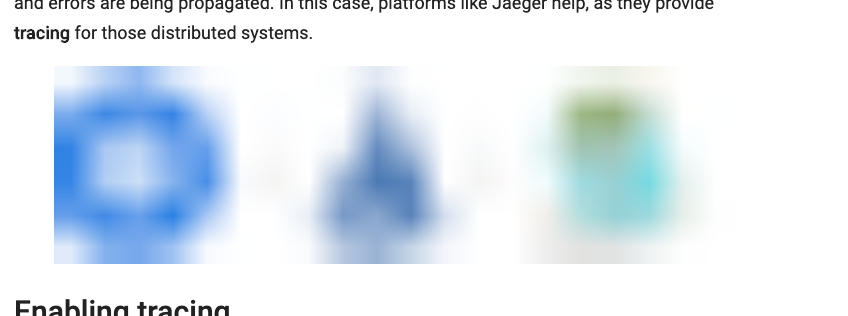

In [my previous tutorials](/tag/gatsby), we've explored how to use WordPress with Gatsby. One issue we haven't covered yet is to lazy-load embedded images within our WordPress posts. This isn't easily done with `gatsby-source-wordpress` or other plugins.

In this tutorial, I'll hack my way around it to show lazy images with Gatsby.


### Installing dependencies

To use lazy images with Gatsby, we have to install the following Gatsby plugins:

```
npm install gatsby-image gatsby-plugin-sharp gatsby-transformer-sharp --save
```

Additionally, we'll add an HTML to React parser library. We'll use this library to replace the normal images with Gatsby images:

```
npm install html-react-parser --save
```

### Wrapping our images

To use the Gatsby image component, we’ll create a wrapper component. This component will accept the `src`, `alt` and `width` parameters. These parameters are usually present on any image embedded with WordPress:

```javascript
export const PostImage = ({src, alt, width}) => {

};
```

The next step is to map each `src` to a local image served with Gatsby. To do this, I wrote a static query to load all image references:

```javascript
const allMedia = graphql`
  query {
    allWordpressWpMedia {
      edges {
        node {
          source_url
          localFile {
            publicURL
            childImageSharp {
              fluid(maxWidth: 800) {
                ...GatsbyImageSharpFluid
              }
            }
          }
        }
      }
    }
  }
`;
```

Now we can find out which image we should serve by checking the `source_url` property. One issue we have is that WordPress usually serves a rescaled version of an image for performance-reasons. The URL pattern they follow is:

```
https://example.org/wp-content/my-image-100x100.png
```

While the original source image is:

```
https://example.org/wp-content/my-image.png
```

Using regular expressions we can map those URLs to the correct Gatsby image:

```javascript
export const PostImage = ({src, alt, width}) => {
  const {allWordpressWpMedia} = useStaticQuery(allMedia);
  const originalSource = src.replace(/^(http?s:\/\/.+?\/.+?)-(\d+x\d+)\.(.+?)$/g, '$1.$3');
  const image = allWordpressWpMedia.edges.find(({node}) => node.source_url === originalSource);
});
```

In this example, `image` may contain a reference to a local image. If we found a local image, we can use Gatsby's `` component to show it. If we didn't find a local image, we can use a fallback to a normal `` using the original source.

```javascript
export const PostImage = ({src, alt, width}) => {
  const {allWordpressWpMedia} = useStaticQuery(allMedia);
  const originalSource = src.replace(/^(http?s:\/\/.+?\/.+?)-(\d+x\d+)\.(.+?)$/g, '$1.$3');
  const image = allWordpressWpMedia.edges.find(({node}) => node.source_url === originalSource);
  return image == null || image.node.localFile.childImageSharp == null ? (
    
  ) : (
    
  );
};
```

### Parsing the post content

Now that we have our `<PostImage/>` component, we can use **html-react-parser** to replace all normal `` tags with our new component.

Originally, we used the following code to visualize the post content:

```jsx
<div dangerouslySetInnerHtml={{__html: content}}/>
```

Now we're going to replace that by using the `parse()` function from `html-react-parser`:

```jsx
<div>{parse(content, {replace: replaceMedia})}</div>
```

We can import the `parse()` function like this:

```javascript
import parse from 'html-react-parser';
```

The last step is to implement the `replaceMedia()` function. This function will return the `<PostImage/>` component if we encounter a normal ``. However, since Gatsby images aren't intended to be used within paragraphs and such, we'll look for any paragraph that contains an image:

```javascript
const getImage = node => {
  if (node.name === 'img') {
    return node;
  } else if (node.children != null) {
    for (let index = 0; index < node.children.length; index++) {
      let image = getImage(node.children[index]);
      if (image != null) return image;
    }
  }
};

const replaceMedia = node => {
  if (node.name === 'p') {
    const image = getImage(node);
    if (image != null) {
      return <PostImage src={image.attribs.src} alt={image.attribs.alt} width={image.attribs.width}/>;
    }
  }
};
```

The html-react-parser library will call this function for each node it encounters. If we return anything from within this function, it will show that instead of the original node.

Be aware that replacing these images costs time, and your build-time might increase significantly. Luckily, everything happens during the build, and the end-users are unaffected.

In fact, they'll notice that images below the fold are lazy-loaded. Images below the fold use a blurry version of the image, and load the image as soon as they're visible:



With that, we've properly implemented lazy-loading with Gatsby and WordPress for embedded images. If you're interested in a complete example, you can view the source code of this blog on [GitHub](https://github.com/g00glen00b/gatsby-blog).
